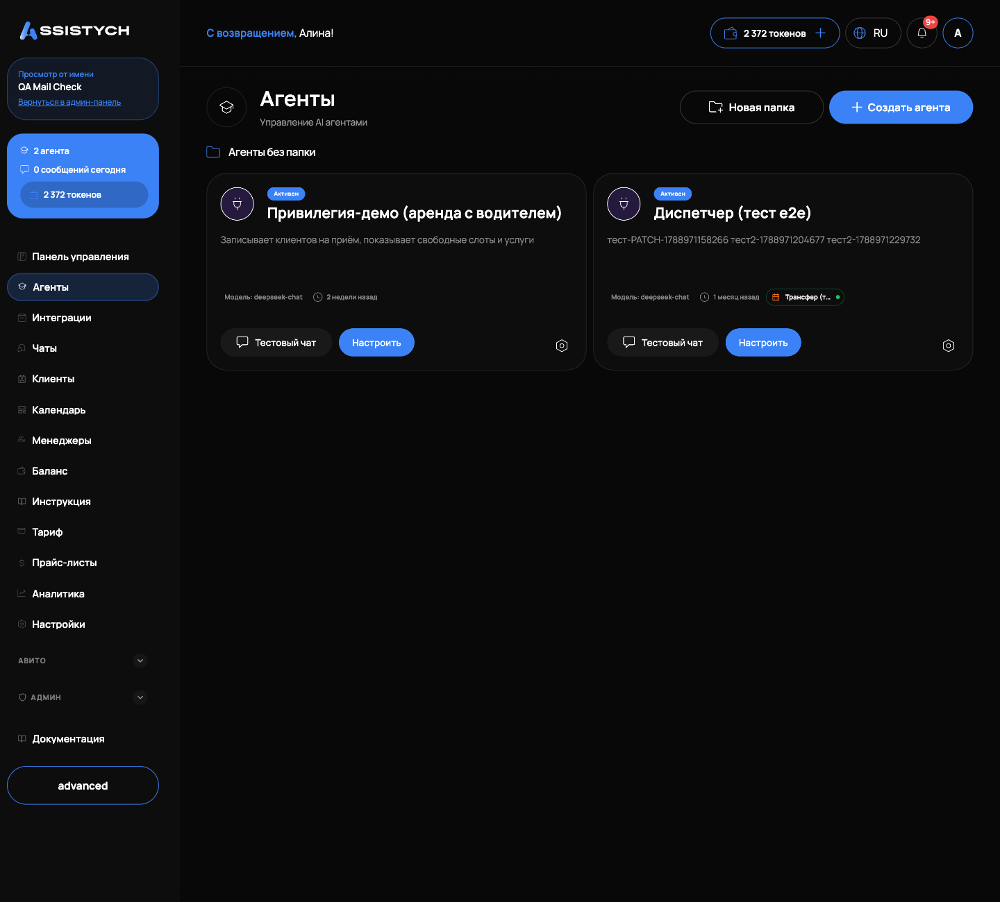
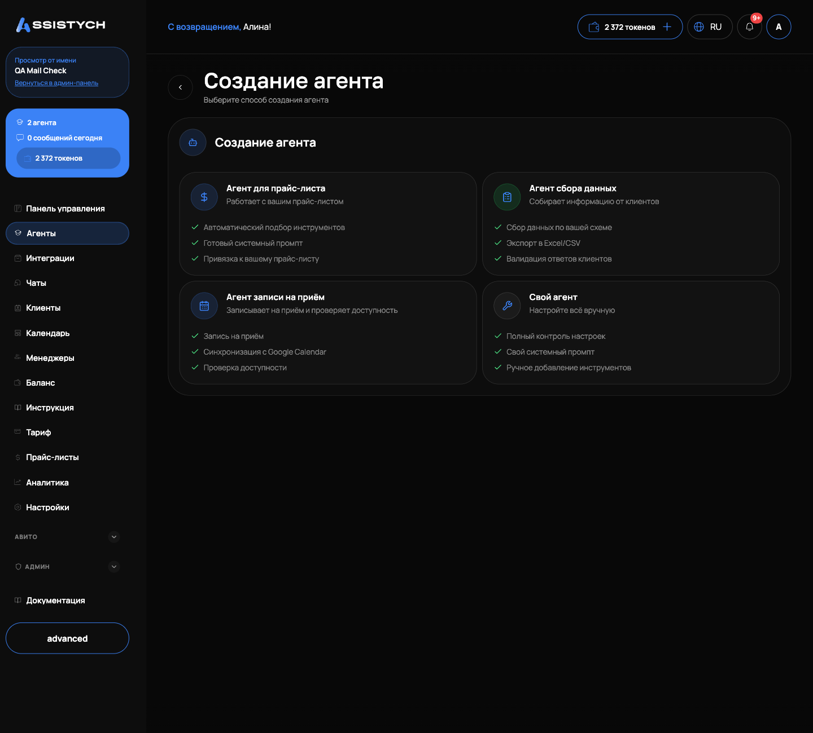
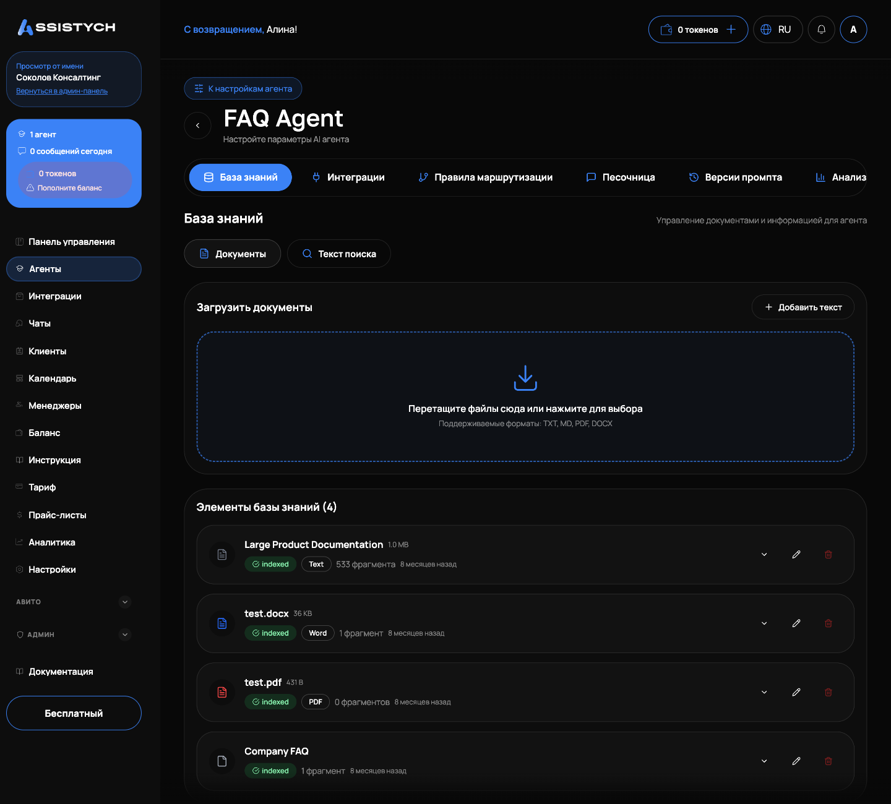

# Агенты

Агент это ИИ-бот, который отвечает клиентам в чатах: в Telegram, MAX, на Авито и в виджете на сайте. Раздел «Агенты» нужен, чтобы создавать таких ботов, настраивать их поведение, подключать к каналам связи и временно выключать. Открывается из левого меню, пункт «Агенты».

## Список агентов

На странице «Агенты» каждый агент показан карточкой. На карточке видно:

- статус: «Активен» или «Неактивен»;
- название и краткое описание (если описания нет, показывается начало системного промпта);
- модель, на которой работает агент;
- значки подключённых интеграций (например, Telegram или Авито) с индикатором состояния;
- кнопки «Тестовый чат» и «Настроить».

«Тестовый чат» открывает песочницу: можно поговорить с агентом прямо в кабинете, не трогая реальных клиентов. «Настроить» ведёт на страницу настроек агента. Через меню на карточке доступны «База знаний», «Маршрутизация», «Переместить в папку» и удаление агента (с подтверждением «Вы уверены, что хотите удалить этого агента?»).

Если агентов много, их можно раскладывать по папкам. Кнопка «Новая папка» создаёт папку с названием, описанием, иконкой и цветом. Карточку агента можно перетащить мышью в папку или обратно в список «Агенты без папки». При удалении папки агенты не удаляются, а возвращаются в основной список.

## Включение и выключение агента

На странице настроек агента есть переключатель «Активен» с подсказкой «Включить или отключить агента».

Выключенный агент работает в режиме «только мониторинг»: сообщения клиентов продолжают приходить и сохраняются, переписку видно в разделе «Чаты», но бот не отвечает. В списке чатов такой диалог помечается статусом «Агент выключен». Это удобно, когда нужно временно отвечать клиентам только вручную, не теряя историю. Чтобы бот снова начал отвечать, включите переключатель обратно и нажмите «Сохранить».

## Создание агента

Нажмите «Создать агента» в правом верхнем углу. Откроется мастер «Создание агента», первый экран: «Выберите способ создания агента». Вариантов четыре:

- «Агент для прайс-листа»: работает с вашим прайс-листом. Автоматический подбор инструментов, готовый системный промпт, привязка к прайс-листу.
- «Агент сбора данных»: собирает информацию от клиентов по вашей схеме, с экспортом в Excel/CSV и валидацией ответов.
- «Агент записи на приём»: записывает клиентов и проверяет доступность по расписанию.
- «Свой агент»: всё настраивается вручную.

Дальше шаги зависят от выбора.

Агент для прайс-листа. «Шаг 1 из 3: Выбор прайс-листа»: выберите, по какому прайс-листу агент будет отвечать на вопросы. Если прайс-листов нет, мастер предложит кнопку «Создать прайс-лист» (подробнее в [Прайс-листах](../price-lists/overview.md)). «Шаг 2 из 3: Выбор шаблона»: шаблон определяет поведение и инструменты агента, список зависит от формата прайс-листа («Детейлинг»: цены по классам авто, или «Универсальный»: фиксированные цены). «Шаг 3 из 3: Подтверждение»: проверьте название агента, прайс-лист, формат и шаблон. Блок «Инструменты будут подключены автоматически» показывает, что получит агент, например «обзор всех категорий услуг», «поиск услуг и цен», «определение класса автомобиля». Подпись «Эти инструменты заблокированы и не могут быть удалены» означает: без них агент по шаблону работать не будет. Нажмите «Создать агента».

Агент сбора данных. «Шаг 1 из 2: Выбор интеграции»: выберите интеграцию сбора данных, по схеме которой агент будет собирать поля. На шаге подтверждения видно число полей и формат экспорта. Автоматически подключаются инструменты «получение схемы полей» и «сохранение данных».

Агент записи на приём. «Шаг 1 из 2: Выбор расписания»: выберите интеграцию записи. На подтверждении видно число услуг и часовой пояс. Подключаются инструменты «получение информации о расписании», «проверка свободных слотов», «запись на приём».

Свой агент. Сначала мастер спросит «Как создать промпт?». Вариант «Сгенерировать с AI»: опишите бота, ИИ создаст промпт, его можно отредактировать и перегенерировать кнопкой «Перегенерировать». Вариант «Написать вручную»: полный контроль над промптом. Затем форма «Настройка агента вручную»:

- «Название *», например «Консультант по продажам»;
- «Описание»: краткое описание агента;
- «Системный промпт *»: роль, поведение и правила работы агента, минимум 10 символов;
- «Модель»: список моделей, см. ниже;
- «Макс. токенов ответа»: ограничение длины одного ответа.

## Выбор модели

В списке «Модель» две группы, DeepSeek и Kimi. Подписи в интерфейсе:

- «DeepSeek V4 Flash (Рекомендуется)»
- «DeepSeek V4 Pro»
- «DeepSeek Chat (устаревшая)»
- «DeepSeek Reasoner (устаревшая)»
- «Kimi K2.6»
- «Kimi K2.5 (устаревшая)»

Рекомендуемый вариант помечен прямо в списке. Модель можно сменить позже на странице настроек агента.

## Настройки агента

Страница агента открывается кнопкой «Настроить» и содержит несколько вкладок: настройки, «База знаний», «Инструменты», «Интеграции», «Версии промпта» и другие.

На вкладке настроек можно изменить название, описание и «Системный промпт *». Кнопка «Улучшить с AI» переписывает промпт нейросетью, а «Сгенерировать из истории переписок» строит промпт по реальным диалогам. После правки промпта появляется подсказка «Промпт изменён. Нажмите "Сохранить" для применения»: пока не нажали «Сохранить», агент работает по-старому. Здесь же меняются «Модель» и «Макс. токенов ответа».

Блок «Настройки приватности»: переключатель «Скрывать персональные данные» скрывает номера телефонов, email и другие персональные данные перед отправкой в ИИ, оригиналы при этом сохраняются в базе.

Блок «Группировка сообщений»: «Ожидание завершения отправки нескольких сообщений перед ответом». Режимы «Выкл» и «Автоопределение», плюс поле «Время ожидания тишины»: сколько секунд ждать после последнего сообщения клиента, прежде чем ответить. Полезно, когда клиент пишет мысль несколькими сообщениями подряд.

Вкладка «Версии промпта» хранит историю изменений промпта: можно сравнить версии и вернуться к прошлой.

## База знаний

База знаний это документы и тексты, которыми агент пользуется при ответах: инструкции, FAQ, условия работы. Открывается вкладкой «База знаний» на странице агента.

Кнопка «Добавить знания» предлагает два способа:

- «Загрузить документы»: перетащите файлы в область загрузки или нажмите для выбора. Поддерживаемые форматы: TXT, MD, PDF, DOCX. После загрузки документ некоторое время находится в статусе «Обработка...»: файл разбивается на фрагменты и индексируется.
- «Добавить текст»: вручную введите название и содержимое, подходит для FAQ и коротких заметок. Текст индексируется сразу.

Каждый элемент списка «Элементы базы знаний» показывает тип («Текст», «FAQ», «Документ»), число фрагментов и дату. Элемент можно редактировать: после сохранения содержимое переиндексируется. Внимание: если отредактировать текст, извлечённый из PDF или DOCX, исходный формат файла будет потерян, сохранится только текст. Удаление: с подтверждением «Вы уверены, что хотите удалить этот элемент?».

Проверить, что агент находит нужное, можно прямо здесь: блок «Поиск по базе знаний». Введите запрос и нажмите поиск, система покажет найденные фрагменты с оценкой «Релевантность».

## Инструменты агента

Вкладка «Инструменты» показывает, какие действия может выполнять агент. «Подключённые инструменты»: то, что уже работает у агента. «Доступные инструменты»: каталог, откуда инструменты подключаются кнопкой «Подключить».

У каждого подключённого инструмента есть «Настройки» и «Тест». В настройках: «Приоритет» от 0 до 100 (инструменты с более высоким приоритетом ИИ рассматривает первыми) и «Своё описание»: подсказка, когда именно этому агенту использовать инструмент. Кнопка «Запустить тест» проверяет инструмент на тестовых данных.

Инструменты, подключённые автоматически при создании агента из шаблона (мастер предупреждал «Эти инструменты заблокированы и не могут быть удалены»), снять нельзя: без них шаблон перестанет работать.

## Привратник

В системе есть режим «привратник»: агент отправляет клиенту одно шаблонное сообщение и дальше передаёт диалог оператору, свободные ответы ИИ в этом диалоге блокируются. Вернуть бота в такой диалог можно кнопкой «Вернуть боту» в чате: она разрешает ровно один ответ. Отдельного переключателя привратника в карточке агента в кабинете нет.
## Привязка к каналам

Агент отвечает там, куда он подключён. Вкладка «Интеграции» на странице агента показывает «Подключённые интеграции» и кнопку «Добавить интеграцию». Подключение мессенджеров (Telegram, MAX, ВКонтакте, виджет) описано в [Интеграциях](../integrations/messengers.md), подключение Авито: в [Подключении Авито](../getting-started/connect-avito.md). После привязки значок канала появляется на карточке агента в общем списке.

## Расход токенов

Каждый ответ агента расходует токены с баланса бизнеса: и генерация ответа, и генерация промпта кнопкой «Сгенерировать с AI», и обработка документов базы знаний. Если токены закончились, агент перестаёт отвечать, а в списке чатов появляется статус «Баланс исчерпан». Пополнение и цены: [Токены и пополнение](../billing/tokens.md) и [Баланс](../getting-started/balance.md).

## Если что-то пошло не так

- Агент молчит в чатах. Проверьте переключатель «Активен» на странице агента, баланс токенов и статус интеграции (значок на карточке агента).
- Кнопка «Создать агента» в мастере неактивна. На шаге выбора не выбран прайс-лист, шаблон или интеграция: вернитесь шаг назад и выберите.
- Ошибка «Укажите название агента» или «Опишите роль агента: минимум 10 символов». Заполните обязательные поля «Название *» и «Системный промпт *».
- Агент отвечает, но не находит информацию из документа. Дождитесь конца «Обработка...» в базе знаний и проверьте документ через «Поиск по базе знаний».
- «Не удалось сохранить» при правке настроек. Проверьте интернет и повторите; если ошибка повторяется, скопируйте промпт в безопасное место и перезагрузите страницу.
- Не получается удалить инструмент. Это заблокированный инструмент шаблона, такие не удаляются.
