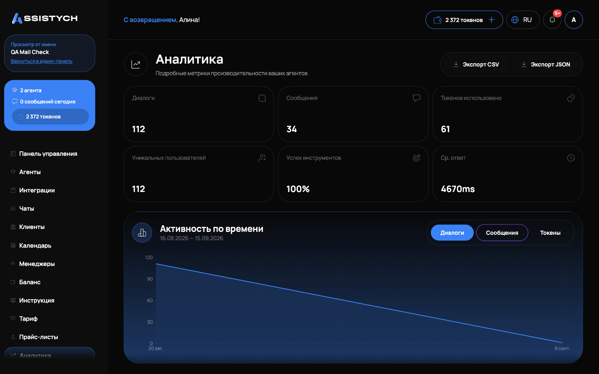
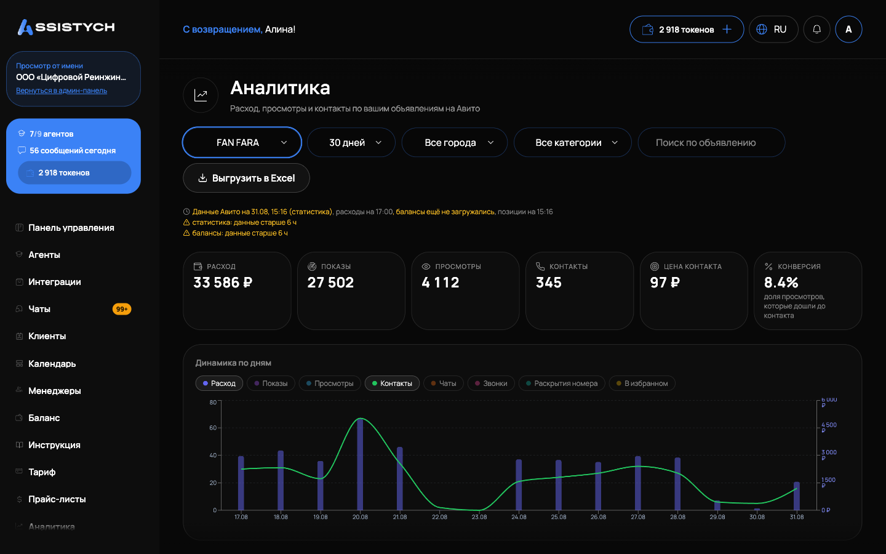

# Аналитика

В кабинете два раздела с цифрами. «Аналитика» показывает, как работают ваши ИИ-агенты: диалоги, сообщения, расход токенов. «Авито → Аналитика» показывает, как работают объявления: показы, просмотры, контакты, расход на продвижение и звонки. Эта страница описывает оба, плюс анализ диалогов и сравнение с рынком.

## Аналитика агентов

Раздел «Аналитика» в меню: «Подробные метрики производительности ваших агентов».

Верхний ряд: шесть карточек за период: «Диалоги», «Сообщения», «Токенов использовано», «Уникальных пользователей», «Успех инструментов» (доля успешных вызовов инструментов) и «Ср. ответ» (в миллисекундах).

Ниже график «Активность по времени» с переключателем «Диалоги» / «Сообщения» / «Токены». Вкладка «Токены»: это расход токенов по дням, удобно следить, куда уходит пакет. Если за период пусто, график скажет «Нет данных за этот период».

Дальше три вкладки:

- «Производительность агентов»: таблица «Сравнение агентов» с колонками «Диалоги», «Сообщения», среднее время ответа, вызовы инструментов и «RAG Оценка» (насколько ответы опирались на базу знаний) по каждому агенту.
- «Использование инструментов»: по каждому инструменту число вызовов, средняя длительность и процент успеха. Красный процент у нужного инструмента: повод проверить его настройки у агента.
- «Отзывы»: оценки пользователей, «Всего отзывов», «Средний рейтинг», «За 7 дней» и последние отзывы с комментариями.

Кнопки «Экспорт CSV» и «Экспорт JSON» выгружают данные за последние 30 дней: сводку, сравнение агентов и активность по дням.

## Анализ диалогов

Открывается со страницы конкретного агента: «Анализируйте разговоры для улучшения агента и получения бизнес-инсайтов». Два режима: «Анализ» и «Генерация промпта».

Как запустить:

1. Задайте период «С» / «По» (не больше 90 дней), при желании сузьте «Платформа» (Telegram, Avito, «Виджет на сайте») и «Интеграция».
2. Нажмите «Оценить стоимость»: увидите «~N диалогов, примерная стоимость: …».
3. Нажмите «Начать анализ» и подтвердите. Стоимость спишется с баланса, отчёт появится в «История отчётов» со статусом «В очереди», затем «Обработка...» и «Готово».

Что показывает готовый отчёт (кнопка «Открыть»):

- «Резюме» по всем диалогам периода;
- «Предложения по улучшению агента»: что дописать в промпт, с уровнем уверенности («Высокая», «Средняя», «Низкая»). Видны «Текущий» и «Предлагаемый» варианты, кнопка «Применить» вносит правку в промпт агента;
- «Бизнес-инсайты»: «Популярные темы», «Частые возражения», «Паттерны поведения покупателей», «Инсайты по товарам».

Режим «Генерация промпта» строит промпт с нуля по реальным диалогам (нужно минимум 10 диалогов за период): «Сгенерированный промпт», «Стиль общения», предложенные название и описание. Кнопка «Применить к агенту» заменяет промпт агента. Если применение не прошло с ошибкой «промпт был изменён после анализа», пересохраните агента и примените снова.

## Авито: Аналитика

Открывается из раздела Авито: «Расход, просмотры и контакты по вашим объявлениям на Авито».

Сверху фильтры: «Аккаунт» (если подключено несколько), период (от 7 до 365 дней), «Все города», «Все категории» и «Поиск по объявлению». Кнопка «Выгрузить в Excel» скачивает таблицу.

Карточки за период: «Расход», «Показы», «Просмотры», «Контакты», «В избранном», «Конверсия» (доля просмотров, которые дошли до контакта) и «Цена контакта».

Ниже:

- «Динамика по дням»: график с метриками «Чаты», «Звонки», «Раскрытия номера».
- «По городам»: таблица по городам, клик по заголовку колонки сортирует.
- «По объявлениям»: объявления с наибольшим расходом за выбранный период.
- «Звонки»: данные Коллтрекинга Авито, обновляются каждые полчаса, записи хранятся у Авито 3 месяца.Сводка «Всего звонков», «Отвечено», «Пропущено», «Средний разговор» и список звонков с длительностью ожидания, разговора и кнопкой «Слушать». Если звонков нет, а Коллтрекинг включили недавно, нажмите «Обновить звонки».

На странице интеграции Авито есть также панель «Расход на продвижение по дням» (7, 30 или 90 дней): расход, просмотры, контакты и конверсия по дням с итогами «всего», «в среднем в день» и «пик». Управление самим продвижением: [Управление ставками](../promotion/bids.md), список объявлений: [Мои объявления](../listings/overview.md).

## Сравнение с рынком (бенчмарк)

Кнопка «Сравнить с рынком» у объявления запускает разбор конкурентов по вашей нише. Для услуг сначала откроется «Запустить бенчмарк»: введите «Ключевой запрос», по которому покупатели ищут услугу (например, «парсинг авито»). Если объявления нет в публичной выдаче, используйте «Бенчмарк по ссылке»: ссылка на объявление плюс ключевой запрос.

Анализ идёт в очереди: «Анализ запущен», «Идёт обработка...». Готовый отчёт «Сравнение с рынком» показывает:

- «Позиция в поиске»: «Ваше объявление №… из … по запросу …»;
- «Цена на рынке»: медиана и среднее по конкурентам, «Ваша цена» и «Ваш перцентиль»;
- «Топ-5 конкурентов»: цена, продвижение, число фото, длина описания, ссылка «Открыть на Avito»;
- «Конкурентность ниши» и «Рекомендации»: что поправить (фото, описание, цена, продвижение);
- «Резюме от AI».

Кнопка «Применить стратегию» включает рекомендованные услуги продвижения Авито (Выделение, XL-карточка, Премиум, VIP, Поднятие). Деньги за них списываются с баланса вашего Avito-аккаунта, не с баланса Assistych: перед применением видно «Итого: … ₽ — спишется с баланса Avito».
Ограничения: бенчмарк поддерживает авто и квартиры, из услуг только IT-сферу. По одному объявлению анализ идёт не чаще, чем раз в сутки: «Стратегия применялась к этому объявлению за последние 24 часа». Кнопка «Обновить данные» сбрасывает кэш и запускает новый анализ.

## Если что-то пошло не так

- Графики «Аналитики» пустые. За выбранный период не было диалогов, либо агенты ещё не работали: проверьте период и вернитесь позже.
- «Недостаточно средств» при запуске анализа диалогов. Пополните баланс: [Токены и пополнение](../billing/tokens.md).
- «Анализ уже выполняется». По этому агенту уже идёт отчёт, дождитесь статуса «Готово» или «Ошибка» в «Истории отчётов».
- «Слишком много диалогов. Сузьте диапазон дат.» Уменьшите период или задайте платформу/интеграцию.
- «Не удалось применить: промпт был изменён после анализа». Промпт агента правили после запуска отчёта. Запустите свежий анализ и применяйте предложения из него.
- В «Звонках» пусто. Коллтрекинг Авито отдаёт данные с задержкой до получаса: нажмите «Обновить звонки» и проверьте, что Коллтрекинг включён у аккаунта.- Бенчмарк пишет «Доступ временно ограничен». Авито ограничивает запросы, обычно ограничение снимается через час: попробуйте позже.
Соседние страницы: [Мои объявления](../listings/overview.md), [Управление ставками](../promotion/bids.md), [Баланс](../getting-started/balance.md).
