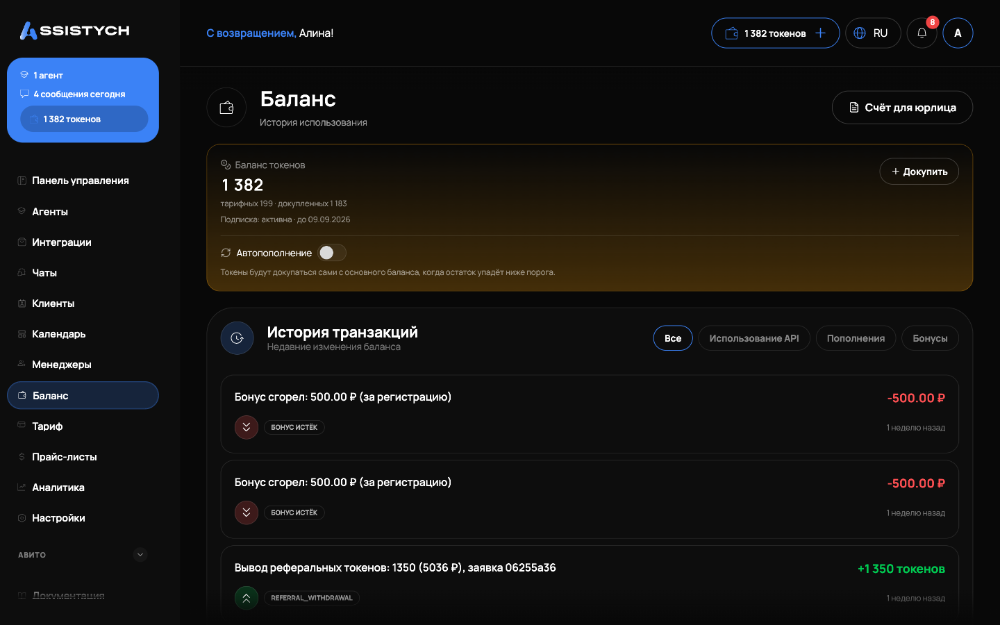

# Тарификация и баланс

## Тарифы

Тариф — основной способ платить за нейросеть: он даёт пакет токенов каждый месяц. Раздел **Тариф и использование** показывает текущий тариф и сравнение всех планов: Бесплатный, Старт, Авито, Профи, Команда, а также Компания — с условиями «индивидуально / по договорённости». Оплата помесячно или на год со скидкой −20%.


**Индивидуальная цена.** Крупным клиентам поддержка может выставить персональную цену на тариф — тогда в кабинете отображается она, а не общая сетка.


## Токены

Деньги внутри кабинета — это токены, двух видов (на Панели управления: «тарифные · докупленные»):

* **Тарифные** приходят пакетом с тарифом каждый месяц.
* **Докупленные** — пополнение в разделе **Баланс** в любой момент.

| Операция | Как считается |
| --- | --- |
| Ответ ИИ в чате | По объёму ответа. Чем короче, тем дешевле. Есть потолок за один ответ. |
| Ответ агента на отзыв | По обычному курсу ответа агента |
| Ручные сообщения оператора | Бесплатно |
| Генерация фото | Фиксированная цена за картинку (зависит от модели) |
| Генерация текста объявления | По объёму |


**Токены кончились — агенты останавливаются.** Бот молча перестаёт отвечать, диалоги копятся в «Ждут ответа». Пополните баланс или дождитесь продления тарифа — уведомление о низком остатке приходит заранее.


## Оплата и чеки

Оплата картой через ЮKassa. Чек приходит на почту — поэтому почта аккаунта обязательна.

## Способ оплаты

Блок **«Способ оплаты»** (в разделе «Тариф и использование») показывает сохранённую карту и управляет автопродлением:

* **«Продлевать автоматически»** — карта сохраняется в ЮKassa при оплате, и тариф продлевается сам в день окончания. Сумма и дата следующего списания видны заранее. Если тариф оплачен до конца периода, автопродление можно выключить — тариф просто доработает до даты.
* **«Отвязать карту»** — способ оплаты стирается, автопродление выключается. Уже оплаченный период при этом не сгорает: тариф действует до конца. Повторная отвязка ничего не ломает.

Текущий баланс и история списаний — в разделе **Баланс**, там же разбивка трат по типам операций и порог «низкого баланса» для оповещений.

