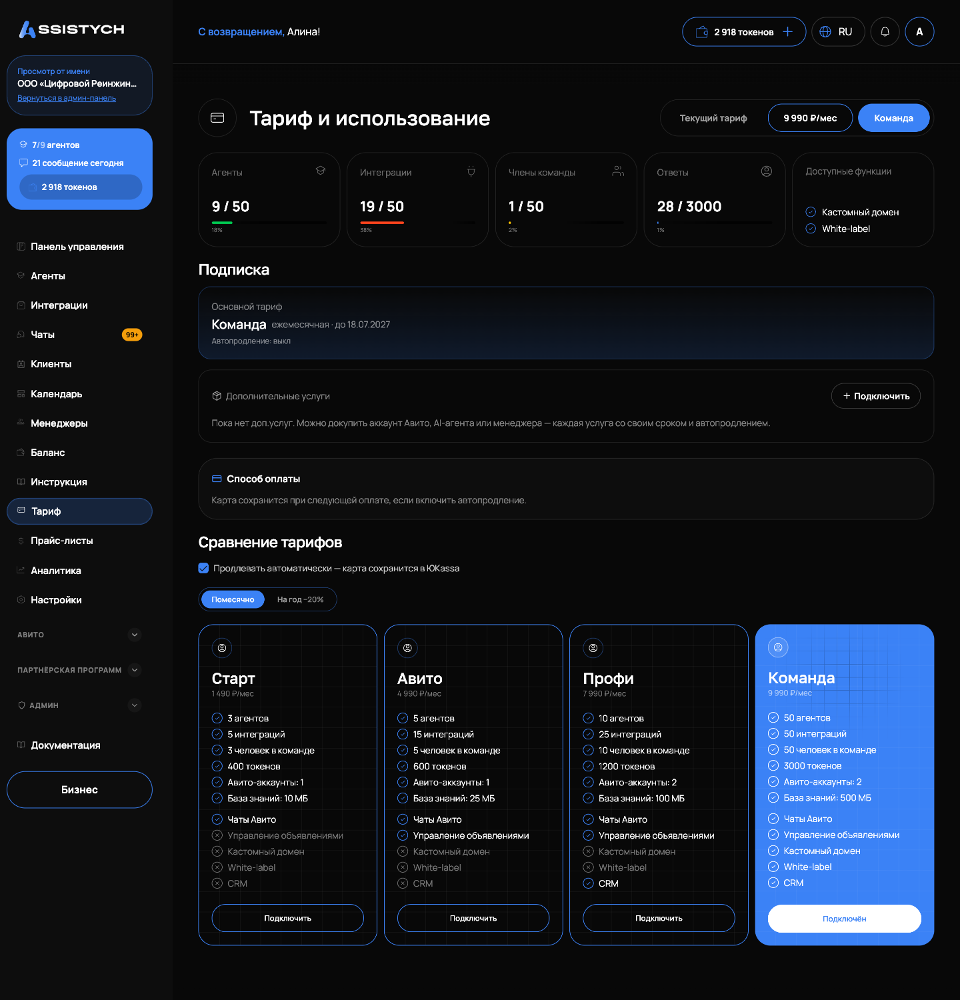
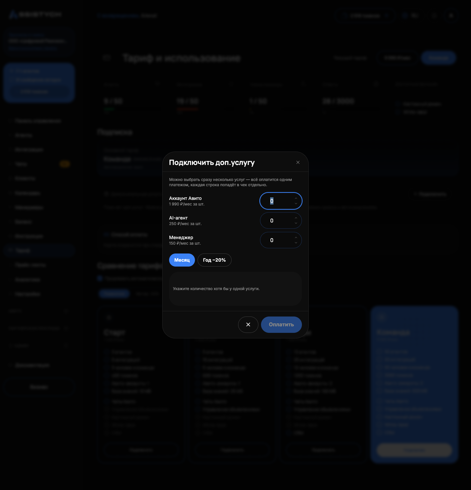

# Тариф и использование

Тариф: основной способ платить за нейросеть, он даёт пакет токенов каждый месяц. Эта страница: как выбрать и оплатить тариф, как работает автопродление и как докупить дополнительные услуги. Загляните сюда перед первой оплатой или когда упёрлись в лимиты.

Раздел называется «Тариф и использование», в меню кабинета это пункт «Тариф».

## Что даёт тариф

Каждый платный тариф раз в месяц начисляет пакет тарифных токенов и открывает лимиты: сколько агентов, интеграций, членов команды и Авито-аккаунтов можно подключить, какой объём базы знаний доступен.

Сетка тарифов в кабинете: «Старт», «Авито», «Профи», «Команда». Точные цены и лимиты показаны на карточках в разделе «Тариф и использование» и могут меняться: актуальные всегда на странице. Для крупных клиентов есть индивидуальные условия: тариф «Интегратор» с пометкой «индивидуально», заявка уходит письмом через кнопку «Оставить заявку». Если поддержка выставила вам персональную цену, в кабинете отображается она, а не общая сетка.

## Как оплатить или сменить тариф

1. Откройте «Тариф и использование».
2. Выберите период оплаты: «Помесячно» или «На год». Годовая оплата идёт со скидкой −20%, цена пересчитывается сразу.
3. На карточке нужного тарифа нажмите «Подключить». Текущий тариф помечен «Подключён».
4. Откроется страница оплаты ЮKassa. Оплатите картой.5. После оплаты вы вернётесь в кабинет: подписка активируется, тарифный пакет токенов начислится сразу.

Чек приходит на почту аккаунта.
Если идёт пробный период, блок «Подписка» показывает «Пробный период», пометку «бесплатно» и дату окончания. После окончания выберите тариф: данные сохранятся.

## Подписка и автопродление

Блок «Подписка» в разделе «Тариф и использование» показывает основной тариф: название, период («ежемесячная» или «годовая»), дату «до» и состояние автопродления строкой «Автопродление: вкл» или «Автопродление: выкл».

Как это работает:

- Автопродление включается при оплате тарифа. В день окончания с сохранённой карты списывается сумма следующего периода, тариф продлевается сам.
- Если автосписание не прошло (например, не хватило средств), повторных попыток не будет: придёт уведомление в кабинете и письмо на почту. Подписка получит статус «Подписка заморожена (не оплачено)». Важно: заморозка не останавливает бота сразу — пока на балансе есть токены (тарифные или докупленные), агенты продолжают отвечать. Бот встанет, только когда токены кончатся. Чтобы этого не случилось, продлите тариф вручную: нажмите «Подключить» на своём тарифе и оплатите.
- Оплаченный период не сгорает ни при каких изменениях: тариф всегда дорабатывает до оплаченной даты.

Отдельного тумблера автопродления тарифа и кнопки «Отвязать карту» в текущем кабинете нет. Чтобы отключить автопродление или отвязать карту, напишите в поддержку: support@assistych.ru.

## Использование

Верхний ряд карточек показывает расход лимитов текущего тарифа: «Агенты», «Интеграции», «Члены команды», «Ответы» (пакет токенов: использовано / лимит) и «Доступные функции» (например, «Кастомный домен» и «White-label», галочка есть или нет). Если уперлись в лимит, появится «Достигнут лимит тарифа»: перейдите на тариф выше или докупите дополнительную услугу.

Сам расход токенов по операциям смотрите в разделе [Баланс](../getting-started/balance.md): история транзакций с разбивкой по агентам. Про токены подробно: [Токены и пополнение](../billing/tokens.md).

## Дополнительные услуги

Блок «Дополнительные услуги» позволяет расширить тариф без смены плана. Можно докупить:

- «Аккаунт Авито»;
- «AI-агент»;
- «Менеджер».

Как подключить:

1. Нажмите «Подключить» в блоке «Дополнительные услуги».
2. Укажите количество по каждой услуге. Можно несколько разных: всё оплатится одним платежом, каждая строка попадёт в чек отдельно.
3. Выберите период: «Месяц» или «Год −20%».
4. Проверьте смету «Итого» и нажмите «Оплатить». Откроется страница ЮKassa.

Каждая дополнительная услуга: самостоятельная подписка, у неё свой срок (месяц или год) и своё автопродление, независимое от тарифа. В списке услуг видны срок «до», цена за штуку и статус («активна» или «не оплачена»).

Управление услугой:

- Кнопка «Автопродление вкл» / «Автопродление выкл» переключает продление конкретной услуги.
- Кнопка «Отменить» прекращает услугу: она перестаёт учитываться в лимитах и не продлевается. Оплаченный срок дорабатывает.

Если автопродление услуги включено, а оплата очередного периода не прошла, услуга получает статус «не оплачена»: оплатите её снова через «Подключить».

## Если что-то пошло не так

- Нажали «Подключить», а оплата не открылась («Оплата недоступна»). Приём платежей временно не работает, попробуйте позже.
- Оплатили, а тариф не изменился. Подождите минуту и обновите страницу. Если не помогло, напишите в поддержку: support@assistych.ru, оплата сверяется по платежу.
- «Подписка заморожена (не оплачено)». Автосписание не прошло. Бот при этом продолжает отвечать, пока на балансе есть токены: заморозка сама по себе его не останавливает. Проверьте карту и продлите тариф вручную кнопкой «Подключить», чтобы не остаться без токенов.
- Случайно нажали «Подключить» дважды. Второй платёж не создаётся: в течение часа повторный клик ведёт на тот же платёж.
- Нужен тариф, которого нет в сетке. Нажмите «Оставить заявку» на карточке «Интегратор» или напишите на support@assistych.ru: крупным клиентам поддержка выставляет индивидуальную цену.
- «Достигнут лимит тарифа». Зайдите в «Тариф и использование», посмотрите карточки использования и либо перейдите на тариф выше, либо докупите нужную дополнительную услугу.

Соседние страницы: [Токены и пополнение](../billing/tokens.md), [Частые вопросы](../faq.md).
