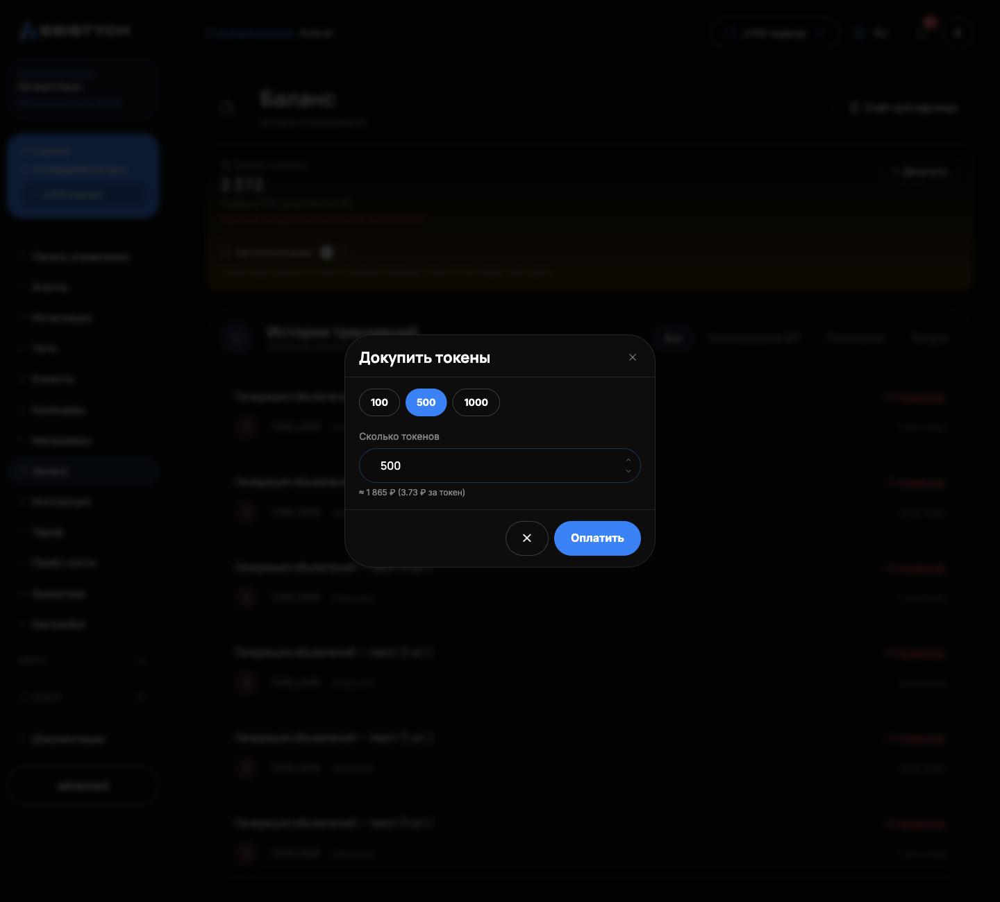
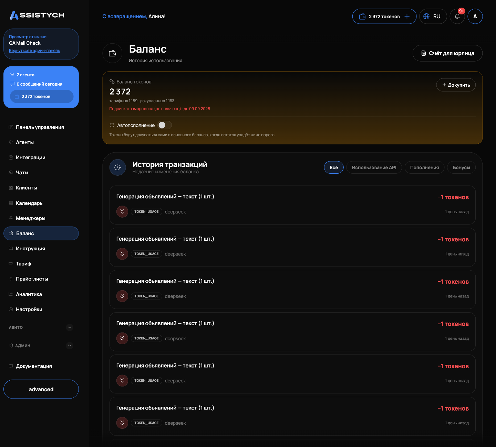

# Токены и пополнение

Работа нейросети в Assistych оплачивается токенами. Эта страница: что такое токен, за что списывается, как пополнить баланс картой или по счёту и что происходит, когда токены кончаются. Пригодится, когда вы впервые пополняете баланс или когда бот внезапно замолчал.

## Что такое токен

Токен: единица оплаты работы нейросети. Один обычный ответ агента в чате стоит примерно один токен. Длинный диалог с большим контекстом или дорогая модель стоят несколько токенов. Рублёвого баланса в кабинете нет, весь учёт идёт в токенах.

Токены бывают двух видов (на [Панели управления](../getting-started/dashboard.md) видна разбивка «тарифных · докупленных»):

- Тарифные. Приходят пакетом вместе с тарифом каждый месяц. Неизрасходованный остаток не переносится: при продлении пакет начисляется заново.
- Докупленные. Пополнение в разделе «Баланс» в любой момент. Не сгорают.

Списываются сначала тарифные, потом докупленные.

Сколько стоит каждая операция:

| Операция | Как считается |
|---|---|
| Ответ ИИ в чате | По объёму ответа: обычный ответ ≈ 1 токен, длинный контекст или дорогая модель: несколько |
| Ответ агента на отзыв | Как обычный ответ агента |
| Ручные сообщения оператора | Бесплатно |
| Генерация фото | Фиксированная цена за картинку |
| Генерация текста объявления | По объёму |

## Как пополнить: докупка токенов

1. Откройте раздел «Баланс».
2. На карточке «Баланс токенов» нажмите «Докупить».
3. Выберите пакет (100, 500 или 1000 токенов) или введите своё количество: от 10 до 100 000.
4. Под полем видна цена: 3,73 ₽ за токен, итог считается сразу.
5. Нажмите «Оплатить». Откроется страница оплаты ЮKassa.6. После оплаты вы вернётесь в «Баланс» и увидите «Оплата принята — баланс обновится в течение минуты».

Докупленные токены попадают в «докупленные» и не сгорают. Если оплата не завершилась, появится «Оплата не завершена», деньги не спишутся.

Чек приходит на почту аккаунта, поэтому почта должна быть рабочей.
Оплата через СБП в кабинете не предусмотрена.

## Как пополнить: счёт для юрлица

Если платите с расчётного счёта компании:

1. Один раз заполните реквизиты: «Настройки» → «Реквизиты компании». Обязательны название юрлица (или ИП) и ИНН, остальное по желанию: КПП, ОГРН, юридический адрес, банк, БИК, расчётный счёт.
2. В разделе «Баланс» нажмите «Счёт для юрлица».
3. Проверьте плательщика, выберите сумму (990, 5000 или 10 000 ₽) или введите свою, от 100 ₽.
4. Нажмите «Сформировать счёт». Счёт в PDF скачается автоматически, появится «Счёт … сформирован и скачан».
5. Оплатите счёт с расчётного счёта компании. Назначение платежа менять нельзя: по номеру счёта мы находим вашу оплату.

Баланс пополнится после поступления оплаты, обычно в течение 1 рабочего дня. Оплату подтверждаем вручную по банковской выписке. В том же диалоге видны последние счета со статусами «Ожидает оплаты», «Оплачен», «Отменён»; по номеру счёта можно скачать PDF ещё раз. Зачисление появится в истории как «Пополнение по счёту № АС-…».

Если реквизиты не заполнены, диалог покажет «Чтобы сформировать счёт, сначала заполните реквизиты вашей компании в настройках» и кнопку «Перейти в настройки».

## Автопополнение

На карточке «Баланс токенов» есть тумблер «Автопополнение». Как настроить:

1. Включите тумблер.
2. Задайте правило: «остаток ниже [порог] → докупить [количество] токенов».
3. Нажмите «Сохранить».

Когда остаток упадёт ниже порога, пакет докупится сам. Деньги списываются с основного денежного баланса, под настройкой видна оценка суммы. Если денег не хватит, придёт уведомление. Чтобы выключить, переведите тумблер обратно: настройка сохраняется сразу.

Когда автопополнение включено, на странице «Баланс» появляется кнопка «Пополнить»: она пополняет денежный баланс, с которого идёт автодокупка (сумма от 50 до 300 000 ₽, оплата через ЮKassa).

## Токены кончились: что происходит

Когда остаток падает до 50 токенов и ниже, в кабинете появляется уведомление о низком балансе. При нуле придёт ещё одно уведомление «Токены закончились. Пополните пакет, чтобы бот продолжил отвечать» и письмо на почту.

На нуле агенты останавливаются: бот молча перестаёт отвечать, без заглушек и «ошибок» клиенту. Новые сообщения клиентов копятся, в [Чатах](../chats/assistant.md) у таких диалогов видна метка «Без ответа».

## Догон после пополнения

После пополнения (докупка токенов, оплата или продление тарифа, ежемесячное обновление пакета) бот не просто возобновляет работу: он отвечает накопившимся диалогам. Отвечают диалоги, где последнее сообщение клиента моложе 48 часов, старейшие первыми. Диалоги «С оператором» не трогаются. Если токенов не хватит на всех, оставшиеся дождутся следующего пополнения. Отвечать вручную накопившееся не нужно.

## История транзакций

В разделе «Баланс» блок «История транзакций» показывает все движения токенов. Фильтры: «Все», «Использование API», «Пополнения», «Бонусы».

В каждой строке: описание операции, сумма со знаком (зелёный плюс: зачисление, красный минус: списание), тип («Пополнение», «Использование API», «Корректировка», «Перенос за месяц»), а у списаний видно, какой агент израсходовал и какая модель использовалась. Длинную историю листайте кнопками «Назад» и «Вперёд».

## Если что-то пошло не так

- Оплатили, а токены не пришли. Подождите минуту и обновите страницу: зачисление проверяется при возврате с оплаты. Если не появилось, проверьте «Историю транзакций» и напишите в поддержку: support@assistych.ru.
- Кнопка «Оплатить» не реагирует, «Оплата недоступна». Приём платежей временно не работает, попробуйте позже. Либо сумма вне диапазона: докупка от 10 до 100 000 токенов.
- «Не удалось сформировать счёт». Проверьте реквизиты в «Настройках»: название и ИНН обязательны, формат ИНН/КПП/БИК/счёта проверяется.
- Баланс по счёту не пополняется второй день. Счета подтверждаются вручную по выписке. Проверьте, что назначение платежа не меняли, и напишите в поддержку.
- Автопополнение не сработало. Проверьте, что тумблер включён и нажата «Сохранить», а на основном денежном балансе есть деньги. Если денег не хватило, вам уже пришло уведомление.

Соседние страницы: [Тариф и использование](../billing/pricing.md), [Частые вопросы](../faq.md), [Баланс](../getting-started/balance.md).
