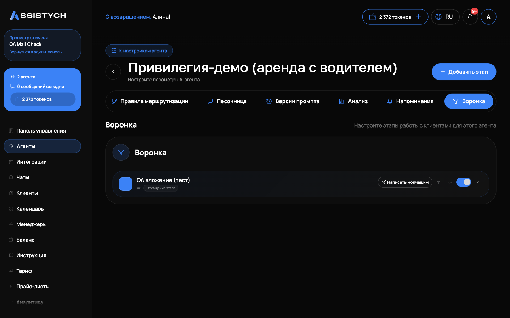
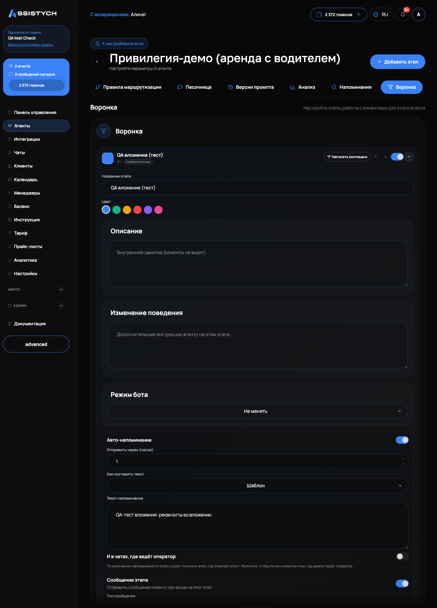

# ИИ-ассистент

ИИ-ассистент это агент, который автоматически отвечает клиентам во всех подключённых каналах: Авито, Telegram, ВКонтакте, виджет на сайте. Он работает по вашему сценарию (системному промпту), пользуется базой знаний и инструментами агента. Эта страница про то, как ассистент ведёт диалог, как забрать диалог себе и как настроить воронку с напоминаниями. Сами переписки живут в разделе [Чаты](../chats/assistant.md), создание и настройка агента в [Агентах](../agents/overview.md).

## Как работает автоответ

У каждого диалога есть «Режим ответа», он виден в карточке чата на панели «Информация о клиенте»:

- «Автоответ»: бот отвечает сам. В поле ввода при этом подсказка «Бот отвечает автоматически».
- «Режим оператора»: диалог ведёт человек, бот молчит. В списке чатов такой диалог помечен бейджем «Оператор».

Переключение ручное, кнопками в шапке чата:

- «Взять управление»: автоответ выключается, вы пишете клиенту напрямую. Бот не будет перебивать. Ручные сообщения не тарифицируются: токены расходуются только на ответы бота.
- «Вернуть боту»: автоответ включается снова, бот продолжает отвечать с учётом всей истории диалога.

Если диалог взял коллега, вы всё равно можете ответить: чат перезакрепится на вас, а автор каждой реплики сохранится в истории. Поле «Управление взято» в карточке клиента показывает, когда оператор подключился.

Расход нейросети виден по каждому диалогу: в списке чатов на строке диалога, в токенах. Подробнее о списаниях в [Токены и пополнение](../billing/tokens.md).

## Если у бота сбой

Если нейросеть недоступна или ответила пусто, бот не отправляет клиенту ничего: никаких заглушек «произошла ошибка» от имени вашей компании. Диалог при этом остаётся без ответа, на строке чата растёт бейдж «Без ответа: N», а владельцу приходит уведомление «клиент ждёт ответа» (не чаще раза в час на диалог). Это штатное поведение: молчание бота лучше, чем честное «я сломался». Разберите такой диалог вручную кнопкой «Взять управление».

Те же правила у среза «Ждут ответа»: туда попадают диалоги, где клиент написал и никто не ответил, в том числе когда бот передал диалог человеку или промолчал из-за сбоя. Подробности в [Чатах](../chats/assistant.md).

## Воронка агента

Воронка это этапы работы с клиентом: «Первичный контакт», «Ждёт оплаты» и т.д. Настраивается на странице агента, вкладка «Воронка». Этапы свои у каждого агента.

У этапа настраивается:

- «Название этапа», «Цвет» и «Описание» (внутренняя заметка, клиенты не видят).
- «Изменение поведения»: дополнительные инструкции агенту на этом этапе.
- «Режим бота»: «Не менять», «Включить бота» или «Выключить бота (режим оператора)». Например, на финальном этапе можно автоматически передавать диалог человеку.
- «Финальный этап (завершён/потерян)».
- «Сообщение этапа»: что отправить клиенту при входе на этап. Типы: «Статичный текст», «Шаблон с полями» (подстановки вида {price}) или «Сгенерированное ИИ» по вашей инструкции. «Режим отправки» решает, уходит ли сообщение само или требует подтверждения: «По умолчанию (авто для бота, ревью для оператора)», «Всегда отправлять автоматически», «Всегда требовать подтверждение». Ожидающее подтверждения сообщение появляется в чате карточкой «Сообщение для этапа: ...» с кнопками «Отправить клиенту» и «Отменить».

Текущий этап диалога виден в шапке чата и в списке чатов, меняется выпадающим списком «Этап» в шапке или массово в разделе [Клиенты](../chats/clients.md). Удаление этапа («Этап будет удалён и снят со всех диалогов») снимает его со всех чатов, сами диалоги остаются.

## Напоминания по этапам

Агент умеет сам возвращаться к клиенту, который замолчал на этапе. Настраивается на этапе воронки, блок «Авто-напоминание»:

- «Отправить через (часов)»: задержка после перехода на этап.
- Текст напоминания: либо готовый «Текст напоминания», либо режим, где ИИ пишет «в своей манере» по вашей инструкции с учётом истории диалога и названных клиентом дат.
- «И в чатах, где ведёт оператор»: по умолчанию выключено, напоминание уходит только в диалоги, где отвечает бот. Включите, если хотите дожимать и операторские чаты.

Отдельно от этапов есть раздел «Напоминания» с правилами «По неактивности» и «По расписанию»: часы неактивности или дата, «Шаблон» или «Генерация ИИ», «Макс. напоминаний», «Уведомить оператора при достижении максимума» и «Тихие часы». Журнал отправленных и ожидающих напоминаний виден там же.
Напоминания расходуют токены как обычные ответы бота. Если у агента включён режим «привратник» (одно сообщение и передача человеку), повторная генерация в диалоге блокируется, напоминания в таких диалогах не пишутся.

## Если что-то пошло не так

- Бот молчит во всех чатах. Проверьте статус у диалога: «Баланс исчерпан», «Агент выключен» или «Канал не работает». Лечится пополнением токенов, включением агента или переподключением интеграции.
- Бот молчит в одном диалоге. Посмотрите «Режим ответа» в карточке клиента: скорее всего, стоит «Режим оператора». Нажмите «Вернуть боту».
- Клиент ждёт, уведомление пришло. Это сбой генерации: откройте диалог, ответьте вручную и при повторах напишите в чат «Поддержка Assistych».
- Напоминание не ушло. Проверьте, что у этапа заполнены «Отправить через (часов)» и текст (или режим ИИ), а если диалог ведёт оператор, включено «И в чатах, где ведёт оператор».
- Клиенту ушло сообщение этапа, которое вы не писали. Это «Сообщение этапа» в режиме автоматической отправки: поставьте на этапе «Всегда требовать подтверждение», тогда каждое такое сообщение будет ждать вашего «Отправить клиенту».
- Не могу удалить этап, кнопка предупреждает о диалогах. Это штатно: этап снимется со всех диалогов, сами переписки не пострадают.
