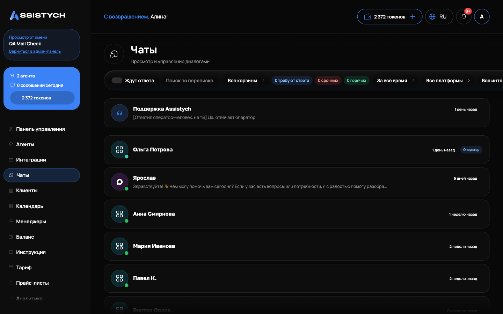

# Чаты

Раздел «Чаты» в левом меню собирает все переписки с клиентами со всех подключённых каналов: Авито, Telegram, ВКонтакте, виджет на сайте (подключение каналов описано в [Интеграции](../integrations/messengers.md)). Здесь вы смотрите, что бот ответил клиентам, забираете диалог себе и отвечаете вручную. Открывайте раздел, когда хотите проверить работу бота или ответить клиенту лично.

## Список чатов

Каждая строка списка это один диалог с клиентом. В строке видно:

- Имя клиента: имя или @username из Telegram, имя покупателя с Авито, имя из ВКонтакте. Если имени нет, показывается «Аноним» или «User ...».
- Аватар: иконка канала (Telegram, MAX и т.д.), а у чатов Авито фото покупателя, если оно есть.
- Краткое описание диалога: одна строка о сути переписки. Её можно править: откройте чат и нажмите карандаш рядом с описанием под заголовком «Сообщения».
- Бейдж «Оператор», если диалог ведёт человек, а не бот.
- Синий кружок с числом: сколько сообщений клиента осталось без нашего ответа («Без ответа: N», больше 99 показывается как «99+»).
- Плашки с именем агента и названием интеграции, через которую пришёл диалог.
- Число сообщений в диалоге, расход по чату в токенах (у старых чатов, живших до токеновой системы, может показываться сумма в рублях), дата первого обращения клиента и время последнего сообщения («5 минут назад»).

Список подгружается порциями: внизу кнопка «Загрузить ещё». Если чатов ещё нет, вы увидите «Чатов пока нет» и подсказку: диалоги появятся, когда клиенты напишут вашим интеграциям.

## Непрочитанные и счётчик в меню

Чат считается непрочитанным, если после вашей последней отметки о прочтении клиент написал новое содержательное сообщение. Счётчик непрочитанных показывается бейджем на пункте «Чаты» в левом меню, чтобы было видно, не заходя в раздел.

Прочтение снимается автоматически: когда вы открываете чат, и когда вы сами отправляете ответ клиенту (даже из уведомления, не открывая переписку). Отдельно ничего нажимать не нужно.

## Статус бота у чата

У каждого чата есть состояние «кто сейчас ведёт диалог». Возможные подписи:

- «Бот отвечает автоматически»: всё в порядке, агент работает.
- «Ведёт оператор»: вы или менеджер нажали «Взять управление».
- «Передано менеджеру»: бот сам перевёл диалог на человека, но человек ещё не подключился.
- «Агент выключен»: агент остановлен, бот не ответит.
- «Канал не работает»: у интеграции ошибка (например, отозван токен).
- «Канал отключён»: интеграция остановлена.
- «Баланс исчерпан»: кончились токены, бот молчит до пополнения (см. [Баланс](../billing/tokens.md)).

Статус считается по факту: если агент выключен или токены на нуле, вы увидите честную причину, а не «бот работает».

## Фильтры и поиск

Над списком строка фильтров:

- «Поиск по переписке»: ищет по тексту сообщений и имени клиента. Введите слово и подождите долю секунды, список сам обновится.
- Период: «За всё время», «Обратился за 7 дней», «Обратился за 30 дней», «Обратился за 90 дней». Фильтр по дате ПЕРВОГО обращения клиента.
- «Все платформы»: только чаты одного канала (Telegram, Авито, ВКонтакте, MAX, API).
- «Все интеграции»: чаты одной конкретной интеграции, если их несколько.
- Режим: «Все чаты», «С оператором» (диалог ведёт человек), «Только бот».

Диалоги, где клиент ждёт ответа человека, видны прямо в списке: на строке чата синий бейдж «Без ответа: N» показывает, сколько сообщений клиента осталось без нашего ответа. Отдельный срез «Ждут ответа» собирает такие диалоги вместе: клиент написал после вашего последнего ответа и никто ему не ответил, либо бот передал диалог менеджеру, а менеджер молчит. Служебные события Авито (звонок, «посмотрел номер») сюда не попадают: клиент ничего не писал. Учитываются обращения за последние 7 дней, более старое ожидание считается архивом. Самые долго ждущие сверху, у чата видно, сколько времени клиент ждёт.
## Экран чата

Нажмите на строку, откроется переписка. Слева сообщения с разделителями по датам, справа панель «Информация о клиенте»: платформа, имя пользователя, внешний ID, подключённый агент, интеграция, режим ответа, когда диалог начат. Если диалог пришёл с Авито по объявлению, в панели карточка объявления: фото, название (кликабельная ссылка), цена. Ссылки в сообщениях кликабельны. У чатов Авито на наших сообщениях есть галочки прочтения: одна, доставлено, две, прочитано клиентом.
### Как ответить самому

Пока диалог ведёт бот, поле ввода заменено подсказкой «Бот отвечает автоматически». Чтобы писать самому:

1. Нажмите «Взять управление» в шапке. Автоответы по этому диалогу выключатся, бот не будет перебивать.
2. Пишите в поле «Введите сообщение...», кнопка «Отправить». Ручные сообщения не расходуют токены: списание идёт только за ответы бота.
3. Закончили, нажмите «Вернуть боту»: автоответы включатся снова.

Если диалог уже взял коллега, вы всё равно можете писать: чат перезакрепится на того, кто отправил сообщение, а автор каждой реплики сохраняется в истории.

Дополнительно в поле ввода:

- Вложения (скрепка «Прикрепить файл»): фото и файлы, до 10 вложений за сообщение, файл до 25 МБ. В чаты Авито файлы отправить нельзя, такой возможности нет у самой площадки.- «Ответить с цитатой»: у сообщения выберите ответ с цитатой, текст появится над полем ввода; «Убрать цитату» снимает её.
- «Отправить позже»: текст уйдёт клиенту в выбранное время. Запланированные сообщения видны списком над полем ввода, там же кнопка «Отменить отправку».
- «Шаблоны сообщений»: заготовки быстрых ответов. Наберите текст и нажмите «Сохранить текущий текст как шаблон». Лимит 50 шаблонов, лишние удаляются кнопкой «Удалить шаблон».

Новые сообщения подгружаются сами, обновлять страницу не нужно.

## Поддержка Assistych

Первой строкой в списке закреплён чат «Поддержка Assistych»: прямая связь с нашей командой из кабинета. Он всегда сверху, не участвует в фильтрах и поиске, у него свой счётчик непрочитанного.

Открывается тот же экран чата, но без кнопок «Взять управление» и «Вернуть боту»: вы всегда пишете как клиент. Вложения и голосовые работают. На пустом диалоге первым придёт приветствие: чем поддержка может помочь.

В этот же чат приходят проактивные сообщения поддержки: кончились токены (с кнопкой пополнить), подписка истекает через 3 дня, интеграция перестала работать (например, отозван доступ Авито или Telegram). Если у вас привязан Telegram или MAX (см. [Настройки](../settings/overview.md)), ответ поддержки продублируется туда.

Чат с поддержкой удобен и нам, и вам: оператор сразу видит ваш тариф, баланс токенов и состояние интеграций, поэтому не задаёт лишних вопросов. Пишите сюда по любой проблеме: бот первой линии ответит сразу или передаст вопрос человеку.

## Если что-то пошло не так

- Кнопка «Отправить» не работает, ошибка отправки. Проверьте, что вы нажали «Взять управление»: писать вручную можно только в режиме оператора.
- Файл не уходит в чат Авито. Это ограничение площадки: отправка файлов поддерживается в Telegram, ВКонтакте и виджете, в Авито нет.- Бот молчит. Посмотрите статус у чата: «Баланс исчерпан» лечится пополнением токенов, «Агент выключен» включением агента, «Канал не работает» переподключением интеграции в разделе [Интеграции](../integrations/messengers.md).
- «Чат не найден» при открытии. Диалога нет или у вас нет к нему доступа, вернитесь «Назад к чатам» и обновите список.
- Бейдж непрочитанного не сбрасывается. Откройте сам чат: отметка о прочтении ставится при открытии. Если не помогло, обновите страницу.
- Чат «Поддержка Assistych» не открывается. Возможно, чат поддержки временно недоступен: подождите и попробуйте позже либо напишите нам в Telegram.
