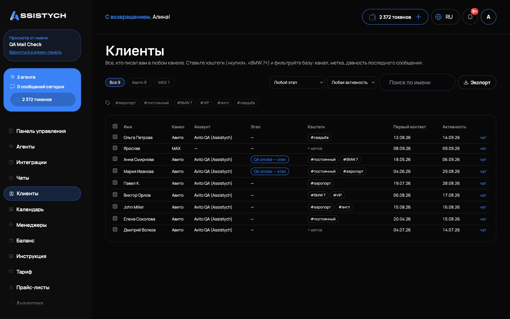
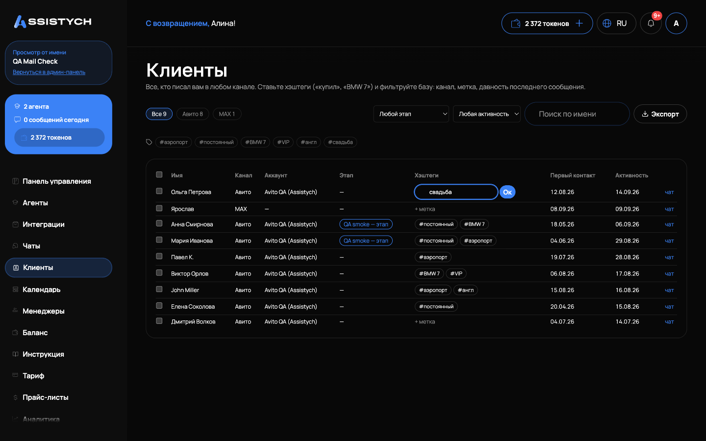

# Клиенты

Раздел «Клиенты» в левом меню это база всех, кто писал вам в любом подключённом канале: Авито, Telegram, ВКонтакте, виджет на сайте. Здесь удобно смотреть базу целиком, метить клиентов хэштегами, фильтровать по каналу и давности, выгружать в CSV и массово переводить диалоги по этапам воронки.

Клиент в этом разделе это диалог. Если один и тот же человек написал вам и в Авито, и в Telegram, это будут две строки: автоматической склейки людей между каналами нет.

## Список

Таблица показывает по каждому клиенту: «Имя», «Канал», «Аккаунт» (интеграцию), «Этап» воронки с цветом, «Хэштеги», «Первый контакт» и «Активность» (дата последнего сообщения). Ссылка «чат» в конце строки открывает сам диалог в разделе [Чаты](../chats/assistant.md).

Сортировка по последней активности, свежие сверху. Список листается постранично.

Если база пуста, вы увидите подсказку: «Пока пусто: здесь появятся все, кто напишет вам в подключённые каналы».

## Каналы и фильтры

Над таблицей переключатели каналов со счётчиками: «Все» и отдельно каждый канал, где есть клиенты (больше клиентов, левее). Дальше фильтры:

- Хэштег: под переключателями лежат все хэштеги, которые вы когда-либо ставили, чаще используемые первыми. Клик по хэштегу фильтрует список, повторный клик снимает фильтр.
- Этап воронки: показать только клиентов на выбранном этапе. Этапы сгруппированы по агентам, у каждого агента своя воронка.- Давность: «Любая активность», «Молчит 7+ дней», «Молчит 30+ дней», «Молчит 90+ дней». Считается по дате последней активности в диалоге.
- «Поиск по имени»: подстрока по имени клиента. Введите текст и подождите долю секунды, список обновится сам.

Фильтры работают вместе: например, «Авито + молчит 30+ дней + #купил» покажет покупателей из Авито, которым вы месяц не писали. Если по фильтрам никого нет, таблица скажет «По выбранным фильтрам никого нет».

## Хэштеги

Хэштеги это ваши ручные метки на диалоге: «купил», «BMW 7», «должник», что угодно.

1. Нажмите «+ метка» в строке клиента (или на существующие хэштеги, чтобы изменить).
2. Введите метки через запятую и нажмите «Ок» или Enter. Escape отменяет правку.

Ограничения: до 10 хэштегов на один диалог, каждый до 40 символов. Символ «#» в начале можно не вводить, он подставится сам. Пробелы внутри метки допустимы, повторы схлопываются.

## Экспорт в CSV

Кнопка «Экспорт» над списком выгружает текущий список в CSV с учётом включённых фильтров: выгружается ровно то, что вы видите на экране. За раз выгружается до 5000 строк.
В файле колонки: «Имя», «Канал», «Интеграция», «Этап воронки», «Теги», «Первое обращение», «Последняя активность», «ID диалога». Файл открывается в Excel с корректной кириллицей (выгрузка в UTF-8 с BOM).

## Массовые действия

Выделите клиентов галочками (галочка в шапке выделяет всю страницу), появится панель «Выбрано: N»:

- Хэштеги: в поле «+ хэштеги, через запятую» впишите метки, которые надо проставить, в поле «− хэштеги, через запятую» те, что снять. Можно заполнить только одно из полей.
- Этап воронки: выберите этап в списке «→ этап (не менять)», все выбранные клиенты перейдут на него.

Нажмите «Применить». Действие выполняется одной операцией ко всем выбранным, максимум 500 диалогов за раз.
Ограничения и особенности:

- Этап применяется только к диалогам, чей агент ведёт эту воронку: этапы у каждого агента свои. Диалоги других агентов будут пропущены, вы увидите предупреждение «N диалогов другого агента, этап не применён».- Если часть диалогов уже недоступна (удалены), они не помешают остальным: появится подсказка «N диалогов не найдено, список мог обновиться».- Если у диалога уже 10 хэштегов, при массовом добавлении список обрежется до лимита, сама операция не упадёт.

## Если что-то пошло не так

- Клиент есть в «Чатах», но его нет в «Клиентах». В раздел попадают только диалоги клиентских каналов (Авито, Telegram, ВКонтакте, виджет, MAX): тестовые чаты из песочницы агента сюда не входят.
- Хэштег не сохраняется. Проверьте лимиты: не больше 10 меток на диалог и не длиннее 40 символов каждая. Лишние пробелы и «#» в начале можно не убирать, система почистит сама.
- В экспорте меньше строк, чем клиентов. Выгрузка ограничена 5000 строк: сузьте список фильтрами (канал, давность, хэштег) и выгружайте частями.
- Массовая смена этапа сработала не для всех. Этапы привязаны к агенту: диалоги другого агента пропускаются с предупреждением. Выбирайте этап той воронки, к которой относятся выбранные диалоги.
- Кириллица в CSV «ломается». Файл отдаётся в UTF-8 с BOM специально под Excel: открывайте двойным кликом, а не через «Импорт текста» со своей кодировкой.- Фильтр по хэштегу не находит диалог, где метка есть. Клик по хэштегу работает как переключатель: проверьте, не включён ли одновременно другой фильтр (канал, давность), который сужает выдачу.
