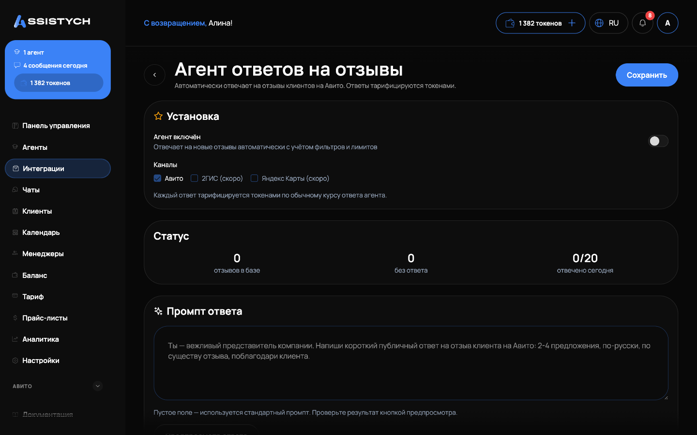

# Агент ответов на отзывы

Готовый агент, который сам отвечает на отзывы вашего аккаунта Авито. Ставится из **Магазина** в один клик: **Магазин → «Агент ответов на отзывы» → Установить**. Ответы тарифицируются токенами по обычному курсу ответа агента.

## Что настраивается

* **Промпт** — как отвечать, каким тоном. Пустое поле = стандартный промпт (вежливый ответ 2-4 предложения, без клише).
* **Минимальная оценка** — порог «негатива». Отзывы с оценкой ниже него обрабатываются по отдельному правилу (см. ниже), равные и выше получают обычный ответ.
* **Задержка перед ответом** — новый отзыв получает ответ не раньше, чем через это время (по умолчанию час): у вас есть окно ответить лично.
* **Лимит ответов в день и интервал между ответами** — ответы уходят по одному с паузой, никогда не пачкой.
* **Пропуск отвеченных** — на отзыв, где уже есть ответ на Авито, агент не отвечает повторно.
* **Старые отзывы** — по умолчанию агент отвечает только на новые. Бэклог до включения агента включается отдельным тумблером и разбирается постепенно, в рамках дневного лимита.


Кнопка **«Предпросмотр ответа»** показывает, как агент ответит на реальный неотвеченный отзыв, ничего не отправляя. Если таких нет — покажет ответ на отзыв-образец.


## Негативные отзывы

Для отзывов ниже минимальной оценки два режима:

* **Не отвечать (оставить владельцу)** — по умолчанию. Решение по негативу остаётся за человеком.
* **Отвечать отдельным промптом** — сдержанный вежливый ответ: сожаление о впечатлении, без споров, предложение связаться с компанией.
