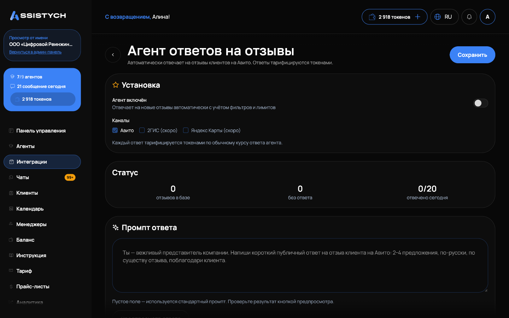
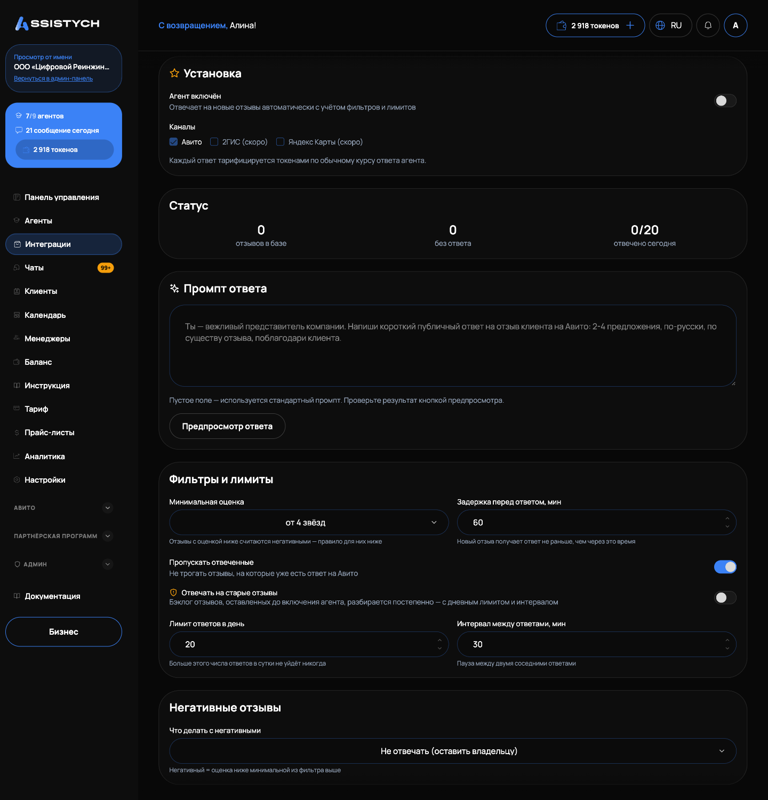

# Агент ответов на отзывы

Готовый агент, который сам отвечает на отзывы вашего аккаунта Авито по вашему сценарию: вежливо, с задержкой и лимитами, чтобы ответы выглядели естественно. Ставится из Магазина в один клик, настраивается одной страницей. Ответы тарифицируются токенами по обычному курсу ответа агента (см. [Токены и пополнение](../billing/tokens.md)).

## Установка

1. Откройте «Интеграции» в левом меню, вкладка «Все продукты и услуги», раздел «Бизнес-инструменты».
2. На карточке «Агент ответов на отзывы» нажмите «Установить».
3. Откроется страница настройки агента. Включите тумблер «Агент включён» и нажмите «Сохранить».

Для работы нужен подключённый аккаунт Авито (см. [Подключение Авито](../getting-started/connect-avito.md)). Канал один: «Авито», остальные помечены «(скоро)».

Блок «Статус» показывает: сколько отзывов в базе, сколько без ответа, сколько отвечено сегодня (день считается по Москве) и список «Последние ответы» с оценкой, автором и текстом ответа.

## Что настраивается

Блок «Промпт ответа»:

- Промпт: как отвечать, каким тоном. Пустое поле означает стандартный промпт: вежливый ответ 2-4 предложения по существу отзыва, с благодарностью, без шаблонных клише, без обилия эмодзи, без обещаний скидок и сроков.
- Кнопка «Предпросмотр ответа» показывает, как агент ответит на самый свежий неотвеченный отзыв, ничего не отправляя. Если таких нет, покажет ответ на отзыв-образец с пометкой «Неотвеченных отзывов нет, показан ответ на отзыв-образец». Предпросмотр не тарифицируется.

Блок «Фильтры и лимиты»:

- «Минимальная оценка»: порог негатива, варианты «от N звёзд». Отзывы с оценкой ниже считаются негативными и обрабатываются по отдельному правилу (см. ниже), равные и выше получают обычный ответ.
- «Задержка перед ответом, мин»: новый отзыв получает ответ не раньше, чем через это время (по умолчанию 60 минут). У вас есть окно ответить лично.
- «Пропускать отвеченные»: не трогать отзывы, на которые уже есть ответ на Авито.
- «Отвечать на старые отзывы»: по умолчанию агент отвечает только на новые, оставленные после включения. Этот тумблер подключает бэклог: старые отзывы разбираются постепенно, в рамках дневного лимита и интервала. Граница «новые/старые» фиксируется при первом включении агента и дальше не двигается.
- «Лимит ответов в день»: больше этого числа ответов в сутки не уйдёт никогда (по умолчанию 20).
- «Интервал между ответами, мин»: пауза между двумя соседними ответами (по умолчанию 30, минимум 5). К паузе всегда добавляется небольшая случайная добавка, поэтому ответы уходят по одному и выглядят естественно, а не как рассылка по таймеру.

Отдельное правило расписания: ответы отправляются только с 9:00 до 21:00 по Москве. Отзыв, пришедший ночью, получит ответ утром.

## Негативные отзывы

Блок «Негативные отзывы» решает, что делать с отзывами ниже минимальной оценки. Два режима «Что делать с негативными»:

- «Не отвечать (оставить владельцу)»: режим по умолчанию, решение по негативу остаётся за человеком.
- «Отвечать отдельным промптом»: поле «Промпт для негативных». Пустое поле даёт стандартный вариант: сдержанный вежливый ответ, благодарность за обратную связь, сожаление о впечатлении, без споров и оправданий, предложение связаться с компанией для решения вопроса.

## Если что-то пошло не так

- Агент включён, но ответы не уходят. Проверьте по очереди: есть ли токены на балансе, подключён ли аккаунт Авито, не ночь ли сейчас по Москве (ответы только 9:00-21:00), не исчерпан ли «Лимит ответов в день», прошла ли «Задержка перед ответом».
- На старый отзыв ответа нет. Это штатно: бэклог до включения агента разбирается только с тумблером «Отвечать на старые отзывы», постепенно и в рамках лимита.
- На отзыв с ответом агент ответил повторно. Так быть не должно при включённом «Пропускать отвеченные»: проверьте тумблер и напишите в чат «Поддержка Assistych».- «Не удалось сгенерировать предпросмотр». Обычно временный сбой нейросети: повторите через минуту. Настройки при этом сохраняются, на работу агента ошибка предпросмотра не влияет.
- «Не удалось сохранить настройки». Проверьте интернет и повторите. Лимиты имеют границы: задержка до 10080 минут, лимит от 1 до 100 в день, интервал от 5 минут, промпт до 4000 символов.
- Ответ на негативный отзыв не ушёл, хотя режим «Отвечать отдельным промптом». Проверьте «Минимальная оценка»: отзыв мог оказаться НЕ ниже порога и уйти по обычному правилу или в общую очередь с задержкой.
- Отзыв удалили на Авито, а он числится в статистике. Удалённые на площадке отзывы снимаются из счётчиков ночным полным прогоном: до утра цифра может быть завышена.
