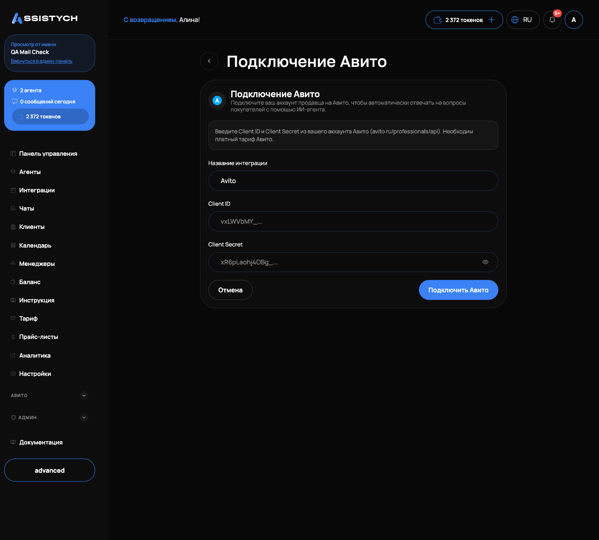
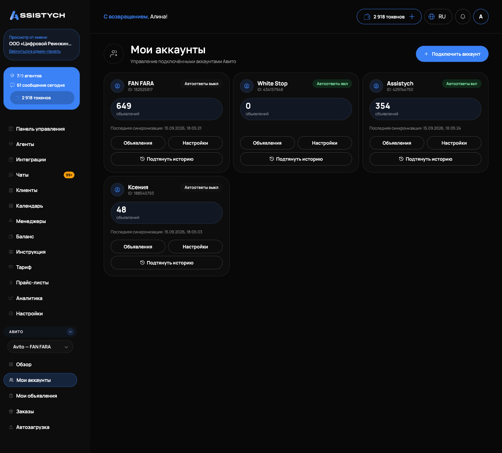

# Подключение Авито

Как подключить аккаунт Авито к кабинету, чтобы агент отвечал покупателям в чатах Авито, а объявления, заказы и статистика были видны в Assistych. Нужно один раз для каждого аккаунта Авито.

## Что понадобится

Пара ключей API Авито: «Client ID» и «Client Secret». Их берут в кабинете Авито для разработчиков: avito.ru/professionals/api.Форма подключения подсказывает: для работы API нужен платный тариф Авито.
## Подключение первого аккаунта

1. В левом меню откройте группу «Авито» → «Мои аккаунты».
2. Нажмите «Подключить аккаунт». Откроется форма «Подключение Авито».
3. Заполните поля:
   - «Название интеграции»: как аккаунт будет называться в кабинете, например «Мой магазин Авито». Если оставить как есть, после подключения подставится имя из Авито.
   - «Client ID»: ключ из кабинета Авито.
   - «Client Secret»: второй ключ из кабинета Авито. Поле скрывает ввод, как пароль.
4. Нажмите «Подключить Авито».

Assistych проверяет ключи на стороне Авито. Если ключи верные, аккаунт подключается, и вы попадаете на страницу интеграции. Если нет, появится сообщение об ошибке: проверьте, что скопировали оба ключа целиком и без пробелов.

Тот же аккаунт можно подключить и из раздела «Интеграции»: карточка «Авито» → «Подключить Авито». Форма та же.

## Что видно на карточке аккаунта

После подключения аккаунт появляется на странице «Мои аккаунты». На карточке видно:

- имя аккаунта из Авито и его ID;
- статус: «Автоответы вкл» или «Автоответы выкл»;
- число объявлений;
- телефон и почту аккаунта, если Авито их отдал;
- «Последняя синхронизация»: когда мы в последний раз получали данные аккаунта.

С карточки доступны кнопки «Объявления» (переход в «Мои объявления»), «Настройки» (страница интеграции) и «Подтянуть историю».

## Второй и следующие аккаунты

Второй аккаунт подключается так же: кнопка «Подключить аккаунт» на странице «Мои аккаунты» и своя пара ключей от другого аккаунта Авито.

Когда аккаунтов больше одного, в левом меню в группе «Авито» появляется переключатель «Активный аккаунт Авито». Все разделы группы («Обзор», «Мои объявления», «Заказы», «Автозагрузка» и остальные) показывают данные выбранного аккаунта. Выбор запоминается: после перезахода в кабинет активным останется тот же аккаунт.

## Автоответы и привязка к агенту

Каждый аккаунт привязан к агенту: именно агент отвечает покупателям в чатах. Если подключать аккаунт из раздела «Агенты» (карточка агента → «Интеграции»), привязка выбирается сразу. Если агента не выбрать, при подключении создаётся выключенный агент «Авито-ассистент»: ничего не отвечает, пока вы его не включите и не настроите.

Автоответы включаются и выключаются на странице интеграции: кнопка «Настройки» на карточке аккаунта, затем «Включить автоответы» или «Выключить автоответы». Рядом есть подсказка: «Автоответы: бот отвечает покупателям в чатах этого аккаунта. Статистика и объявления работают независимо от автоответов».

Выключенный агент или выключенные автоответы это режим «только мониторинг»: переписка, объявления и статистика видны, но бот не отвечает. Про настройку самого агента: [Агенты](../agents/overview.md).

## История переписки

Если у аккаунта уже есть переписка с покупателями, нажмите на карточке «Подтянуть историю». Импорт добавит в «Чаты» сообщения клиентов из истории Авито, дубли исключаются. Если переписка уже импортировалась раньше, кабинет уточнит число диалогов и попросит подтверждение. Импорт занимает несколько минут, сообщения появляются постепенно.

## Требования Авито к отдельным функциям

Чаты в реальном времени требуют платной подписки «API мессенджера» в кабинете Авито. Без неё сообщения подтягиваются фоновой сверкой с задержкой до часа, и бот не может отвечать мгновенно.
Для управления ставками и автозагрузки у аккаунта Авито должен быть доступ к соответствующим разделам Авито: Pro-кабинет и автозагрузка.
## Если что-то пошло не так

- Ошибка при подключении после ввода ключей: проверьте, что «Client ID» и «Client Secret» скопированы из одного приложения в кабинете Авито, целиком и без пробелов по краям.
- Сообщение «Выберите агента»: форма открылась без привязки к агенту. Подключите аккаунт через карточку агента: «Агенты» → нужный агент → «Интеграции» → «Авито».
- Аккаунт подключён, но бот молчит: проверьте статус на карточке. Если «Автоответы выкл», включите их через «Настройки». Также проверьте, что агент включён и на нём хватает токенов: [Баланс](../getting-started/balance.md).
- Сообщения приходят с задержкой: скорее всего, на Авито не оформлена подписка «API мессенджера», сообщения подтягиваются фоновой сверкой.- «Импорт истории уже идёт»: повторный запуск не нужен, дождитесь завершения. Переписка появится в «Чатах» в течение нескольких минут.
- В меню нет переключателя аккаунтов: он появляется, только когда подключено два аккаунта и больше.

Дальше: [Мои объявления](../listings/overview.md), [Чаты](../chats/assistant.md), [Панель управления](../getting-started/dashboard.md).
