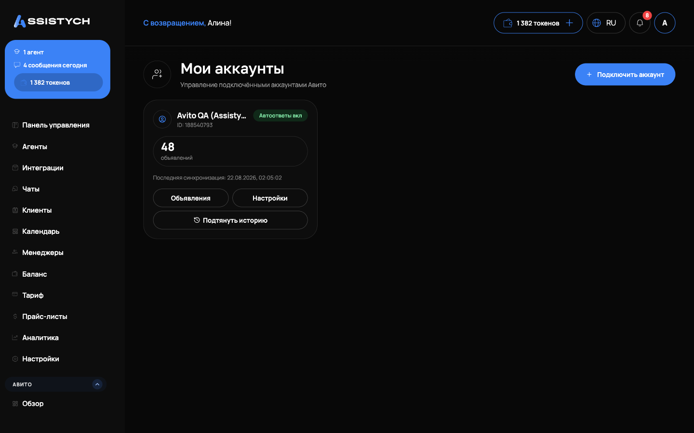

# Подключение Авито

1. В левом меню откройте раздел **Авито → Мои аккаунты**.
2. Нажмите «Подключить Авито» и авторизуйтесь в своём аккаунте Авито.
3. После подключения аккаунт появится в списке.


Для управления ставками и автозагрузки у аккаунта Авито должен быть доступ к соответствующим разделам Авито (Pro-кабинет и автозагрузка).

