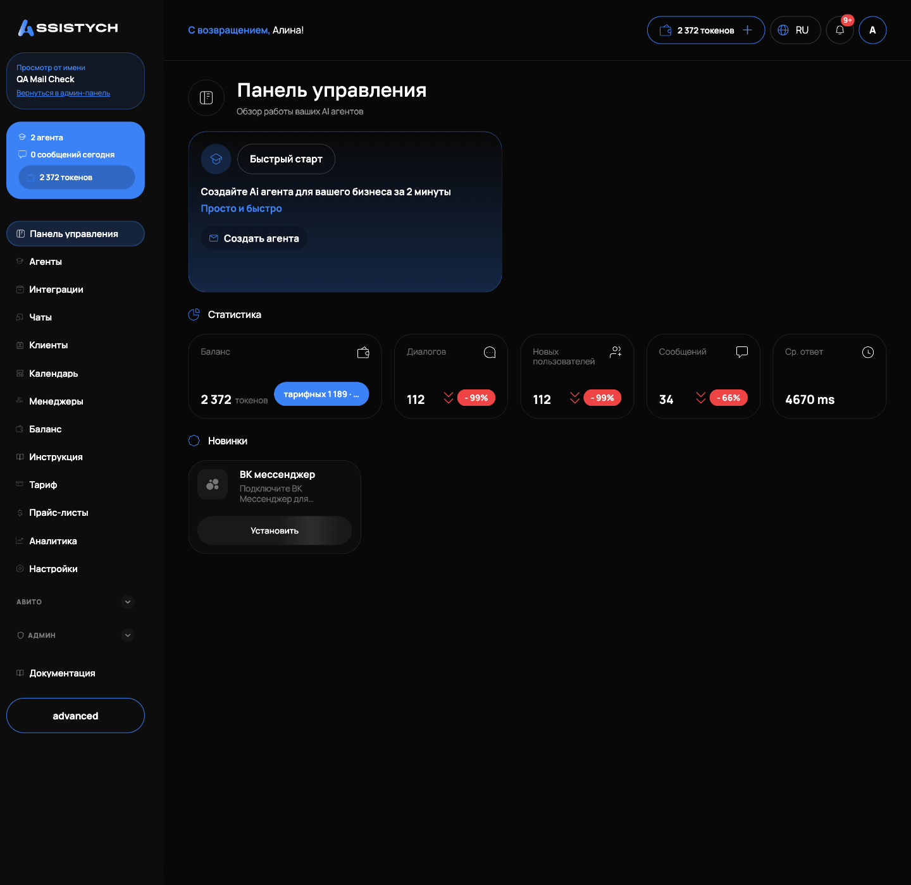

# Панель управления

Стартовый экран кабинета: сводка по агентам, баланс токенов и быстрые переходы в основные разделы. Открывается из левого меню пунктом «Панель управления». Подходит, чтобы за минуту понять, что происходит в кабинете: работают ли агенты, хватает ли токенов.

## Что на экране

Сверху заголовок «Панель управления» с подписью «Обзор работы ваших AI агентов». Ниже идут три блока: карточки быстрого старта, «Статистика» и «Новинки».

## Быстрый старт

Под заголовком лежат карточки быстрых действий.

Карточка «Быстрый старт» предлагает: «Создайте Ai агента для вашего бизнеса за 2 минуты». Кнопка «Создать агента» ведёт в раздел «Агенты», где создаётся первый агент. Подробно: [Агенты](../agents/overview.md).

Если вы ещё не подтвердили почту, рядом может быть карточка с предложением подтвердить e-mail и кнопкой «Отправить письмо повторно». После подтверждения она пропадает. Про подтверждение почты: [Регистрация и вход](../getting-started/registration.md).

## Статистика

Блок «Статистика» показывает пять карточек.

«Баланс»: текущий запас токенов. Крупно выведено общее число с подписью «токенов», под ним расшифровка «тарифных · докупленных»: сколько токенов осталось из пакета тарифа и сколько из докупленных отдельно. Про устройство токенов: [Баланс](../getting-started/balance.md) и [Токены и пополнение](../billing/tokens.md).

Остальные карточки это счётчики работы агентов:

- «Диалогов»: сколько всего диалогов с клиентами вели агенты.
- «Новых пользователей»: сколько уникальных клиентов написало.
- «Сообщений»: сколько всего сообщений обработано.
- «Ср. ответ»: среднее время ответа агента в миллисекундах.

У карточек «Диалогов», «Новых пользователей» и «Сообщений» рядом со значением показывается стрелка тренда: зелёная вверх или красная вниз. Она сравнивает последние дни с предыдущим периодом и помогает заметить рост или просадку обращений.

Подробную статистику по дням, каналам и агентам смотрите в разделе [Аналитика](../analytics/overview.md).

## Новинки

Блок «Новинки» показывает свежие возможности кабинета. Сейчас там карточка «ВК мессенджер» с описанием «Подключите ВК Мессенджер для автоматического общения с клиентами» и кнопкой «Установить», которая ведёт в раздел «Интеграции». Про подключение мессенджеров: [Интеграции: Telegram, MAX, ВКонтакте и виджет](../integrations/messengers.md).

## Левое меню

Через левое меню открываются все разделы кабинета. У владельца бизнеса видно всё:

- «Панель управления»: этот экран.
- «Агенты»: создание и настройка ИИ-агентов.
- «Интеграции»: подключение мессенджеров и сервисов.
- «Чаты»: переписка с клиентами.
- «Клиенты»: база клиентов.
- «Календарь»: записи и заказы.
- «Менеджеры»: сотрудники с ограниченным доступом.
- «Баланс»: токены и история списаний.
- «Тариф»: подписка и её использование.
- «Прайс-листы»: загрузка цен для агентов.
- «Аналитика»: детальная статистика.
- «Настройки»: профиль, реквизиты, API-ключи.

Отдельная группа «Авито»: «Обзор», «Мои аккаунты», «Мои объявления», «Заказы», «Автозагрузка», «Конвейер», «Перепубликация», «Фото», «Управление ставками», «Аналитика», «Профили клиентов». Если подключено несколько аккаунтов Авито, в этой группе есть переключатель активного аккаунта: [Подключение Авито](../getting-started/connect-avito.md).

Менеджер видит только «Чаты», «Календарь» и «Настройки»: [Менеджеры и роли](../managers/overview.md).

## Виджеты внизу меню

В нижней части левого меню два компактных виджета.

Виджет агентов и сообщений: строка «N агентов» (активных из общего числа, ссылка ведёт в «Агенты») и строка «M сообщений сегодня» (ссылка ведёт в «Аналитику»).

Виджет баланса: текущий остаток в токенах. Нажатие открывает [Баланс](../getting-started/balance.md). Виджет подсвечивает проблемы:

- жёлтая подсветка и подпись «Низкий баланс»: токенов осталось меньше 50;
- красная подсветка и подпись «Пополните баланс»: токены на нуле, агенты остановлены.

## Кому что смотреть

Типовой сценарий утренней проверки: открыть «Панель управления», глянуть баланс токенов и счётчики диалогов, при просадке перейти в «Чаты» или «Аналитику» и разобраться. Если «Ср. ответ» заметно вырос или диалогов стало меньше, проверьте, что агенты включены и интеграции активны.

## Если что-то пошло не так

- Все счётчики по нулям, хотя переписка идёт: статистика обновляется не мгновенно. Откройте страницу позже или сверьтесь с «Чатами» напрямую.
- Карточка «Баланс» показывает ноль, а работа идёт: проверьте виджет баланса в меню и раздел «Баланс». Если там тоже ноль, пополните: [Баланс](../getting-started/balance.md).
- «Ср. ответ» равен 0 ms: агенты ещё не отвечали в выбранном периоде, метрике просто не из чего считаться.
- Не видно разделов «Авито» в меню: не подключён ни один аккаунт Авито. Подключите: [Подключение Авито](../getting-started/connect-avito.md).
- В меню нет половины разделов: вы вошли как менеджер. Полный доступ только у владельца: [Менеджеры и роли](../managers/overview.md).

Дальше: [Баланс](../getting-started/balance.md), [Агенты](../agents/overview.md), [Аналитика](../analytics/overview.md).
