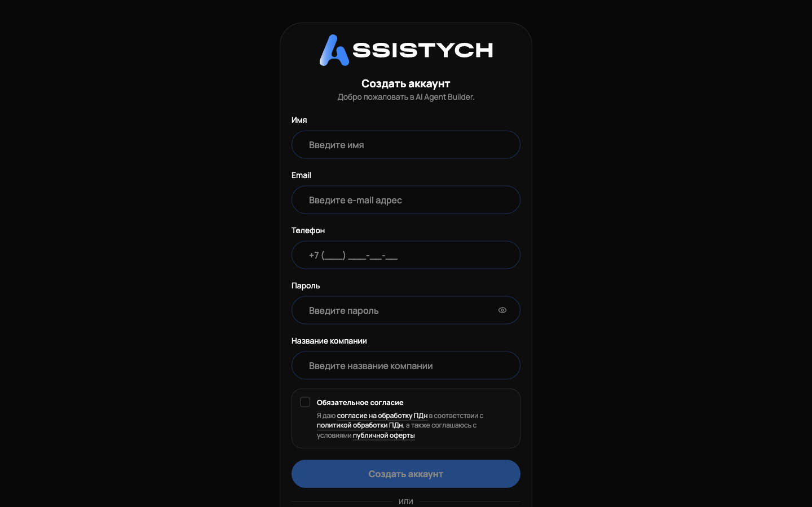

# Регистрация и вход

Как создать аккаунт Assistych, войти в кабинет и восстановить пароль. Нужно один раз при старте и каждый раз, когда вы заходите в кабинет с нового устройства.

## Регистрация

Откройте assistych.ru и нажмите «Войти / Регистрация», затем на экране входа перейдите по ссылке «Регистрация» рядом с подсказкой «Нет аккаунта?». Откроется форма «Создать аккаунт».

Заполните поля:

- «Имя»: как к вам обращаться, минимум 2 символа.
- «Email»: на эту почту придут письма о подтверждении, платежах и уведомления.
- «Телефон»: российский номер, формат подставляется сам: +7 (___) ___-__-__.
- «Пароль»: минимум 8 символов.
- «Название компании»: минимум 2 символа. Так будет называться ваш кабинет.

Ниже обязательный блок «Обязательное согласие»: поставьте галочку, что даёте согласие на обработку ПДн и принимаете условия публичной оферты. Документы открываются по ссылкам прямо из формы. Без галочки кнопка «Создать аккаунт» неактивна.

Нажмите «Создать аккаунт». Если поле заполнено неверно, под ним появится подсказка, что исправить. После регистрации вы сразу попадаете в кабинет, в раздел «Агенты», и для бизнеса автоматически включается пробный период с полным функционалом.

## Подтверждение почты

Сразу после регистрации на ваш email отправляется письмо со ссылкой подтверждения. Откройте письмо и перейдите по ссылке: появится экран «Email подтверждён!» с кнопкой «Перейти в кабинет».

Подтверждение не блокирует работу: кабинет доступен и без него. Но без подтверждённой почты вы не получите письма о платежах и уведомления, поэтому лучше подтвердить сразу.

Если ссылка устарела или уже использована, на экране будет «Ошибка подтверждения» и подсказка запросить письмо ещё раз из кабинета.

## Вход

На экране входа (заголовок «С возвращением!») введите «Email» и «Пароль», нажмите «Войти». При неверной паре почта и пароль появится сообщение «Неверный email или пароль. Попробуйте снова».

Есть и другие способы входа:

- Через VK ID: кнопка «Войти с VK ID» под разделителем «или».
- Через Яндекс ID: кнопка «Войти с Яндекс ID».

Кнопки внешних сервисов показываются, только если вход через них включён на сервере. Если вы видите только поля почты и пароля, значит вход через VK ID и Яндекс ID сейчас недоступен, используйте почту.
После входа владелец попадает в раздел «Агенты». Общий обзор работы смотрите на [Панели управления](../getting-started/dashboard.md), она открывается из левого меню.

## Вход менеджера

Менеджер не регистрируется сам: владелец отправляет ему приглашение из раздела «Менеджеры». Менеджер переходит по ссылке из приглашения, задаёт пароль и дальше входит на обычном экране входа. В поле «Email» менеджер может вводить свой логин без почты.

После входа менеджер попадает сразу в «Чаты». Ему доступны «Чаты», «Календарь» и «Настройки», остальные разделы скрыты. Подробно про приглашения и права: [Менеджеры и роли](../managers/overview.md).

## Восстановление пароля

Если забыли пароль:

1. На экране входа нажмите «Забыли пароль?» рядом с полем «Пароль».
2. На экране «Сброс пароля» введите «Email» и нажмите «Отправить ссылку».
3. Появится экран «Проверьте почту». Если аккаунт с таким email существует, на него уйдёт письмо со ссылкой. Ссылка действует 1 час.
4. Перейдите по ссылке из письма, на экране «Установить новый пароль» заполните поля «Новый пароль» и «Подтвердите пароль».

После смены пароля появится сообщение «Пароль обновлён! Теперь вы можете войти». Войдите с новым паролем.

Если ссылка просрочена, на экране будет «Недействительная ссылка». Нажмите «Запросить новую ссылку» и повторите сброс.

## Один кабинет: один бизнес

Один аккаунт равен одному бизнесу. Если у вас два бизнеса, заведите второй аккаунт на другую почту. Переключения между бизнесами внутри одного входа нет.

## Выход из кабинета

Нажмите на своё имя в шапке кабинета справа вверху: откроется меню с вашим именем и почтой. Внизу меню нажмите «Выйти». Вы вернётесь на экран входа.

## Если что-то пошло не так

- «Неверный email или пароль. Попробуйте снова»: проверьте раскладку клавиатуры и Caps Lock. Если не помогло, сбросьте пароль через «Забыли пароль?».
- Письмо не приходит (подтверждение или сброс пароля): проверьте папку «Спам» и правильность адреса. Запросите письмо повторно: для подтверждения из кабинета, для сброса кнопкой «Отправить ссылку» ещё раз.
- «Недействительная ссылка» при сбросе пароля: ссылка живёт 1 час. Запросите новую.
- Кнопка «Создать аккаунт» не нажимается: не поставлена галочка «Обязательное согласие» или не заполнено одно из полей. Подсказка появляется под проблемным полем.
- «Ошибка регистрации» и текст про email: такой адрес уже зарегистрирован. Войдите через «Войти» или восстановите пароль.
- После входа через VK ID или Яндекс ID ошибка «Не удалось получить данные профиля»: войдите по почте и паролю. Если аккаунта с паролем ещё нет, зарегистрируйтесь на ту же почту.
Дальше: [Подключение Авито](../getting-started/connect-avito.md), [Панель управления](../getting-started/dashboard.md), [Баланс](../getting-started/balance.md).
