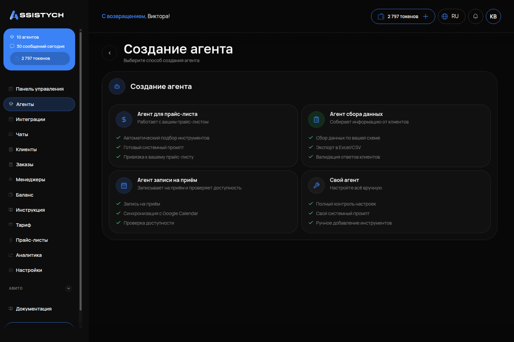

# Как создать агента

## Что это и зачем

**Агент** — ИИ-сотрудник. Он переписывается с клиентами в Telegram, на Авито, во ВКонтакте и в чате на сайте. У бизнеса может быть несколько агентов. Первый создаётся через мастер за две минуты.

## Где включается

Меню **«Агенты»** → кнопка **«Создать агента»** в правом верхнем углу.

## Что настроить

### Экран 1: «Выберите способ создания агента»

Четыре карточки:

- **«Агент для прайс-листа»** — «работает с вашим прайс-листом». Система сразу подключает инструменты цен и услуг и просит выбрать прайс-лист. Если прайсов нет, мастер предложит его создать.
- **«Агент сбора данных»** — «собирает информацию от клиентов». Подключает инструмент сбора заявок по вашей схеме полей.
- **«Агент записи на приём»** — «записывает и проверяет доступность». Подключает инструменты онлайн-записи: услуги, свободные окна, создание записи. Мастер попросит выбрать интеграцию записи.
- **«Свой агент»** — «Настройте всё вручную». Инструменты по умолчанию выключены.

Первые три карточки — это **тот же самый агент**, но с заранее включёнными инструментами. Выбор можно изменить: инструменты подключаются и отключаются на вкладке «Интеграции» (см. [Инструменты агента](12-instrumenty-agenta.md)). Единственное отличие: инструменты из шаблона помечены как заблокированные, отключить их у этого агента нельзя.

Что выбрать в первый раз: **«Свой агент»**. Так вы будете точно знать, какие функции включены. Если агент нужен только для записи — выбирайте «Агент записи на приём».

### Экран 2: «Как создать промпт?»

Две карточки:

- **«Сгенерировать с AI»** — «Опишите бота, AI создаст промпт». Напишите два-три предложения о бизнесе, и нейросеть составит инструкцию. Черновик можно отредактировать и перегенерировать.
- **«Написать вручную»** — «Полный контроль над промптом». Вы пишете инструкцию сами.

Совет: после автоматической генерации прочитайте результат целиком и добавьте стоп-правила — генератор их обычно не пишет. Что должно быть в инструкции — на странице [Инструкция агента](02-instrukciya-agenta.md).

### Экран 3: форма нового агента

- **«Название \*»** — имя агента в кабинете, например «Консультант по продажам». Обязательное поле.
- **«Описание»** — видно только вам, клиент его не увидит.
- **«Системный промпт \*»** — инструкция для работы, минимум 10 символов. Обязательное поле.
- **«Модель»** — оставьте вариант с пометкой «Рекомендуется». Как выбирать модель — на странице [Настройки агента](03-nastroyki-agenta.md).
- **«Макс. токенов ответа»** — длина ответа. По умолчанию стоит 1024, оставьте это значение.

Нажмите **«Создать агента»**. Новый агент появится в списке со статусом «Активен».

## Как проверить, что работает

1. В разделе «Агенты» появилась карточка с названием вашего агента.
2. Нажмите на карточке **«Тестовый чат»** и напишите «Здравствуйте» — агент ответил.
3. Для шаблонных агентов: на вкладке «Интеграции» в блоке «Что умеет агент» стоит статус «Работает» у нужного умения.

## Частые ошибки

- **Кнопка «Создать агента» неактивна.** Вы не выбрали прайс-лист или интеграцию. Вернитесь на шаг назад и выберите их.
- **Ошибка «Опишите роль агента: минимум 10 символов».** Поле «Системный промпт» пустое или слишком короткое.
- **Создали «Агента для прайс-листа», но прайса нет.** Агент отвечает «Нет источника». Создайте прайс в меню «Прайс-листы».
- **Ждут, что агент уже знает цены.** Не знает: цены живут в [базе знаний](05-baza-znaniy.md) и [прайс-листах](06-prays-listy.md), их нужно заполнить.
