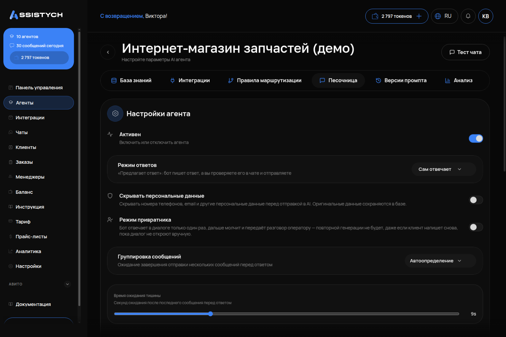

# Настройки агента

## Что это и зачем

**Настройки агента** — страница для управления работой агента. Здесь выбирают режим ответов, модель, сколько секунд ждёт, пока клиент допишет, и скрытие телефонов от нейросети. Сюда заходят при запуске и для смены режима работы.

Инструкция агента (поле «Системный промпт») находится здесь же. О ней читайте отдельно: [Инструкция агента](02-instrukciya-agenta.md).

## Где включается

Меню «Агенты» → карточка агента → кнопка **«Настройки агента»** справа вверху.

## Что настроить — поля по порядку

### «Активен»

Подпись: «Включить или отключить агента».

Выключенный агент молчит. Сообщения клиентов приходят и сохраняются в «Чатах». Это режим «только смотрю». Выключайте агента при обновлении инструкции или базы, чтобы клиенты не получали сырые ответы.

Что будет, если не включить: агент молчит во всех каналах, а вы ищете причину в интеграциях.

### «Режим ответов»

Два значения:

- **«Сам отвечает»** — агент пишет клиентам без вашего участия.
- **«Предлагает ответ»** — подпись в кабинете: «"Предлагает ответ": бот пишет ответ, а вы проверяете его в чате и отправляете». В разделе «Чаты» диалог получит пометку «Бот предлагает ответ». Под черновиком появятся кнопки **«Отправить»**, **«Изменить»**, **«Отклонить»**.

Что выбрать: в первые недели используйте «Предлагает ответ». Вы увидите сообщения до отправки клиенту и сможете доработать инструкцию. Когда черновики станут точными — включайте «Сам отвечает».

Что будет, если оставить «Предлагает ответ» и забыть про «Чаты»: клиенты не получат сообщений. Черновики будут ждать нажатия кнопки **«Отправить»**.

### «Возвращать диалог боту, если оператор молчит (часов)»

Подпись: «Оператор не писал столько часов: следующее сообщение клиента снова получит бот. 0 — не возвращать».

После нажатия кнопки «Взять управление» агент в этом диалоге замолкает. Это поле задаёт время, через которое агент вернётся к диалогу, если менеджер молчит. Значение «0» отключает возврат. Оптимально ставить 2–4 часа. Если менеджер уйдёт домой, клиент получит ответ от агента.

Что будет, если оставить 0: диалог останется за менеджером навсегда, даже если про клиента забыли.

### «Скрывать персональные данные»

Подпись: «Скрывать номера телефонов, email и другие персональные данные перед отправкой в AI. Оригинальные данные сохраняются в базе».

Включите опцию для защиты контактов клиентов. В кабинете и заказах данные видны. Они скрываются только в запросах к нейросети.

### «Режим привратника»

Подпись: «Бот отвечает в диалоге только один раз, дальше молчит и передаёт разговор оператору».

Это схема «автоответчик + человек». Агент реагирует на первое сообщение (например: «Здравствуйте, перевожу на менеджера. Уточните модель машины»). Дальше диалог ждёт оператора. **Клиент напишет второй раз и не получит ничего — это задумано.** Включайте режим, только если менеджер быстро разбирает «Чаты».

Что будет, если включить и забыть: после первого сообщения клиент будет писать в пустоту.

### «Группировка сообщений»

Подпись: «Ожидание завершения отправки нескольких сообщений перед ответом». Значения: **«Автоопределение»** и **«Выкл»**. Ниже поле **«Время ожидания тишины»** — «Секунд ожидания после последнего сообщения перед ответом».

Зачем: клиенты часто дробят мысли: «здравствуйте», «камри 2018», «стекло левое есть?». Без группировки агент выдаст три ответа. С «Автоопределением» он выдержит паузу и ответит одним сообщением.

Что ставить: «Автоопределение». «Время ожидания тишины» по умолчанию — 9 секунд, оставьте его. Если уменьшить — агент ответит быстрее, но может перебить клиента. Если увеличить — пауза затянется, зато клиент успеет дописать мысль.

### «Название \*», «Описание», «Системный промпт \*»

- «Название» — имя агента в кабинете и списке чатов. Обязательное поле.
- «Описание» — заметка для вас, клиент её не видит. Если оставить пустым, на карточке покажется начало инструкции.
- «Системный промпт» — инструкция агента, читайте на [отдельной странице](02-instrukciya-agenta.md).

### «Модель»

Список моделей — это «мозг» агента. Подписи в кабинете:

- **DeepSeek V4 Flash (Рекомендуется)**
- DeepSeek V4 Pro
- DeepSeek Chat (устаревшая)
- DeepSeek Reasoner (устаревшая)
- Kimi K2.6
- Kimi K2.5 (устаревшая)

Как выбирать, по замерам отдела:

- **Продажи по прайсу, чаты на Авито и в Telegram, где клиент ждёт** — **DeepSeek V4 Flash**. Отвечает за 2–6 секунд.
- **Поддержка строго по базе знаний, где важнее точность, чем скорость** — **Kimi K2.6**. Реже выдумывает, но думает 12–55 секунд. Для живого чата это долго.
- Модели с пометкой «устаревшая» не выбирайте — они остались для старых агентов.

### «Макс. токенов ответа»

Потолок длины одного ответа. Токен — примерно половина русского слова. По умолчанию стоит 1024 — этого хватает на подробный ответ. Уменьшайте лимит, если агент пишет слишком длинные тексты (и добавьте в инструкцию «три-пять строк»). Увеличивайте, если ответы обрываются на полуслове.

### Кнопка «Сохранить»

Находится внизу страницы. Без нажатия изменения не применятся. После сохранения кабинет вернёт вас на страницу агента.

## Как проверить, что работает

1. Сохранили → откройте «Тестовый чат» и отправьте три коротких сообщения подряд с паузой в секунду. При «Автоопределении» агент ответит один раз.
2. Если выбрали «Предлагает ответ» — напишите агенту через реальный канал (свой Telegram-бот) и откройте «Чаты». У диалога будет статус «Бот предлагает ответ» и черновик с кнопкой **«Отправить»**.
3. Смените модель на Flash и задайте вопрос по прайсу. Ответ должен прийти за несколько секунд.

## Частые ошибки

- **Поменяли модель и ждут, что агент станет умнее.** Сначала инструкция и база знаний, модель — последнее. Плохая инструкция плоха на любой модели.
- **Включили «Предлагает ответ» и не заглядывают в «Чаты».** Клиенты остаются без ответов. Назначьте сотрудника для отправки черновиков или переключите режим на «Сам отвечает».
- **Включили привратника «на всякий случай».** Клиент напишет второй раз и не получит ответа.
- **Группировка выключена.** Три сообщения подряд вызовут три отдельных ответа. Это выглядит как спам.
- **Возврат диалога боту равен 0.** Менеджер забрал диалог и забыл о нём, а клиент ждёт неделями.
- **Забыли нажать «Сохранить».** Изменения видны на экране, но сбросятся при обновлении страницы.
