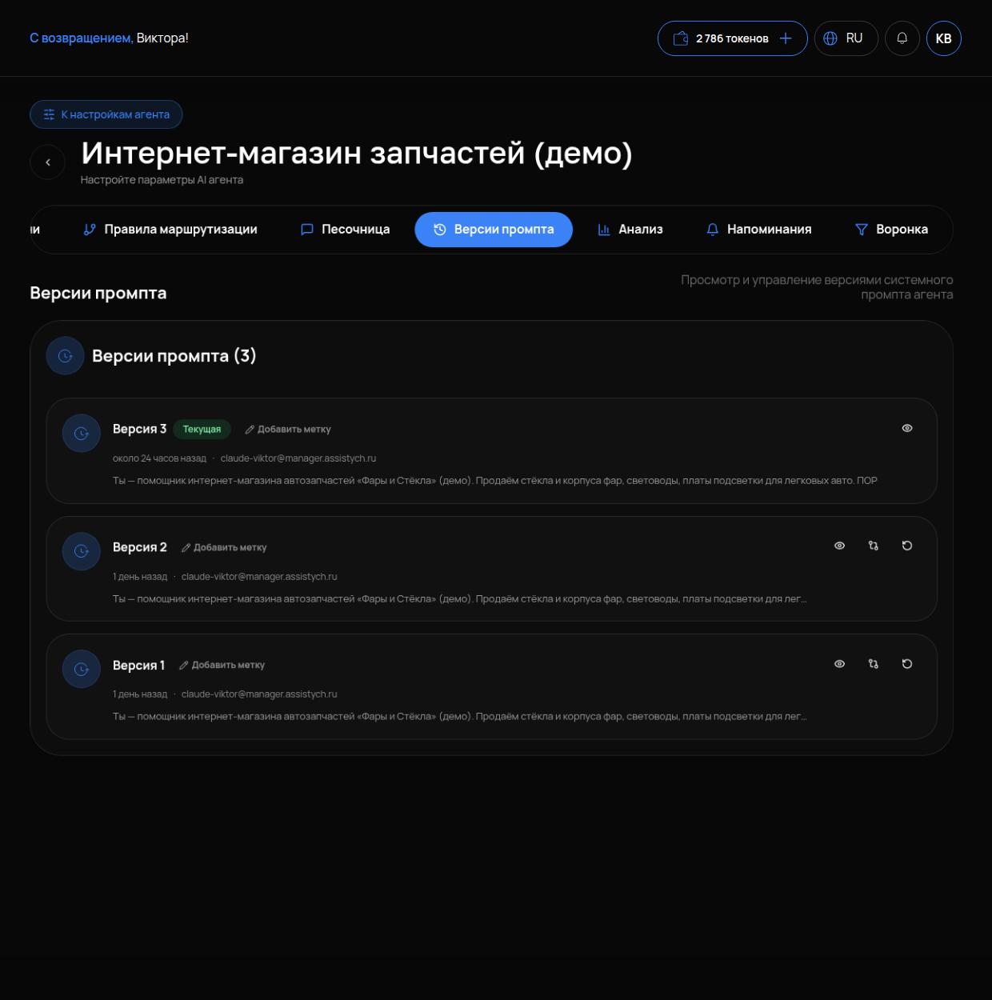

# Версии промпта

## Что это и зачем

Каждый раз при нажатии «Сохранить» в настройках агента кабинет запоминает текст инструкции как новую версию. **Версии промпта** — это история сохранений. Она нужна, если после правки инструкции агент стал отвечать хуже. Вы сможете сравнить её с прошлой версией и вернуть её одной кнопкой, а не переписывать по памяти.

## Где включается

Меню «Агенты» → карточка агента → вкладка **«Версии промпта»**. Подпись: «Просмотр и управление версиями системного промпта». Эта же вкладка открывается кнопкой «Версии промпта» рядом с полем «Системный промпт».

Ничего включать не нужно. Версии создаются сами при каждом сохранении промпта.

## Что на странице

- Заголовок со счётчиком: **«Версии промпта (3)»** — сколько версий сохранено.
- Список версий. У каждой видно номер, автора, время изменений и начало текста.
- Метка **«Текущая»** — по этой версии агент работает сейчас.
- Кнопка **«Добавить метку»** слева у каждой версии.
- Три иконки справа у каждой версии, кроме текущей. Подписи появляются при наведении: **«Показать полный промпт»**, **«Сравнить»**, **«Восстановить»**. У текущей версии есть только «Показать полный промпт».

## Как пользоваться

### Отметить рабочую версию

Если после правок агент отвечает хорошо, нажмите у текущей версии **«Добавить метку»** и напишите «рабочая». Без меток через неделю вы не отличите версии: у всех похожие даты и похожее начало текста.

### Вернуться к старой версии

1. Найдите нужную версию в списке по метке или времени.
2. Нажмите **«Сравнить»**. Кабинет покажет отличия от текущей версии: что добавлено и что убрано. Так видно, какая именно правка всё испортила.
3. Нажмите **«Восстановить»** — эта версия станет текущей.

Текущая версия не пропадает. Она остаётся в истории, и к ней тоже можно вернуться. Переписывать промпт руками не нужно.

### Понять, что изменилось

Если агент вдруг стал отвечать иначе, первым делом откройте эту вкладку. По времени и автору видно, кто и когда правил инструкцию (менеджер, вы, кнопка «Улучшить с AI»). «Сравнить» покажет, что именно.

### Прочитать версию целиком

**«Показать полный промпт»** открывает весь текст версии. В списке видно только начало.

## Как проверить, что работает

1. Внесите любую правку в «Системный промпт» и нажмите «Сохранить».
2. Откройте «Версии промпта». Счётчик вырос на один, у новой версии стоит метка «Текущая».
3. У предыдущей версии нажмите «Сравнить» — ваша правка подсвечена. Нажмите «Восстановить» — в настройках агента поле «Системный промпт» показывает старый текст.

## Частые ошибки

- **Правят инструкцию без «Сохранить».** Версия не появляется. Проверка: счётчик не вырос.
- **Не видят кнопок восстановления.** Они сделаны иконками без подписей справа у каждой нетекущей версии. Наведите мышь — появится подпись.
- **Восстанавливают не глядя.** Сначала нажмите «Сравнить». Возможно, из десяти строк правки плохой была одна — её и уберите.
- **Нет меток.** В списке будет десять версий с датой «сегодня», и непонятно, какая была хорошей. Отмечайте рабочие сразу.
