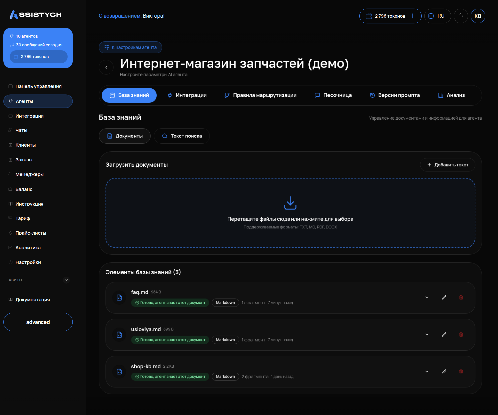
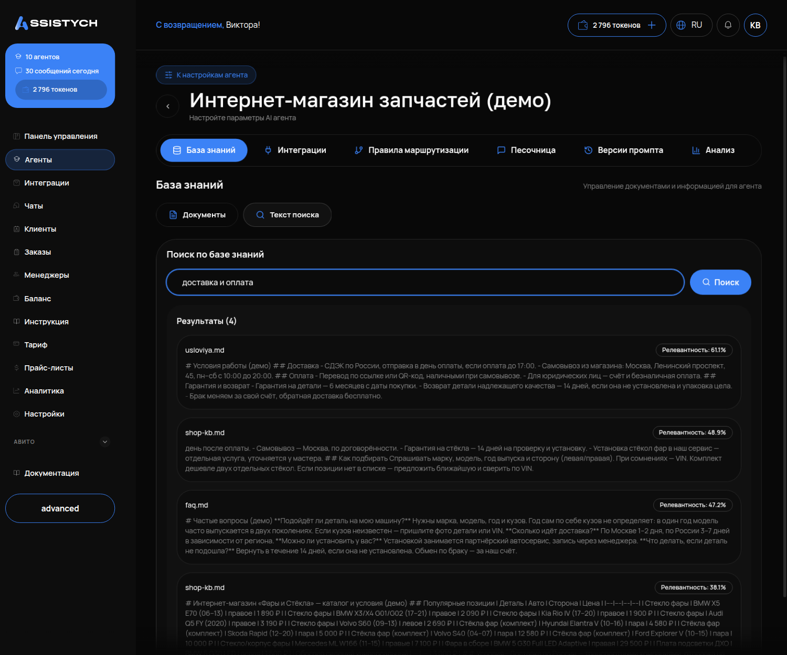

# База знаний

## Что это и зачем

**База знаний** — папка с вашими документами. Оттуда агент берёт факты для ответов: условия работы, доставку, гарантию, описание услуг и частые вопросы. Агент отвечает только по информации из базы. Без неё он не молчит, а уверенно выдумывает. Например, при тесте агент без документов назвал три тарифа, которых у компании не было.

Как база связана с инструкцией: инструкция — как себя вести, база — что знать. Цены и условия — сюда, не в промпт.

## Где включается

Меню «Агенты» → карточка агента → вкладка **«База знаний»**. Внутри две вкладки: **«Документы»** и **«Текст поиска»**.

## Что настроить

### Что загружать

- Условия работы: предоплата, минимальный заказ, доплаты, что входит в цену.
- Доставка и самовывоз, сроки.
- Гарантия и возвраты.
- Описание услуг: что делаете, чего не делаете.
- Частые вопросы с ответами.
- Прайс — если услуг до нескольких десятков. Для структурированных цен есть [Прайс-листы](06-prays-listy.md).

Пишите так, как объяснили бы новому сотруднику: короткими фразами, одна тема — один документ, без «возможно» и «обычно». Цифры цифрами.

### Что загружать нельзя

**Каталог товаров на сотни позиций.** Поиск по базе выдаёт агенту куски текста по смыслу, а не строку таблицы. На вопрос «есть ли стекло на Камри 2018 левое» он получит несколько абзацев с похожими словами, а не конкретную позицию. Для остатков и артикулов нужна складская интеграция (МойСклад).

**Картинки и фото прайса.** База принимает только текст: TXT, MD, PDF, DOCX. Фото перепечатайте.

### Как добавить

Кнопка **«Добавить знания»**, два способа:

- **«Загрузить документы»** — перетащите файл или выберите с диска. Форматы: TXT, MD, PDF, DOCX.
- **«Добавить текст»** — название и текст прямо в кабинете. Подходит для условий и частых вопросов и быстрее: не нужно готовить файл.

### Статусы обработки

После загрузки документ доступен не сразу. Кабинет читает его и раскладывает на фрагменты. Пока идёт обработка — статус «Обработка...», это занимает 10–20 секунд. Готовый документ помечен **«Готово, агент знает этот документ»**. Только после этого агент отвечает по нему.

У каждого элемента списка видно тип («Документ», «Текст», «FAQ»), число фрагментов и дату. Элемент можно открыть и отредактировать — после сохранения он переиндексируется сам.

### Вкладка «Текст поиска»

Это тот же поиск, которым пользуется агент, только руками. Введите вопрос так, как его напишет клиент. Кабинет покажет найденные фрагменты с оценкой релевантности.

Правило: **если нужного фрагмента здесь нет — агент его тоже не увидит.** Не помогают ни инструкция, ни модель. Значит, факт записан не теми словами, что спрашивает клиент, или его нет вовсе.

## Как проверить, что работает

1. У всех документов статус «Готово, агент знает этот документ».
2. На вкладке «Текст поиска» введите три вопроса словами клиента («сколько стоит …», «есть ли доставка», «какая гарантия») — должны найтись ваши фрагменты с высокой релевантностью.
3. В «Тестовом чате» вопрос по документу → ответ совпадает с текстом документа; вопрос, которого в базе нет → агент говорит, что уточнит менеджер, а не называет цифру.

## Частые ошибки

- **Загрузили и сразу пишут агенту.** Документ ещё в «Обработке...», агент его не знает. Подождите, пока статус сменится.
- **Факт есть, но другими словами.** Клиент пишет «плёнка на капот», в документе «PPF, зона риска». Допишите строку словами клиента — один факт можно записать несколькими формулировками.
- **Один документ на всё.** Прайс, условия, гарантия и история компании в одном файле — поиск находит не то. Разбейте по темам.
- **Каталог в базе.** Сотни позиций — агент называет не те. Нужна складская интеграция.
- **Правят инструкцию, когда проблема в базе.** «Агент не знает цену» лечится строкой в документе, а не абзацем в промпте.
- **Устаревшие документы не удалены.** Старый и новый прайс лежат рядом — агент берёт то один, то другой. Удаляйте или редактируйте старый.
