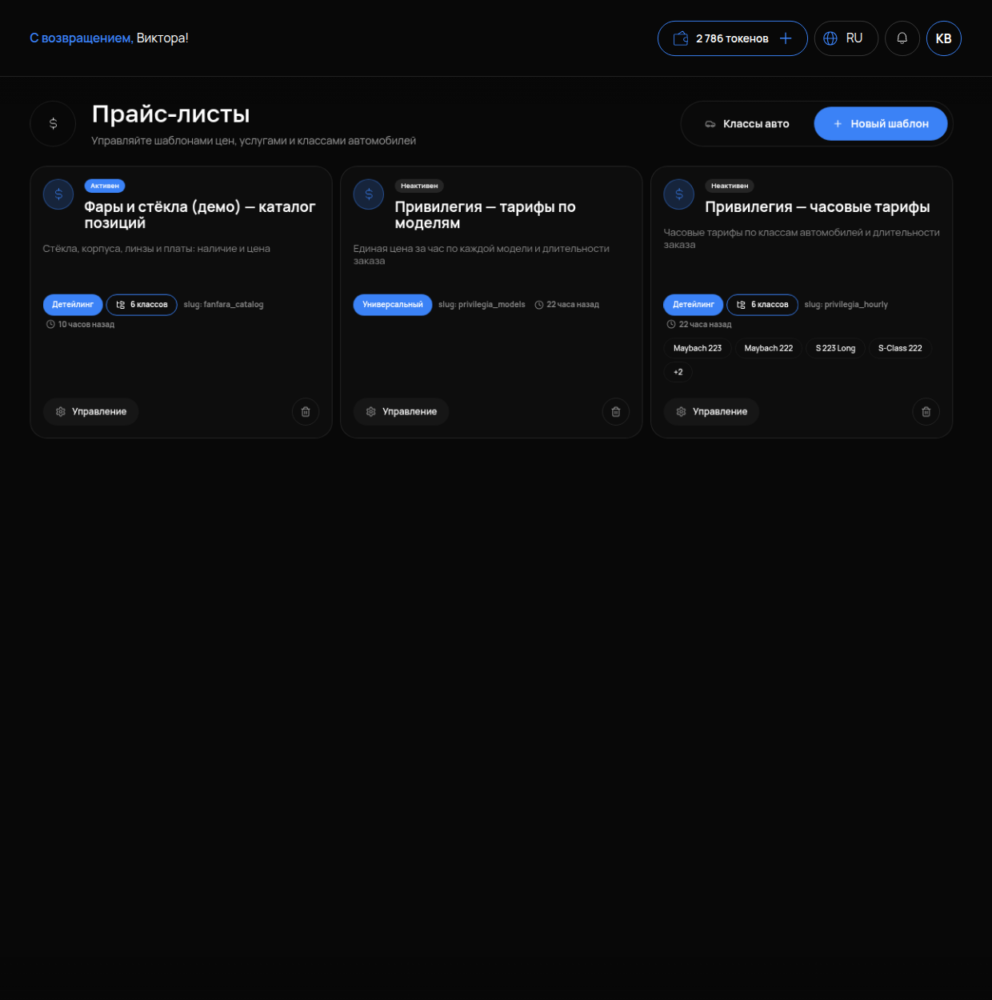

# Прайс-листы

## Что это и зачем

**Прайс-лист** — это таблица ваших услуг с ценами. По ней агент называет клиенту стоимость. В отличие от [базы знаний](05-baza-znaniy.md) с текстами, прайс — это структура: категории, услуги, цена и комментарий. Агент получает его целиком и подставляет цены в ответ.

Прайс-листы создаются один раз для всего бизнеса. Все агенты с активным умением «Цены и услуги» видят их автоматически.

## Где включается

Раздел **«Прайс-листы»** находится в меню бизнеса, а не во вкладке агента. Заголовок страницы — «Прайс-листы», подпись: «Управляйте шаблонами цен, услугами и классами автомобилей». Кнопки сверху: **«Классы авто»** и **«Новый шаблон»**. Агент сам берёт активные прайсы, отдельно привязывать их не нужно.

Видит ли агент прайс — проверка в разделе «Как проверить» ниже и на странице [Инструменты агента](12-instrumenty-agenta.md).

## Что настроить

### Карточка прайса

Каждый прайс — это карточка на странице «Прайс-листы». В ней указаны: статус **«Активен»** / **«Неактивен»**, название, описание, тип, число классов («6 классов») и дата изменения. Кнопка **«Управление»** открывает услуги и цены внутри.

### Тип прайса

Выбирается при создании («Новый шаблон»):

- **«Детейлинг»** — цена зависит от класса автомобиля. У одной услуги будет столько цен, сколько классов. Подходит для студий оклейки, полировки и моек.
- **«Универсальный»** — одна цена на услугу. Подходит для всего остального.

### Классы авто

Кнопка «Классы авто» находится сверху. Классов может быть **максимум шесть**. Если добавить седьмой, при сохранении возникнет ошибка. Называйте классы так, как их называют клиенты и мастера: «Малый», «Средний», «Кроссовер», «Внедорожник», «Минивэн», «Премиум».

### Категории и услуги

Прайс делится на категории («Оклейка», «Полировка», «Мойка»), внутри которых находятся услуги. У каждой услуги есть:

- **название** — пишите так, как его называют клиенты, а не как в вашей внутренней учётке;
- **цена** — число. Если цена «от» — укажите это в комментарии, а не в поле цены;
- **комментарий к услуге** — самое недооценённое поле.

### Комментарий к услуге

Агент **читает комментарий и использует его в ответе**. Пишите сюда то, что клиент спросит следующим вопросом: что входит в работу, от чего зависит цена, сколько времени занимает и что нужно от клиента.

Пример: услуга «Оклейка зоны риска», цена 40 000, комментарий: «Капот, передний бампер, фары, зеркала. Полиуретановая плёнка. 1 день. Точная цена после осмотра: зависит от класса машины». Агент ответит клиенту всё это сразу, а не только цифру.

Что будет, если комментарий пустой: агент назовёт цену и не сможет объяснить, за что она, — начнёт додумывать.

### Несколько прайсов одновременно

Можно завести несколько прайс-листов — по направлениям или сезонам. Агент видит **все активные**. Если у вас два прайса с одной и той же услугой по разным ценам, агент назовёт любую. Не держите дубли: неактуальный прайс выключайте.

## Важно и неочевидно: прайс не фильтруется по запросу

Агент получает **весь список услуг целиком**, а не только похожие на вопрос клиента. Для прайса из десятков услуг это нормально. Для каталога в сотни позиций — нет: список не влезет в ответ модели, агент начнёт терять позиции и путать цены. Товарный каталог с наличием — это складская интеграция, а не прайс-лист.

## Как проверить, что работает

1. У агента на вкладке «Интеграции» → «Что умеет агент» карточка «Цены и услуги» со статусом «Работает» и строкой «Источник: <название прайса>».
2. В «Тестовом чате» спросите цену услуги словами клиента — агент назвал цифру из прайса и добавил то, что написано в комментарии.
3. Спросите услугу, которой в прайсе нет, — агент сказал, что уточнит менеджер, а не подобрал похожую.

## Частые ошибки

- **Цена «от 3 000» в поле цены.** Не распознаётся или агент назовёт 3 000 как точную. Число пишите в цену, а «от» и условия — в комментарий.
- **Пустые комментарии.** Агент знает цену, но не знает, за что она.
- **Названия из внутренней учётки.** «ОЗР ПУ 150» вместо «Оклейка зоны риска». Клиент так не спросит, и агент не свяжет.
- **Седьмой класс авто.** Максимум шесть; ошибка при сохранении — не сбой, а лимит.
- **Тип «Детейлинг» без классов.** Цены указаны по классам, а сами классы не заведены — агенту нечего называть.
- **Два прайса с одной услугой.** Разные цены на один вопрос.
- **Каталог на 300 позиций в прайсе.** Агент путает и теряет позиции. Здесь нужна складская интеграция.
- **Прайс есть, а у агента статус «Нет источника».** Прайс неактивен или у агента отключено умение «Цены и услуги» — проверьте на вкладке «Интеграции».
