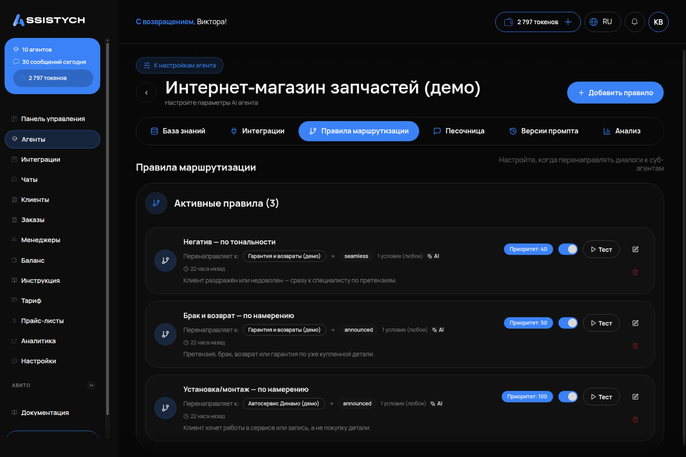

# Правила маршрутизации

## Что это и зачем

**Правило маршрутизации** — это условие, при котором агент передаёт разговор другому агенту. Оно нужно, если у вас работает несколько агентов. Например, первый встречает клиента, а остальные отвечают каждый за свою тему: сервис, гарантию, свадьбы или межгород.

Если агент один, вкладка не нужна. О том, когда подключать новых сотрудников и как распределить задачи, читайте в инструкции [Несколько агентов вместо одного](../../instructions/05-neskolko-agentov.md).

Настраивайте правила у агента, **который передаёт** диалог (обычно это агент входа), а не у того, который принимает.

## Где включается

Меню «Агенты» → карточка агента → вкладка **«Правила маршрутизации»**. Подпись раздела: «Настройте, когда перенаправлять диалоги к суб-агентам». Кнопка **«Добавить правило»**.



## Что настроить — поля формы «Создать правило маршрутизации»


### «Название правила \*»

Это имя правила в списке. Например: «В автосервис», «Претензии» или «Свадьбы». Поле обязательное.

### «Целевой агент \*»

Кому передаём диалог (в поле — «Выберите агента»). В списке будут все агенты вашего кабинета. Целевой агент должен быть включён («Активен»), иначе клиент попадёт к молчащему агенту.

### «Приоритет»

Подпись к полю: «Меньший приоритет = проверяется первым (1–1000)». Система проверяет правила по очереди — от меньшего числа к большему. Сработает то правило, которое подошло первым.

Что указывать: для претензий и раздражённых клиентов ставьте 40–50 (они проверяются раньше всего), для обычных тем ставьте 100. Если оставить поле пустым, у правил будет одинаковый приоритет. Тогда система станет проверять их в случайном порядке.

### «Когда задача считается выполненной»

Подпись к полю: «По этому описанию агент понимает, что задачу можно вернуть основному агенту (авто-возврат)».

Опишите словами, когда специалист закончил работу. Например: «Клиент получил цену и срок работ или записан в сервис» или «Претензия принята, клиенту назван срок ответа». Это работает вместе с полем «Условие возврата» → «Авто». Если оставить поле пустым при авто-возврате, агент будет решать сам. Он может вернуть клиента на вход раньше или позже, чем нужно.

### «Условия маршрутизации»

Вверху блока указано «Совпадение: Любое» и подпись «Перенаправлять, если совпало хотя бы одно». Вы можете настроить несколько условий через кнопку «Добавить условие». Для обычного правила достаточно одного.

В поле **«Тип условия»** по умолчанию выбрано «Ключевые слова». Доступные варианты:

| Тип | Как работает | Когда брать |
|---|---|---|
| **Намерение (LLM)** | Нейросеть-судья читает смысл сообщения | **Брать по умолчанию.** Живой человек пишет «прикрутить», «возьмётесь», «сделаете» — ключевые слова такое не ловят |
| Тональность | Определяет раздражение | Отдельное правило для претензий: клиент может ни слова не сказать про брак («вы вообще работаете? третий день жду»), а уводить его нужно сразу |
| Ключевые слова | Буквальное совпадение слов | Для узких случаев: артикул, название акции |
| Регулярное выражение | Совпадение по шаблону | Номера заказов, телефоны — для тех, кто умеет писать шаблоны |
| Количество сообщений | Срабатывает после N сообщений | Передать человеку, если диалог затянулся |
| Ассистент спросил | Срабатывает, когда агент задал определённый вопрос | Редкие сценарии |
| Контекст содержит | Что-то уже встречалось в диалоге | Редкие сценарии |

Если выбрать тип «Намерение», откроются два поля:

**«Что должен написать клиент»** — текстовое описание намерения. Это главное поле формы. Обязательно укажите, чего намерение **не** касается. Иначе правило начнёт перехватывать похожие вопросы.

```
Клиент просит выполнить работы на автомобиле силами сервиса: установить, смонтировать,
прикрутить, поменять деталь, сделать диагностику или ТО, либо записаться в сервис.
Это НЕ относится к вопросам о цене детали, наличии, подборе и доставке запчасти,
которую клиент покупает и ставит сам.
```

Без второй фразы вопрос «сколько стоит деталь и есть ли в наличии» уходил в автосервис. С ней он остаётся в магазине, а запрос «возьмётесь прикрутить?» переключает диалог на нужного агента.

**«Порог уверенности»** — шкала от «Мягко» до «Строго». Она определяет, насколько судья должен быть уверен для переключения. Оптимальное значение — **0,8**. При значении 0,7 обычная почасовая аренда («машина на 28 сентября на 4 часа, подача от Невского») уходила к свадебному агенту. Значения выше 0,85 подходят только для узких тем, иначе правило перестанет срабатывать.

### «Передача контекста»

- **«Передавать историю диалога»** — обязательно включите. Иначе специалист не поймёт контекст и начнёт заново спрашивать модель, дату или адрес.
- **«Сообщений для передачи»** (диапазон 1–50) — укажите 10.
- **«Передавать краткое резюме»** — настраивается по желанию. Полезно при длинных диалогах.

### «Сообщение при передаче (опционально)»

Подпись к полю: «Заменяет стандартное сообщение для режимов с уведомлением или подтверждением».

Это текст, который клиент увидит в чате при переводе. Напишите свою фразу с упоминанием услуги. Например: «Подключаю мастера сервиса, он ответит по работам». Для правила по тональности оставьте поле пустым и выберите бесшовный режим (подробнее о нём ниже).

### «Режим передачи»

- **Бесшовно** — клиент не замечает переключения, ему просто отвечает другой агент. Используйте этот режим для претензий. Фраза «передаю специалисту» только разозлит недовольного клиента.
- **«С уведомлением (известить пользователя)»** — этот режим выбран по умолчанию. Клиент видит одну фразу перед ответом нового агента. Это честный и понятный способ при смене темы.
- **С подтверждением** — агент сначала спрашивает разрешение на перевод. Подходит для сложных случаев, когда нужно получить чёткое согласие.

### «Условие возврата»

- **«Авто (решает LLM)»** — режим по умолчанию. Специалист ведёт диалог, пока не закрыл задачу (см. поле «Когда задача считается выполненной»), а затем система возвращает клиента агенту входа. При тестировании свадебный специалист вёл переписку три шага, а итоговую сводку собрал уже агент входа.
- **Никогда** — специалист ведёт диалог до завершения. Выбирайте этот вариант, если у него свой финал: бронь или заявка. Учтите: инструмент записи привязан к конкретному агенту ([подробнее](12-instrumenty-agenta.md)). Если этот инструмент есть только у агента входа, то специалист не сможет создать запись.
- **Вручную** — вы сами возвращаете диалог через раздел «Чаты».

Кнопки внизу формы: **«Отмена»** и **«Создать правило»**.

## Как проверить, что работает

Тестируйте настройки в [песочнице](10-pesochnica-i-otladka.md) агента входа. Включите режим **«Отладка»**: под каждым сообщением будет видно, какое правило сработало и какой агент ответил.

1. Задайте вопрос по теме специалиста → в отладке отобразится сработавшее правило, а ответ придёт из базы этого специалиста.
2. Напишите смежный вопрос, который должен остаться на входе (например, цена детали вместо установки) → правило не должно сработать.
3. Отправьте раздражённое сообщение без описания проблемы → должна сработать тональность, а в ответе не должно быть фразы «передаю специалисту».
4. Напишите детали в первом сообщении, а цену спросите во втором → специалист не должен переспрашивать информацию, так как история передана.
5. Проведите диалог на четыре шага → на каждом этапе должен отвечать нужный агент, а после закрытия задачи клиент должен вернуться к агенту входа.

## Частые ошибки

- **В описании намерения нет уточнений «чего НЕ касается».** Из-за этого правило перехватывает соседние вопросы, и клиент попадает в чужую ветку.
- **Порог 0,7 при широкой формулировке.** Это приводит к ложным переключениям. Ставьте значение 0,8.
- **Оставили тип «Ключевые слова».** В этом случае правило не будет реагировать на живую речь.
- **Забыли включить передачу истории.** Специалисту приходится заново спрашивать то, что клиент уже рассказал.
- **Бесшовный режим при смене темы.** Клиент не понимает, почему изменился стиль общения. Для разных тем используйте режим с уведомлением, а для претензий — бесшовный.
- **Одинаковый приоритет у всех правил.** Порядок проверки становится случайным, и претензия может уйти в обычную тематическую ветку.
- **У специалиста нет инструмента записи при возврате «Никогда».** Он довёл клиента до брони, но не может её оформить. Решение: настройте возврат «Авто» или добавьте инструмент записи самому специалисту.
- **Базы знаний противоречат друг другу.** Например, у агента входа написано «украшения не делаем», а у свадебного — «украшения 2 000 ₽». В итоге клиент получит разные ответы. Общие факты в базах должны совпадать.
