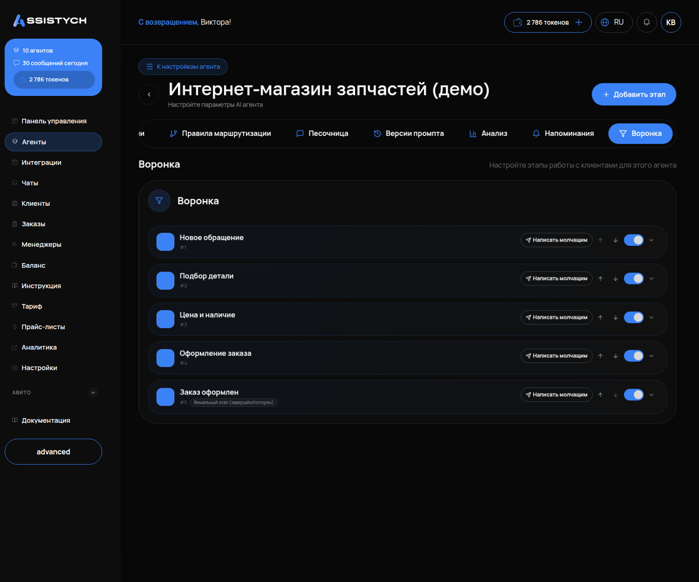

# Воронка продаж

## Что это и зачем

**Воронка** — этапы пути клиента от первого сообщения до заказа или отказа. Агент сам переводит диалог по этапам по смыслу разговора. Вы в «Чатах» видите, на каком этапе застрял клиент.

Это не ярлыки для красоты. На каждом этапе агент ведёт себя по-своему: на «Новом обращении» выясняет, что нужно, на «Согласовании цены» называет варианты, на «Оформлении» собирает имя и телефон. Если менеджер вручную переключит этап, агент подстроится.

## Где включается

Меню «Агенты» → карточка агента → вкладка **«Воронка»**. Подпись: «Настройте этапы работы с клиентами для этого агента». У каждого агента своя воронка.

## Что на странице

- Этапы по номерам: **#1, #2 … #5**. Новый диалог сразу попадает на первый этап.
- Последний этап помечен как **«Финальный этап (завершён/потерян)»**. Сюда попадают закрытые диалоги: и покупки, и отказы.
- У каждого этапа есть кнопка **«Написать молчащим»**.
- Сверху расположена кнопка **«Добавить этап»**.



## Что настроить

### Этапы

Называйте этапы словами своего бизнеса, а не «квалификация — КП — закрытие». Клиент их не видит, но по этапам вы будете читать «Чаты». Рабочий каркас для услуг:

```
#1 Новое обращение → #2 Уточняем детали → #3 Цена и согласование → #4 Оформление → #5 Готово
```

Пример для аренды с водителем: «Новая заявка → Уточняем детали → Согласование цены → Бронь → Реквизиты отправлены → Предоплата получена → Поездка состоялась».

Пять-семь этапов — достаточно. Больше — агент путается, куда переводить, вы — куда смотреть.

### Форма этапа

Кнопка «Добавить этап» открывает форму:

- **«Название этапа»** — словами вашего бизнеса.
- **«Цвет»** — как этап выглядит в списке чатов.
- **«Описание»** — ориентир для агента, когда переводить клиента на этот этап. Пишите конкретный признак: «Клиент выбрал вариант и согласился с ценой».

Блок **«Изменение поведения»** настраивает действия агента на этапе:

- **«Режим бота»** — по умолчанию «Не менять»: агент работает по основной инструкции. Можно переключить, например, чтобы на этапе оформления агент только предлагал ответы, а отправлял человек.
- **«Авто-напоминание»** — отправка напоминаний замолчавшему клиенту. Правила настраиваются на вкладке [Напоминания](09-napominaniya.md).
- **«Уведомить владельца через Telegram»** — уведомление о переходе клиента на этот этап. Включайте для этапов «Оформление» и «Готово», но не для всех подряд.
- **«Финальный этап (завершён/потерян)»** — отметьте этот пункт у последнего этапа. Сюда попадают закрытые диалоги. Напоминания по ним не отправляются.

Что будет, если оставить «Не менять» везде: агент работает по основной инструкции на всех этапах, воронка служит для наблюдения. Для старта это нормально.

### «Написать молчащим»

Разовая рассылка всем, кто застрял на этом этапе и перестал отвечать. Вы пишете текст один раз, агент отправляет его каждому в его канал. Не путать с [Напоминаниями](09-napominaniya.md) — те работают сами по правилу, а это ручной запуск по кнопке.

## Как проверить, что работает

1. В «Тестовом чате» проведите диалог от вопроса до согласия на заказ.
2. Откройте «Чаты» — у этого диалога этап сменился с #1 на более поздний без вашего участия.
3. Если на этапе «Оформление» включили «Уведомить владельца через Telegram» — переведите диалог на этот этап вручную и проверьте, что уведомление пришло.

## Частые ошибки

- **Двадцать этапов.** Агент не отличит «Заинтересован» от «Очень заинтересован». Пять-семь.
- **Этапы без смысла для агента.** «Тёплый», «Горячий» — агенту не по чему их различать. Называйте по действию: «Цена согласована», «Реквизиты отправлены».
- **Нет финального этапа для отказов.** Отказавшиеся висят на середине воронки, и «Написать молчащим» уходит тем, кто уже сказал «нет».
- **«Написать молчащим» каждый день.** Это разовая кнопка. Для регулярных напоминаний — вкладка «Напоминания» с тихими часами.
