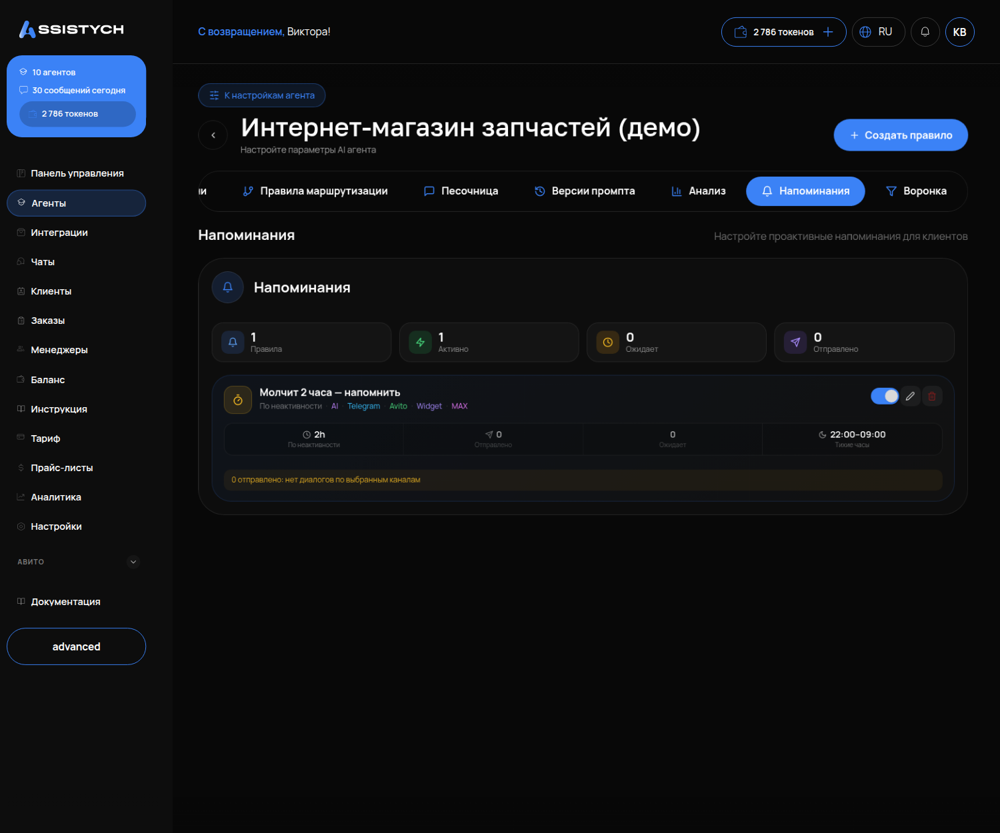

# Напоминания

## Что это и зачем

**Напоминание** — сообщение, которое агент отправляет сам, если клиент замолчал. Например, спросил цену и пропал. Текст не шаблонный. Агент пишет его по вашей инструкции с учётом разговора («Вы спрашивали про стекло на Камри — оно ещё в наличии, привезти?»).

Одно вовремя отправленное напоминание возвращает часть клиентов, которые просто отвлеклись. Но сообщение ночью или после заказа раздражает. Поэтому у правила есть тихие часы и ограничения.

## Где включается

Меню «Агенты» → карточка агента → вкладка **«Напоминания»**. Подпись: «Настройте проактивные напоминания для клиентов».

## Что на странице

Карточка правила, например **«Молчит 2 часа — напомнить»**:

- тип **«По неактивности»** — срабатывает, когда клиент не отвечает заданное время;
- **каналы**: Telegram, Avito, Widget, MAX — где правило работает;
- **задержка** — через сколько после последнего сообщения клиента напомнить (в примере 2h);
- **«Тихие часы»** — когда не отправлять; по умолчанию 22:00–09:00;
- счётчики **«Активно / Ожидает / Отправлено»**: сколько диалогов под правилом сейчас, сколько ждёт, сколько напоминаний уже ушло.

## Что настроить — окно «Создать правило»

Поля по порядку:

- **«НАЗВАНИЕ ПРАВИЛА»** — например, «Молчит 2 часа».
- **«ТИП ПРАВИЛА»** — «По неактивности» (клиент замолчал) или «По расписанию» (в заданное время).
- **«ЧАСЫ НЕАКТИВНОСТИ»** — через сколько часов тишины напомнить.
- **«РЕЖИМ СООБЩЕНИЯ»** — «Шаблон» (один и тот же текст всем) или «Генерация ИИ» (агент пишет по вашей инструкции с учётом разговора).
- **«КАНАЛЫ»** — Telegram, Avito, Widget, MAX: где правило работает.
- **«МАКС. НАПОМИНАНИЙ»** — сколько раз напомнить одному клиенту.
- **«Уведомить оператора при достижении максимума»** — менеджер узнает, что клиент так и не ответил.
- **«ТИХИЕ ЧАСЫ»** — «С 22:00» «До 09:00».

Кнопки «Отмена» и «Сохранить».

### «ЧАСЫ НЕАКТИВНОСТИ»

2–3 часа — рабочее значение для чатов. Меньше часа — клиент ещё думает, напоминание покажется навязчивым. Больше суток — клиент уже забыл, о чём речь.

### «РЕЖИМ СООБЩЕНИЯ»: генерация ИИ и инструкция

Выбирайте «Генерация ИИ». Шаблонное «Здравствуйте! Напоминаю о себе» не работает. Для генерации нужна инструкция: что именно написать агенту. Пишите с опорой на разговор, а не просто «напомни о себе». Например: «Коротко напомни, о чём договаривались, и задай один вопрос для перехода к заказу. Не повторяй цену, если уже называл её. Если дата визита или поездки прошла — не напоминай о ней».

Последняя фраза важна: **напоминание само не смотрит на дату события**. Если поездка прошла вчера, а клиент молчит, агент всё равно напомнит о ней. Чтобы этого не случилось, запретите такое в инструкции.

### «ТИХИЕ ЧАСЫ»

По умолчанию с 22:00 до 09:00. Убедитесь, что они настроены и совпадают с вашим часовым поясом. Напоминание из тихих часов не пропадает, а уходит утром.

### «МАКС. НАПОМИНАНИЙ»

Поставьте 1–2 на диалог. Третье подряд сообщение «вы ещё здесь?» — повод пожаловаться на спам, особенно на Авито.

### «Уведомить оператора при достижении максимума»

Включите эту опцию. Когда лимит напоминаний исчерпан, а клиент молчит, менеджер получит сигнал. Он сам решит: позвонить или отпустить клиента.

## Когда напоминание не уходит

- в тихие часы — ждёт утра;
- диалог на финальном этапе [воронки](08-voronka-prodazh.md) (заказ оформлен или клиент отказался);
- диалог взял менеджер (кнопка «Взять управление» в чатах);
- достигнут «МАКС. НАПОМИНАНИЙ»;
- канал не отмечен в правиле.

## Как проверить, что работает

1. Создайте правило: «По неактивности», 2 часа, «Генерация ИИ», ваш канал, макс. 2, тихие часы 22:00–09:00.
2. Напишите своему Telegram-боту вопрос и не отвечайте на сообщение агента.
3. Через два часа (вне тихих часов) в чат придёт напоминание. На карточке правила счётчик «Отправлено» вырастет на один.
4. Ответьте на напоминание. Агент продолжит разговор и не отправит второе сообщение.

## Частые ошибки

- **Тихие часы пустые или настроены не по вашему поясу.** Клиенту приходит сообщение в три ночи. Настройте их до запуска правила.
- **Напоминание о прошедшем событии.** Например, «Ждём вас завтра в 15:00» через день после визита. Лечится строкой в инструкции напоминания.
- **Задержка 15 минут.** Клиент ещё читает, а ему уже пишут «вы пропали». Ставьте не меньше часа.
- **Большой «МАКС. НАПОМИНАНИЙ».** Серия сообщений на Авито приведёт к жалобе и блокировке чата.
- **Режим «Шаблон» с общим текстом.** Фраза «Здравствуйте! Напоминаю о себе» без привязки к диалогу не работает. Используйте режим «Генерация ИИ» с инструкцией по контексту разговора.
