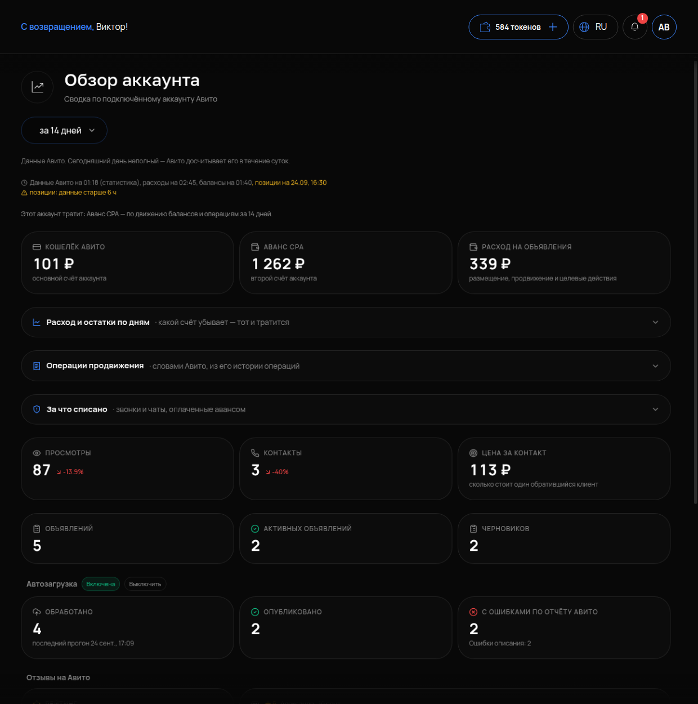

# Обзор аккаунта Авито

## Что это и зачем

**Обзор** — первая страница блока «Авито». Она показывает баланс на счетах аккаунта, расходы на объявления за последние две недели и время обновления данных. Сюда заходят утром. Помогает за минуту понять, всё ли в порядке с деньгами и не встали ли объявления.

## Где включается

Меню **«АВИТО»** → **«Обзор»**. Подпись страницы: «Сводка по подключённому аккаунту Авито», период — «за 14 дней». Настраивать ничего не нужно. Раздел работает сразу после подключения аккаунта (см. [Мои аккаунты](02-moi-akkaunty.md)).

## Что на странице

### Два счёта

Кабинет показывает оба счёта аккаунта Авито:

- **«КОШЕЛЁК АВИТО»** — «основной счёт аккаунта».
- **«АВАНС CPA»** — «второй счёт аккаунта».

За что списывается с каждого счёта, зависит от тарифа и категорий на Авито — кабинет этого не объясняет, но показывает главное. Строка **«Этот аккаунт тратит: Аванс CPA — по движению балансов и операциям за 14 дней»** указывает, с какого счёта уходят деньги именно у вас. Пополняйте тот счёт, который назван в этой строке. Если деньги лежат на другом, объявления встанут, хотя на счету они и есть.

### Расход на объявления

Сумма списаний за 14 дней. Детальная разбивка по объявлениям находится в [Аналитике](11-analitika.md). Здесь выводится общая сумма, чтобы вовремя заметить резкий рост.

### Когда обновлялись данные

Под сводкой находится строка вида **«Данные Авито на 01:18 (статистика), расходы на 02:45, балансы на 01:40, позиции на 24.09, 16:30»** и примечание **«Сегодняшний день неполный — Авито досчитывает его в течение суток»**.

Кабинет получает данные от Авито порциями. У каждого типа данных своё время обновления. Поэтому **расхождение с кабинетом Авито на свежих цифрах — норма, а не ошибка**. Сегодняшние просмотры и расход Авито досчитывает до суток. Сравнивайте вчерашний день и раньше.

Метка **«позиции: данные старше 6 ч»** означает ровно то, что написано: позиции в выдаче замерялись больше шести часов назад. Так отдаёт данные сам Авито — это не задержка кабинета и не ошибка. Свежий замер — в [Моих объявлениях](03-moi-obyavleniya.md), нажатием на позицию.

## Как проверить, что работает

1. На странице видны оба счёта с суммами и строка «Этот аккаунт тратит: …».
2. Время в строке «Данные Авито на …» — сегодняшнее или вчерашнее. Если данные старше суток — нажмите в карточке аккаунта «Настройки» и убедитесь, что интеграция активна.
3. Сумма расхода за 14 дней примерно совпадает с историей операций в кабинете Авито за тот же период (без сегодняшнего дня).

## Частые ошибки

- **Сравнивают сегодняшний расход с Авито и видят разницу.** Сегодня не досчитан. Сравнивайте закрытые дни.
- **Пополнили «Кошелёк», а тратится «Аванс CPA».** Объявления не показываются при деньгах на счету. Смотрите строку «Этот аккаунт тратит».
- **Данные не обновляются несколько дней.** Аккаунт потерял связь. Переподключите ключи в «Мои аккаунты».
- **Ждут точных позиций из обзора.** Здесь только время последнего замера. Сами позиции — в таблице объявлений.
