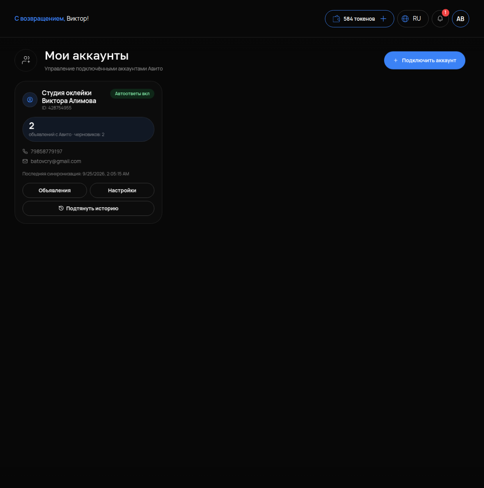

# Мои аккаунты

## Что это и зачем

**Мои аккаунты** — это список подключённых к кабинету аккаунтов Авито. Один бизнес может вести несколько аккаунтов. У каждого аккаунта своя карточка, свои объявления и свой выключатель ответов агента.

## Где включается

Меню **«АВИТО»** → **«Мои аккаунты»**. Для нового аккаунта нажмите кнопку **«Подключить аккаунт»**. Понадобятся «Client ID» и «Client Secret» из кабинета Авито для разработчиков. Как подключать по шагам — в инструкции [Подключение каналов](../../instructions/03-podklyuchenie-kanalov.md).

## Что на карточке аккаунта

- **Название** и **«ID: …»** — имя аккаунта на Авито и его номер.
- **«Автоответы вкл»** / «Автоответы выкл» — отвечает ли агент покупателям в чатах этого аккаунта.
- **Число объявлений и черновиков.**
- **Телефон и почта владельца** — как их отдал Авито.
- **«Последняя синхронизация: …»** — когда кабинет в последний раз получал данные аккаунта.
- Кнопки **«Объявления»** (переход в [Мои объявления](03-moi-obyavleniya.md)), **«Настройки»** (страница интеграции), **«Подтянуть историю»**.

## Что настроить

### Автоответы

Переключатель «Автоответы вкл» запускает и останавливает ответы агента. Он находится в «Настройках» карточки. Там есть кнопки «Включить автоответы» и «Выключить автоответы».

**Не выключайте интеграцию целиком, чтобы бот замолчал.** Если остановить или удалить интеграцию, в кабинет перестанут приходить сообщения клиентов, объявления и статистика. Чтобы агент молчал, а вы видели переписку, выключайте только автоответы. Это режим «только смотрю»: сообщения приходят в «Чаты», а отвечаете вы сами.

### Какой агент отвечает

Каждый аккаунт привязан к одному агенту. Если вы подключали аккаунт с карточки агента, они уже связаны. Если подключали из раздела «Моих аккаунтов» без выбора агента, кабинет автоматически создал выключенного агента «Авито-ассистент». Он не будет отвечать, пока вы его не настроите и не включите (подробнее в инструкции [Настройки агента](../agent/03-nastroyki-agenta.md)).

### «Подтянуть историю»

Кнопка переносит прошлые переписки из Авито в раздел «Чаты». Дубликаты не создаются. Если вы уже импортировали историю, кабинет покажет число диалогов и попросит подтвердить действие. Импорт занимает несколько минут, сообщения появляются постепенно. Функция нужна один раз после подключения, чтобы вы и агент видели прошлую переписку с клиентами.

### Несколько аккаунтов

Если у вас два аккаунта и более, в меню «АВИТО» появится переключатель **«Активный аккаунт Авито»**. Все разделы блока — «Обзор», «Мои объявления», «Аналитика» и другие — показывают данные только выбранного аккаунта. Выбор запоминается.

## Как проверить, что работает

1. На карточке в строке «Последняя синхронизация» стоит сегодняшняя дата.
2. Статус — «Автоответы вкл» (если агент должен отвечать) или «выкл» (если пока только смотрите).
3. Напишите в этот аккаунт с другого профиля Авито. Сообщение должно появиться в «Чатах», а агент — ответить (при включённых автоответах).

## Частые ошибки

- **Остановили интеграцию, чтобы бот не писал.** Пропали и сообщения клиентов. Включите интеграцию обратно и отключите только автоответы.
- **Автоответы включены, но агент молчит.** Агент выключен или на счету кончились токены. Проверьте переключатель «Активен» в настройках агента и раздел «Баланс» в меню.
- **Ответы приходят с задержкой до часа.** На Авито не оформлена подписка «API мессенджера». В этом случае сообщения подтягиваются фоновой сверкой.
- **Не видят второй аккаунт в разделах.** Переключите «Активный аккаунт Авито» в меню.
- **Запустили «Подтянуть историю» повторно во время импорта.** Появится «Импорт истории уже идёт». Дождитесь окончания.
