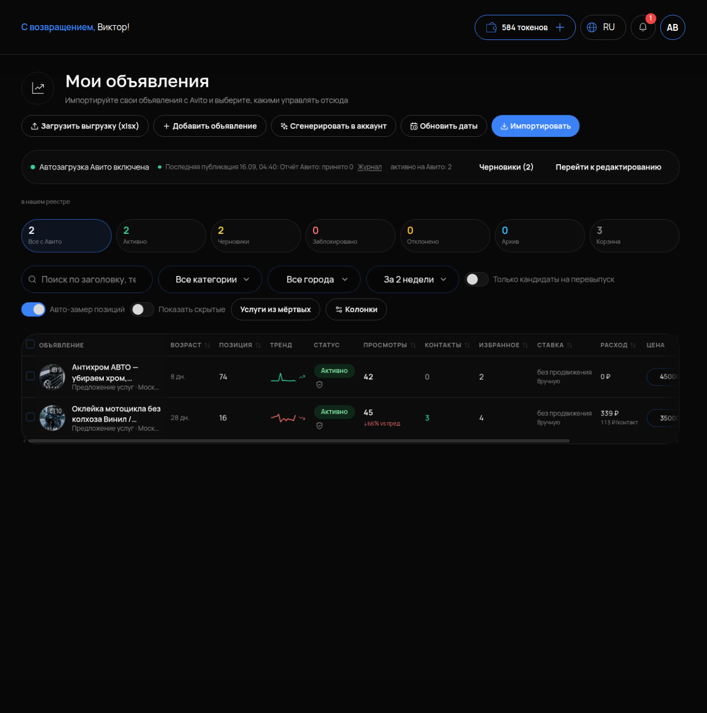

# Мои объявления

## Что это и зачем

**Мои объявления** — таблица со всеми объявлениями аккаунта Авито. Здесь видны их показатели: позиция в выдаче, просмотры, контакты, расход и цена контакта. Из таблицы объявления можно редактировать, публиковать, отправлять в автозагрузку и продвижение. Это рабочий стол для тех, кто ведёт Авито каждый день.

## Где включается

Меню **«АВИТО»** → **«Мои объявления»**. Подпись: «Импортируйте свои объявления с Avito и выберите, какими управлять отсюда». При первом входе нажмите **«Импортировать»** — кабинет заберёт живые объявления из аккаунта.

## Что на странице

### Кнопки сверху

- **«Загрузить выгрузку (xlsx)»** — добавить объявления из файла выгрузки Авито.
- **«Добавить объявление»** — создать новое вручную.
- **«Сгенерировать в аккаунт»** — создать объявление нейросетью (см. [Редактирование объявления](05-redaktirovanie.md)).
- **«Обновить даты»** — подтянуть свежие даты публикации.
- **«Импортировать»** — забрать объявления с Авито.

### Плашка состояния автозагрузки

Если автозагрузка включена, над таблицей: **«Автозагрузка Авито включена»**, **«Последняя публикация …: Отчёт Авито: принято N»**, ссылка **«Журнал»**, **«активно на Авито: N»**, **«Черновики (N)»**, **«Перейти к редактированию»**. Здесь видно, дошла ли последняя публикация до Авито и сколько принято.

### Счётчики реестра

**«Все с Авито»**, **«Активно»**, **«Черновики»**, **«Заблокировано»**, **«Отклонено»**, **«Архив»**, **«Корзина»**. Клик по счётчику фильтрует таблицу. Первым делом загляните в «Отклонено» и «Заблокировано» — эти объявления не работают.

### Фильтры

Поиск по заголовку, фильтры **«Все категории»**, **«Все города»**, период **«За 2 недели»**. Переключатели: **«Только кандидаты на перевыпуск»** (слабые объявления по правилам [Перепубликации](08-perepublikaciya.md)), **«Авто-замер позиций»**, **«Показать скрытые»**. Кнопки: **«Услуги из мёртвых»** и **«Колонки»** (настройка столбцов).

### Колонки таблицы

**ОБЪЯВЛЕНИЕ · ВОЗРАСТ · ПОЗИЦИЯ · ТРЕНД · СТАТУС · ПРОСМОТРЫ · КОНТАКТЫ · ИЗБРАННОЕ · СТАВКА · РАСХОД · ЦЕНА · ДЕЙСТВИЯ**

- **ВОЗРАСТ** — число дней с публикации. Старые объявления со временем проседают в выдаче — для этого есть [Конвейер](07-konveyer.md).
- **ПОЗИЦИЯ** — место в выдаче Авито по своему запросу. Подсказка у числа: «Последняя известная позиция в выдаче. Нажмите, чтобы проверить или настроить отслеживание». Кликните на число — позиция замерится заново.
- **ТРЕНД** — растёт позиция или падает по сравнению с прошлым замером.
- **РАСХОД** — общие траты на объявление. Рядом указана **цена контакта**, например «113 ₽/контакт» — стоимость одного написавшего или позвонившего клиента. По этой цифре решают, поднимать ли ставку или переписывать текст. Почему она главная и как сравнивать её с вашим заработком — в [Аналитике](11-analitika.md).

### Кнопки в строке

При наведении на строку: **«Редактировать»**, **«Отслеживается»** (следить за позицией), **«Статистика»**, **«Продвижение с прогнозом»**, **«Ещё»**.

## Как читать таблицу

Цепочка одна: показы → просмотры → контакты. На каждом шаге часть людей уходит. Где именно — и что чинить в каждом случае, — разобрано в [Аналитике](11-analitika.md).

## Как проверить, что работает

1. После нажатия «Импортировать» счётчик «Все с Авито» совпадает с числом объявлений в кабинете Авито.
2. У активных объявлений заполнены ПРОСМОТРЫ и РАСХОД за выбранный период.
3. Нажмите на ПОЗИЦИЮ у одного объявления — число обновилось, ТРЕНД показал стрелку.

## Частые ошибки

- **Смотрят на просмотры, а не на цену контакта.** Много просмотров при дорогом контакте — деньги уходят впустую.
- **Поднимают ставку у объявления с плохим текстом.** Просмотры вырастут, контакты — нет. Сначала [редактировать](05-redaktirovanie.md), потом ставка.
- **Не заглядывают в «Отклонено».** Объявление снято модерацией, а его продолжают «продвигать».
- **Сравнивают сегодняшние цифры с Авито.** Сегодня не досчитан — см. [Обзор](01-obzor.md).
- **Теряют объявление, когда оно скрыто.** Включите переключатель **«Показать скрытые»**.
