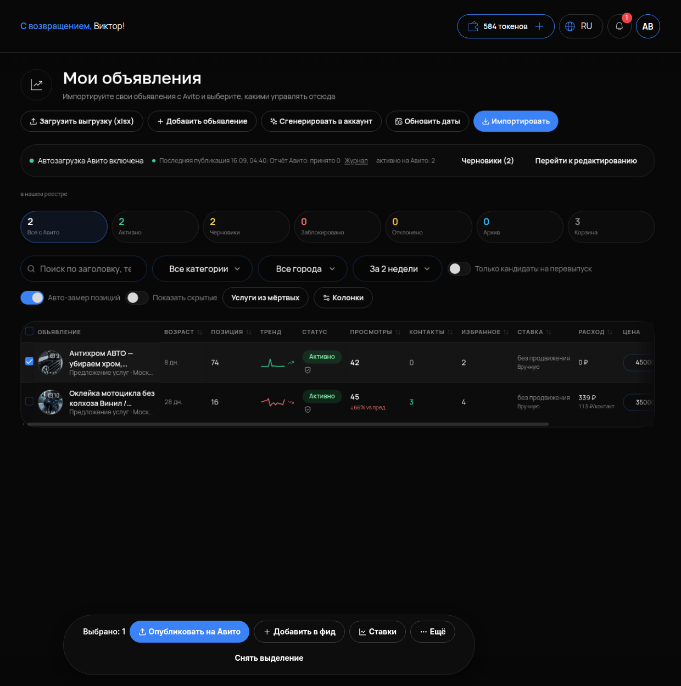

# Выделение и массовые действия

## Что это и зачем

Когда объявлений десятки, менять их по одному долго. **Массовые действия** — отметить несколько объявлений галочками и применить одно действие ко всем сразу: опубликовать черновики, отправить группу в фид автозагрузки, поднять ставки.

## Где включается

Меню **«АВИТО»** → **«Мои объявления»**. Поставьте галочку слева у одного или нескольких объявлений. Внизу экрана появится панель.

## Что на панели

- **«Выбрано: N»** — сколько объявлений отмечено.
- **«Опубликовать на Авито»** — отправить выбранные на площадку.
- **«Добавить в фид»** — включить выбранные в фид [Автозагрузки](06-avtozagruzka.md).
- **«Ставки»** — задать ставку сразу всем выбранным (см. [Управление ставками](10-stavki.md)).
- **«Ещё»** — остальные действия.
- **«Снять выделение»** — очистить выбор.

## Как пользоваться

1. Отфильтруйте таблицу так, чтобы остались нужные объявления. Например, через счётчик «Черновики» или переключатель «Только кандидаты на перевыпуск».
2. Отметьте галочками нужные строки. Галочка в шапке таблицы отмечает все видимые.
3. Нажмите действие на панели внизу и подтвердите.

### «Опубликовать на Авито» — живое действие

Объявления **реально уйдут на площадку**: появятся в аккаунте Авито, начнут показываться и тратить деньги по тарифу. Перед нажатием убедитесь, что выбраны именно те черновики, что нужно, и что у них заполнены заголовок, описание, фото и цена. Отменить публикацию нажатием «назад» нельзя — только снять объявление на Авито.

### «Добавить в фид»

Ничего не публикует само. Объявления попадают в файл автозагрузки. На Авито они появятся только после того, как автозагрузка на стороне Авито заберёт фид (см. [Автозагрузка](06-avtozagruzka.md)).

### «Ставки»

Одна ставка на все выбранные. Удобно поднять ставку на группу объявлений одной услуги в сезон и снять после. Это деньги: списание идёт за просмотры.

## Как проверить, что работает

1. После «Опубликовать на Авито» через несколько минут объявления перешли из «Черновики» в «Активно», а в аккаунте Авито появились.
2. После «Добавить в фид» — объявления видны в составе фида в разделе «Автозагрузка».
3. После «Ставки» — в колонке СТАВКА у выбранных стоит новое значение.

## Частые ошибки

- **Отметили галочку в шапке — выбрались все объявления, включая архив.** Сначала фильтр, потом «выбрать все».
- **«Опубликовать» вместо «Добавить в фид».** Объявления ушли на Авито немедленно, а планировалось через автозагрузку.
- **Массовая ставка на всё подряд.** Расход вырастает на объявлениях, которым продвижение не нужно. Ставку — группе одной услуги.
- **Панель не появляется.** Ни одна галочка не стоит — отметьте хотя бы одно объявление.
