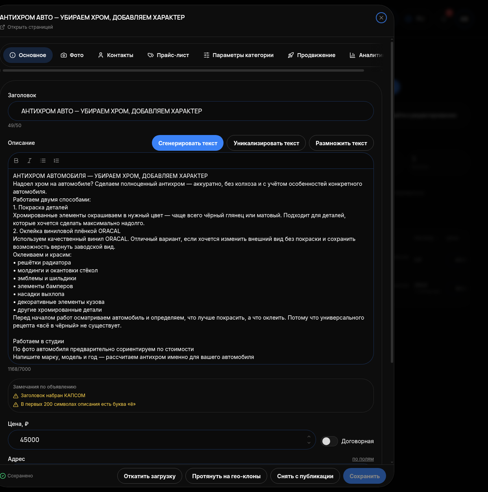

# Редактирование объявления

## Что это и зачем

**Карточка объявления** — это форма, где меняют заголовок, описание, фото, цену, категорию и параметры одного объявления. Кабинет сам проверяет текст и показывает, что в нём не так. Три кнопки нейросети пишут и переписывают текст. Отсюда начинают, когда у объявления мало контактов при нормальных просмотрах: значит, проблема в самом объявлении.

## Когда правки появятся на Авито

Внизу карточки есть предупреждение: **«Изменения подхватятся Avito при следующем поллинге (раз в 2-3 часа)»**. После сохранения изменения в кабинете видны сразу. На Авито они появятся, когда площадка в очередной раз заберёт данные — через два-три часа. Если через 10 минут на Авито всё по-старому — это не ошибка, подождите.

## Где включается

Меню **«АВИТО»** → **«Мои объявления»** → наведите на строку → кнопка **«Редактировать»**. Ссылка **«Открыть страницей»** разворачивает карточку на весь экран.

## Как устроена карточка

Сверху — вкладки **«Основное», «Фото», «Контакты», «Прайс-лист», «Параметры категории», «Продвижение», «Аналитика»**. Отдельных экранов за ними нет: вкладка прокручивает форму к нужному блоку. Можно и просто листать вниз.

## Блок «Замечания по объявлению»

Кабинет сам проверяет текст объявления и перечисляет, что мешает ему работать. Например:

- **«Заголовок набран КАПСОМ»** — заголовок заглавными буквами прямо нарушает правила Авито, а покупатели читают его как крик. Перепишите обычными буквами.
- **«В первых 200 символах описания есть буква „ё"»** — кабинет советует заменить «ё» на «е» в начале описания: так объявление надёжнее находится, когда клиент набирает запрос без «ё» («пленка», а не «плёнка»).

Замечания — готовый список правок. Посмотрите их первым делом, открыв карточку. Исправили — замечание исчезает после сохранения.

## Блок «Основное»

### «Заголовок»

Поле со счётчиком символов, например **49/50**. Лимит Авито — 50 знаков. Пишите то, что ищет клиент: услугу и её главный признак (например, «Оклейка зоны риска полиуретаном»). Обычные буквы, без восклицаний.

### «Описание»

Поле со счётчиком, например **1168/7000** (лимит — 7 000 знаков). Над ним три кнопки:

- **«Сгенерировать текст»** — создаёт описание с нуля по данным объявления: категория, заголовок, прайс, [профиль клиента](13-profili-klientov.md) (бренд, телефон, адрес). Для нового объявления или когда старый текст никуда не годится.
- **«Уникализировать текст»** — переписать существующее описание другими словами, сохранив смысл. Нужно, чтобы Авито не считал объявление дублем другого вашего: одинаковые тексты площадка режет. Обязательно перед перевыпуском и для похожих объявлений на другие районы.
- **«Размножить текст»** — создаёт несколько вариантов одного описания для группы похожих объявлений (одна услуга, разные районы или машины).

После любой кнопки текст **прочитайте**: нейросеть может вставить услугу, которой у вас нет, или цену не из прайса. Всё, что в описании, должно совпадать с прайсом и базой знаний агента — иначе клиент увидит одно в объявлении, а в чате получит другое. И проверьте, не появилось ли новых пунктов в «Замечаниях».

### «Цена, ₽» и «Адрес»

Цена может быть числом или «Договорная». Адрес — «по полям»: город, улица, дом. По адресу Авито определяет, в какой выдаче показывать.

### «Категория»

Полная цепочка, например «Услуги › Предложение услуг › Автосервис, аренда › Автосервисы для автомобилей › Тюнинг и оборудование». Если не знаете, куда отнести объявление, — кнопка **«Не знаете категорию? Подобрать по описанию»**: кабинет предложит категорию по тексту.

Под категорией подпись: «Поля нового шаблона появятся на вкладке „Параметры категории". Заполненные поля сохранятся». То есть при смене категории меняется набор обязательных параметров ниже, но уже введённые данные не сотрутся.

### «Дополнительно»

**AvitoId** — номер объявления на Авито, появляется сам после публикации. Рядом — поле **тип услуги**.

## Остальные блоки

- **«Фото»** — фотографии объявления из общей библиотеки [Фото](09-foto.md).
- **«Контакты»** — телефон, имя, адрес, которые видит покупатель.
- **«Прайс-лист»** — цены на услуги внутри объявления.
- **«Параметры категории»** — обязательные поля для выбранной категории Авито. Без них площадка отклонит объявление.
- **«Продвижение»** — ставка и услуги продвижения для этого объявления.
- **«Аналитика»** — просмотры, контакты и расход именно по нему.

## Кнопки внизу карточки

- **«Сохранить»** — применить правки; рядом индикатор **«Сохранено»**.
- **«Закрыть»** — выйти, не сохранив правки.
- **«Снять с публикации»** — убрать объявление с Авито (при следующем поллинге).
- **«Протянуть на гео-клоны»** — применить эти правки ко всем копиям объявления по другим городам.
- **«Откатить загрузку»** — вернуть объявление к состоянию до последней загрузки из файла или импорта.

## Как проверить, что работает

1. Нажали «Сохранить» — появился индикатор «Сохранено», в «Моих объявлениях» у строки новый заголовок.
2. В блоке «Замечания по объявлению» не осталось пунктов.
3. Через 2–3 часа изменения видны на Авито.
4. Через день-два сравните ЦЕНУ КОНТАКТА до и после правки в колонке РАСХОД.

## Частые ошибки

- **Поправили и через десять минут смотрят Авито.** Правки уходят при следующем поллинге, раз в 2–3 часа.
- **Не читают «Замечания».** Кабинет уже нашёл, что чинить, — а человек переписывает описание наугад.
- **Заголовок 51+ символ или капсом.** Счётчик красный, замечание в блоке; капс — нарушение правил площадки.
- **Сгенерировали и сохранили не читая.** В тексте услуга или цена, которых нет.
- **Одинаковые описания в нескольких объявлениях.** Дубли — «Уникализировать текст».
- **Пустые «Параметры категории».** Объявление уходит в «Отклонено».
- **Правят текст при плохой позиции.** Если объявления не видно в выдаче, текст не поможет — смотрите позицию, ставку и возраст.
