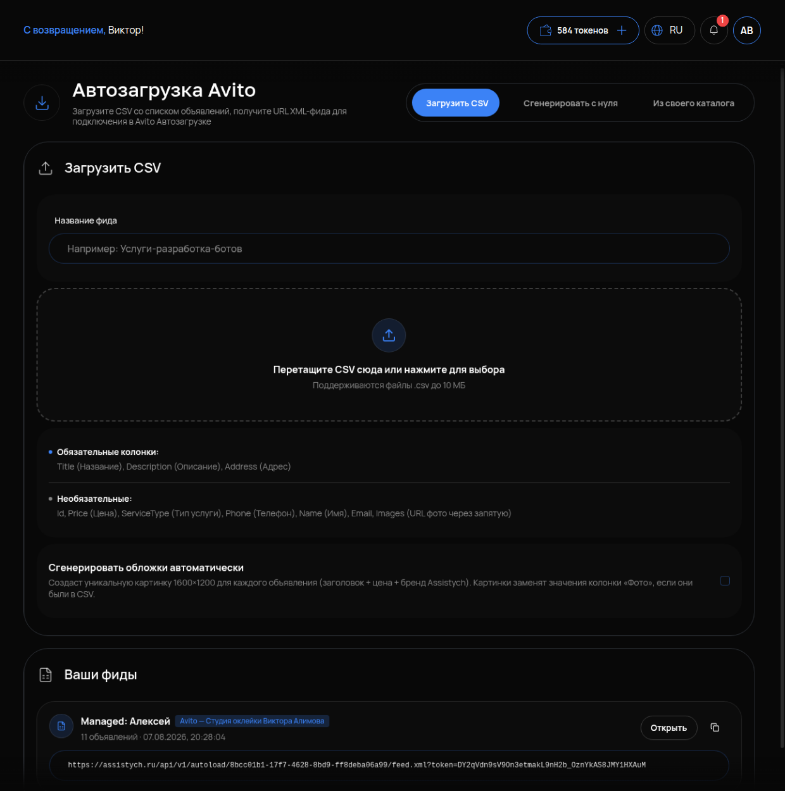

# Автозагрузка

## Что это и зачем

**Автозагрузка** — способ публиковать и обновлять много объявлений разом, файлом, а не руками по одному. Кабинет собирает из ваших объявлений **фид** — файл в формате для Авито — и даёт на него ссылку. Авито сам забирает объявления по этой ссылке, по расписанию. Нужна тем, у кого больше десятка объявлений или кто регулярно их перевыпускает.

## Где включается

Меню **«АВИТО»** → **«Автозагрузка»**. Подпись: «Загрузите CSV со списком объявлений, получите URL XML-фида для подключения в Avito Автозагрузке».

Чтобы автозагрузка работала, у аккаунта Авито должен быть доступ к разделу «Автозагрузка» на самом Авито (он есть не на всех тарифах).

## Что настроить

### Три способа собрать фид

- **«Загрузить CSV»** — у вас уже есть таблица объявлений: загружаете файл.
- **«Сгенерировать с нуля»** — объявлений нет, нейросеть создаёт их по вашему прайсу и профилю.
- **«Из своего каталога»** — фид собирается из объявлений, которые уже есть в «Моих объявлениях» (те, что вы отметили и нажали «Добавить в фид», см. [Массовые действия](04-massovye-deystviya.md)).

### Поля

- **«Название фида»** — как он будет называться в списке; удобно по услуге или городу.
- Зона перетаскивания файла — «Поддерживаются файлы .csv до 10 МБ».

### Колонки CSV

Обязательные — без них строка не пройдёт:

- **Title** (Название) — заголовок объявления, до 50 символов.
- **Description** (Описание) — текст объявления.
- **Address** (Адрес) — адрес, по которому Авито определит город и район.

Необязательные:

- **Id** — ваш собственный номер объявления. По нему Авито понимает, что это то же самое объявление, а не новое. Заполняйте всегда и не меняйте между загрузками.
- **Price** (Цена), **ServiceType** (Тип услуги), **Phone** (Телефон), **Name** (Имя).

## Порядок: два шага, второй — на Авито

1. **Здесь**, в кабинете: собираете фид любым из трёх способов и получаете **URL XML-фида** — ссылку.
2. **На Авито**: в кабинете Авито открываете «Автозагрузка», вставляете эту ссылку в настройки и включаете. Авито начнёт забирать фид по своему расписанию (обычно раз в сутки).

**Без второго шага ничего не опубликуется.** Кабинет только готовит файл; публикует Авито, когда приходит по ссылке. Первый забор — не раньше следующего запуска автозагрузки на Авито.

После публикации в «Моих объявлениях» появится плашка «Автозагрузка Авито включена» и строка «Последняя публикация …: Отчёт Авито: принято N» со ссылкой «Журнал» — там видно, что Авито принял, а что отклонил и почему.

## Как проверить, что работает

1. В кабинете есть фид с названием и ссылкой URL.
2. Ссылка вставлена в настройках автозагрузки на Авито, автозагрузка там включена.
3. После ближайшего запуска на Авито: в «Моих объявлениях» плашка «Отчёт Авито: принято N», где N — число ваших объявлений; в «Журнале» нет отклонённых.

## Частые ошибки

- **Собрали фид и ждут публикации.** Ссылку не вставили на Авито — второй шаг обязателен.
- **Нет колонки Id или он меняется.** Авито не может связать строку с прошлым объявлением и считает её новой.
- **Одинаковые Description.** Отклонение как дублей — перед загрузкой пропустите через «Уникализировать текст» или «Размножить текст» ([Редактирование](05-redaktirovanie.md)).
- **Title длиннее 50 символов.** Строка не принята — смотрите «Журнал».
- **Address без города.** Авито не определил регион — объявление отклонено.
- **Тариф Авито без автозагрузки.** Ссылка есть, но вставить её некуда. Убедитесь, что раздел доступен в кабинете Авито.
