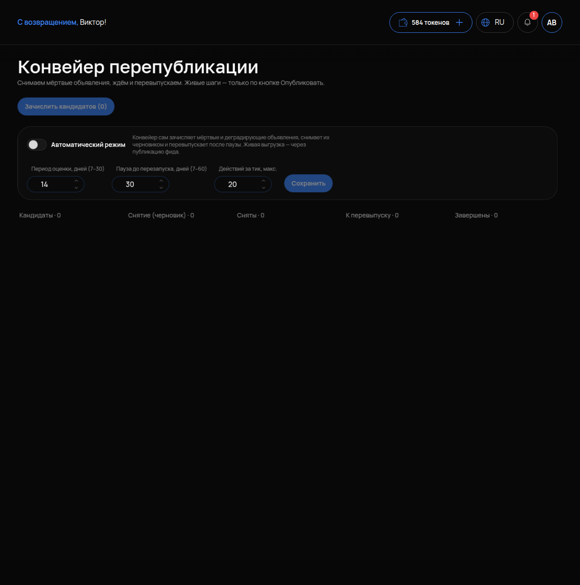

# Конвейер

## Что это и зачем

Со временем объявление на Авито проседает в выдаче: площадка показывает свежие выше старых. **Конвейер перепубликации** — механизм, который ведёт слабые объявления по цепочке: снять → выждать паузу → опубликовать заново. После перевыпуска счётчик возраста обнуляется. Объявление снова показывается как новое.

Конвейер **не** решает сам, что публиковать на Авито. Он только готовит объявления и ждёт вашего нажатия.

## Где включается

Меню **«АВИТО»** → **«Конвейер»**. Заголовок «Конвейер перепубликации», подпись: «Снимаем мёртвые объявления, ждём и перевыпускаем. Живые шаги — только по кнопке Опубликовать».

## Что настроить

- **«Зачислить кандидатов (N)»** — взять в конвейер объявления, которые правила [Перепубликации](08-perepublikaciya.md) отметили слабыми. N — сколько их сейчас. Если 0 — кандидатов нет: либо все объявления живые, либо правила ещё не заданы.
- **«Автоматический режим»** — конвейер сам двигает объявления по этапам без вашего участия. Публикация на Авито всё равно остаётся ручной.
- **«Период оценки, дней (7–30)»** — за сколько дней смотреть просмотры и контакты, чтобы признать объявление слабым. Наш совет для старта — 14 дней: неделя слишком шумная, месяц слишком долго.
- **«Пауза до перезапуска, дней (7–60)»** — сколько объявление лежит снятым перед перевыпуском. Минимум в поле — 7 дней; наш совет — не торопиться и брать ближе к 14.
- **«Действий за тик, макс.»** — сколько объявлений конвейер обрабатывает за один проход. Ограничение, чтобы не снять всё разом.
- **«Сохранить»**.

## Этапы конвейера

На экране пять этапов со счётчиками:

**«Кандидаты»** → **«Снятие (черновик)»** → **«Сняты»** → **«К перевыпуску»** → **«Завершены»**

- **Кандидаты** — отобраны правилами, ещё ничего не сделано.
- **Снятие (черновик)** — подготовлены к снятию; сам шаг выполняется кнопкой.
- **Сняты** — сняты с Авито, идёт пауза.
- **К перевыпуску** — пауза вышла, объявление уникализировано (заголовок и описание переписала нейросеть, фото пересобраны) и ждёт «Опубликовать».
- **Завершены** — перевыпущены, цикл закрыт.

## Ничего не публикуется без вас

Это главное про конвейер: **все живые шаги — снятие с Авито и публикация — только по кнопке «Опубликовать»**. Автоматический режим переводит объявления между этапами внутри кабинета, но на площадку ничего не отправляет. Так задумано: перевыпуск — это деньги и риск, решение остаётся за человеком.

## Как проверить, что работает

1. Настройки сохранены: период, пауза, действий за тик.
2. Если слабые объявления есть — у «Зачислить кандидатов (N)» будет N > 0, и после нажатия они появятся на этапе «Кандидаты».
3. Через заданную паузу объявления дошли до этапа перевыпуска и ждут «Опубликовать».

Если кандидатов 0 — это не поломка. Настройте правила в [Перепубликации](08-perepublikaciya.md) или подождите: объявления ещё не прожили период оценки.

## Частые ошибки

- **Ждут, что конвейер сам опубликует.** Не опубликует — нажмите «Опубликовать».
- **Минимальная пауза «чтобы быстрее».** Слишком короткая пауза может не дать эффекта нового объявления. Поле не даст поставить меньше 7 дней; мы советуем больше.
- **Период оценки 7 дней на редкой услуге.** Объявление признано слабым из-за случайной тихой недели.
- **Перевыпустили без уникализации.** Объявление считается дублем снятого. Конвейер уникализирует сам — не публикуйте кандидатов вручную.
- **Кандидатов 0, и это принимают за ошибку.** Правил перепубликации нет или объявления моложе периода оценки.
