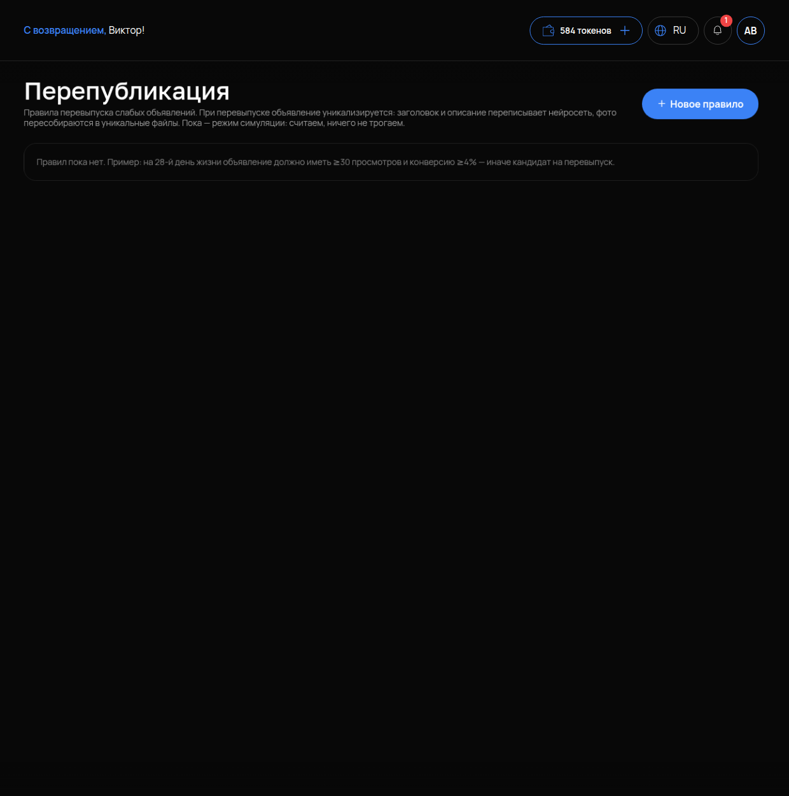

# Перепубликация

## Что это и зачем

**Перепубликация** — правила, по которым кабинет решает, что объявление ослабло и его пора перевыпустить. Это значит снять его и опубликовать заново с новым текстом и фото. Правило — это условие: «к такому-то дню жизни объявление должно набрать столько-то просмотров и такую-то конверсию, иначе оно кандидат». Кандидатов дальше обрабатывает [Конвейер](07-konveyer.md).

## Где включается

Меню **«АВИТО»** → **«Перепубликация»**. Подпись: «Правила перевыпуска слабых объявлений. При перепубликации объявление уникализируется: заголовок и описание переписывает нейросеть, фото пересобираются в уникальные файлы. Пока — режим симуляции: считаем, ничего не трогаем».

## Сейчас — режим симуляции

Прочитайте это до настройки: **правила считают кандидатов, но ничего не меняют.** Ни одно объявление не снимется и не перевыпустится само. Правила показывают, какие объявления слабые. Для этого есть переключатель «Только кандидаты на перевыпуск» в [Моих объявлениях](03-moi-obyavleniya.md). Все действия делаете вы — через конвейер и кнопку «Опубликовать». Если вы ждёте, что после создания правила что-то произойдёт на Авито, — не произойдёт. Это не поломка.

## Что настроить

Кнопка **«Новое правило»**. Пока правил нет, на экране подсказка с готовым примером:

> на 28-й день жизни объявление должно иметь ≥30 просмотров и конверсию ≥4% — иначе кандидат на перевыпуск

Из чего состоит правило:

- **День жизни объявления** для оценки. 28 дней — месяц на площадке. Объявление уже показало, на что способно.
- **Минимум просмотров** к этому дню. Зависит от ниши: для массовой услуги 30 — мало, для узкой — много. Возьмите медиану по своим живым объявлениям из [Моих объявлений](03-moi-obyavleniya.md).
- **Минимальная конверсия** — доля просмотров, дошедших до контакта (см. [Аналитика](11-analitika.md)). 4% — ориентир для услуг.

Объявление, не дотянувшее хотя бы до одного порога, становится кандидатом.

### Что происходит при перевыпуске

Когда кандидат доходит до публикации через конвейер, объявление **уникализируется**: заголовок и описание переписывает нейросеть, фото пересобираются в новые файлы. Это нужно, чтобы Авито не распознал в перевыпуске дубль снятого объявления. Текст после перевыпуска стоит прочитать — как и после любой генерации.

## Как проверить, что работает

1. Правило создано и видно в списке.
2. В «Моих объявлениях» включите «Только кандидаты на перевыпуск» — в списке появятся объявления, не прошедшие пороги правила. Убедитесь по колонкам ПРОСМОТРЫ и ВОЗРАСТ, что они действительно под условие попадают.
3. В [Конвейере](07-konveyer.md) кнопка «Зачислить кандидатов (N)» показывает то же число.

## Частые ошибки

- **Ждут действий после создания правила.** Режим симуляции: правила только считают.
- **Пороги «из головы».** 30 просмотров для услуги с сотней просмотров в день — все объявления живые; для редкой услуги — все кандидаты. Пороги — от своих цифр.
- **Оценка на 7-й день.** Слишком рано, объявление ещё разгоняется. Не раньше 14-го, лучше 28-й.
- **Перевыпускают вручную без уникализации.** Дубль. Перевыпуск — через конвейер, он уникализирует сам.
- **Не читают текст после перевыпуска.** Нейросеть могла изменить смысл или цену.
