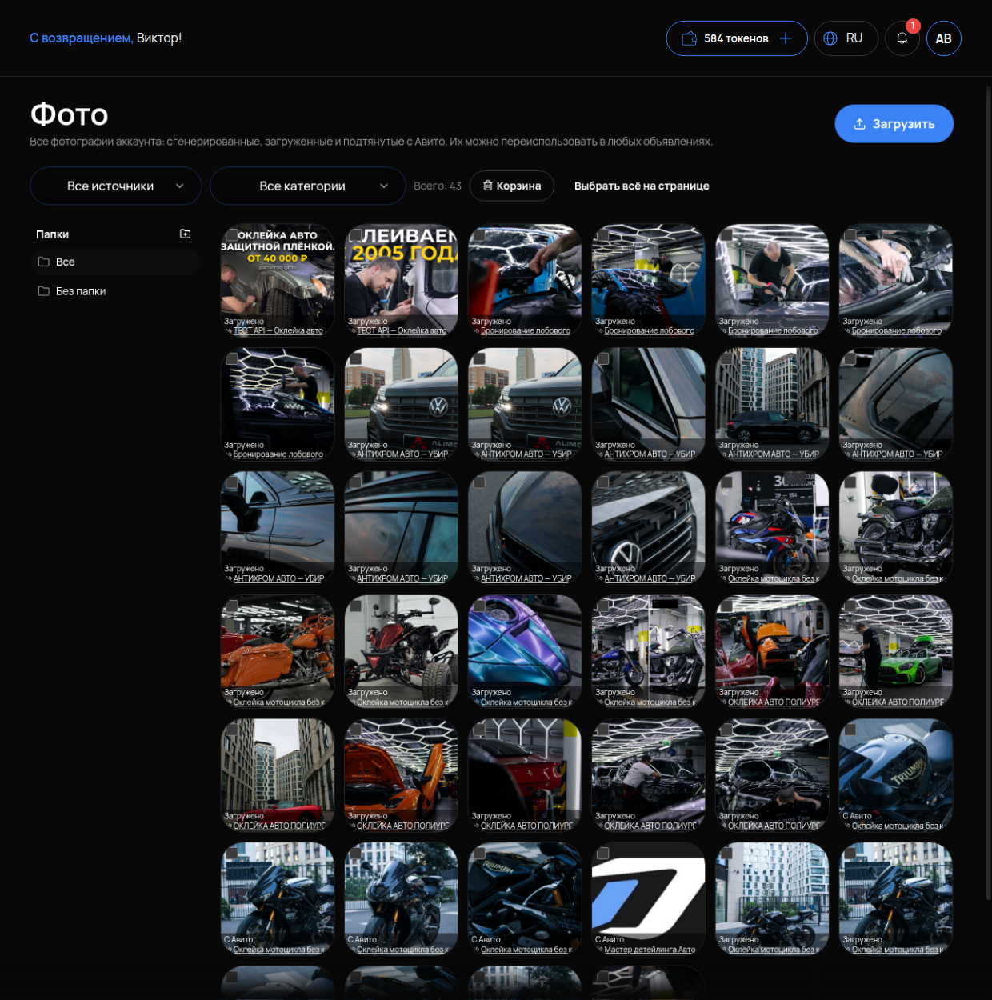

# Фото

## Что это и зачем

**Фото** — общая библиотека картинок аккаунта. Сюда попадают загруженные вами фотографии, сгенерированные нейросетью и подтянутые с ваших объявлений на Авито. Из библиотеки фото ставятся в любое объявление. Одно фото можно использовать в нескольких объявлениях без повторной загрузки.

## Где включается

Меню **«АВИТО»** → **«Фото»**. Подпись: «Все фотографии аккаунта: сгенерированные, загруженные и подтянутые с Авито. Их можно переиспользовать в любых объявлениях».

## Что на странице

- **«Загрузить»** — добавить свои фото с компьютера или телефона.
- Фильтры **«Все источники»** (загруженные / сгенерированные / с Авито) и **«Все категории»**.
- Счётчик **«Всего: N»**.
- **«Корзина»** — удалённые фото; их можно вернуть.
- **«Выбрать всё на странице»** — для массовых действий: переместить в папку, удалить.
- Список папок слева: **«Все»**, **«Без папки»** и ваши папки.

## Что настроить

### Папки

Разложите фото по услугам или объектам: «Оклейка зона риска», «Полная оклейка», «Салон». Когда фото станет много, без папок нужное не найти. Новые загрузки попадают в «Без папки» — разбирайте их сразу.

### Фото в объявлении

Ставятся в карточке объявления на вкладке «Фото» ([Редактирование](05-redaktirovanie.md)) — выбором из этой библиотеки. При перевыпуске через [Конвейер](07-konveyer.md) фото автоматически пересобираются в новые файлы. В библиотеке появятся их копии как «сгенерированные».

### Ссылка на фото

У каждого фото есть прямая ссылка. Она открывается без входа в кабинет. Это позволяет агенту отправлять клиенту фото работ в чате. Но сам агент фото не выбирает: у фотографий нет подписей, по которым он мог бы понять, что на них. Если хотите, чтобы агент показывал работы, — заведите в его базе знаний таблицу «что на фото → ссылка» и напишите в инструкции отправлять ссылку отдельной строкой.

## Что помогает (советы, не настройки кабинета)

Это общие правила для фото на Авито, кабинет их не проверяет и не требует:

- горизонтальные кадры: превью в выдаче горизонтальное, вертикальные обрезаются;
- важное — в центре кадра, края превью срезаются;
- без текста, плашек и водяных знаков — такие фото Авито ранжирует хуже и может отклонить;
- разные **первые** фото у похожих объявлений: одинаковая обложка у серии — риск пометки дублей. Остальные фото повторять можно.

## Как проверить, что работает

1. Загрузите фото — оно появилось в «Без папки», счётчик «Всего» вырос.
2. Переместите в папку — фото видно в папке и в «Все».
3. В карточке любого объявления на вкладке «Фото» это изображение доступно для выбора.

## Частые ошибки

- **Всё в «Без папки».** Через месяц сотни фото без структуры. Разбирайте при загрузке.
- **Удалили фото, которое стоит в активном объявлении.** Объявление осталось без картинки. Прежде чем удалять, посмотрите, где фото используется; удалённое можно вернуть из «Корзины».
- **Одинаковое первое фото в серии объявлений.** Риск пометки дублей.
- **Текст и логотипы на фото.** Хуже ранжируется, может быть отклонено.
- **Ждут, что агент сам пришлёт нужное фото.** Не пришлёт без таблицы «что на фото → ссылка» в базе знаний.
