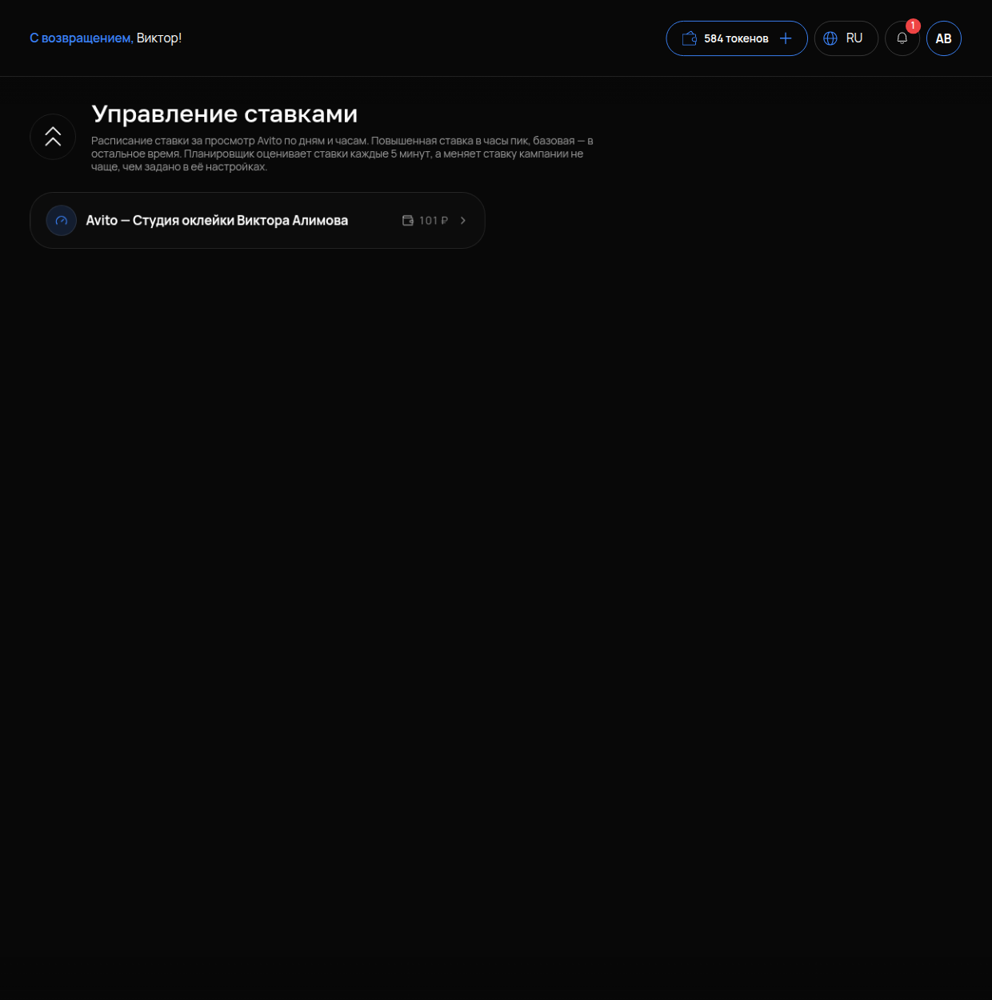

# Управление ставками

## Что это и зачем

На Авито в ряде категорий вы платите **за просмотры** объявления. Размер оплаты — **ставка** — влияет на место в выдаче: чем выше ставка, тем выше показывают.

**Управление ставками** — это расписание, по которому ставка меняется сама. Повышенная ставка включается в часы, когда ваши клиенты ищут, базовая — в остальное время. Так деньги уходят туда, где есть спрос, а не размазываются по ночи.

Это раздел про деньги. Прочитайте до конца, прежде чем ставить цифры.

## Где включается

Меню **«АВИТО»** → **«Управление ставками»**. Подпись: «Расписание ставки за просмотр Avito по дням и часам. Повышенная ставка в часы пик, базовая — в остальное время. Планировщик оценивает ставки каждые 5 минут, а меняет ставку кампании не чаще, чем задано в её настройках».

## Что на странице

- **Выбор аккаунта** и его **баланс** — с какого счёта списываются просмотры (см. [Обзор](01-obzor.md): у аккаунта два счёта).
- Расписание и настройки кампании появляются, когда у аккаунта есть кампания продвижения на Авито. Если кампаний нет, страница показывает только аккаунт и баланс — настраивать пока нечего.

## Как это работает

- **Базовая ставка** действует всегда, когда не активна повышенная. Это ваш минимум, с которым объявление вообще показывается.
- **Повышенная ставка** включается только в отмеченные часы. Например, в будни с 10 до 14 и с 18 до 21, когда клиенты ищут услугу.
- **Планировщик** каждые 5 минут проверяет, какая ставка должна быть сейчас по расписанию. Он меняет ставку кампании на Авито не чаще, чем задано в её настройках. Ставка меняется не мгновенно.
- **Списание идёт за просмотры**, а не за клики и не за контакты. Подняли ставку — выросли просмотры и расход. Выросли ли контакты — отдельный вопрос.

## Что настроить

1. Посмотрите в [Аналитике](11-analitika.md), в какие дни и часы у вас больше контактов, — это и есть часы пик.
2. Базовую ставку оставьте на уровне, при котором объявление держится в выдаче (ориентир — текущая ставка в «Моих объявлениях»).
3. Повышенную поставьте выше базовой и отметьте часы пик в расписании. Насколько выше — зависит от конкуренции в вашей категории. Начните с небольшого шага.
4. Через неделю сравните **цену контакта** до и после.

## По какой цифре судить

**Не по просмотрам.** Просмотры при повышенной ставке вырастут всегда — за них вы платите.

Смотрите **ЦЕНУ КОНТАКТА** в [Аналитике](11-analitika.md) и в колонке РАСХОД в «Моих объявлениях». Если после расписания контакт стал дешевле или контактов стало больше при той же цене — расписание работает.

Если контакт подорожал — повышенная ставка стоит не в те часы или объявление само по себе слабое. Тогда сначала доработайте [текст и фото](05-redaktirovanie.md).

## Как проверить, что работает

1. В расписании отмечены часы, кампания сохранена.
2. В отмеченный час откройте «Мои объявления» — в колонке СТАВКА стоит повышенное значение; в неотмеченный — базовое (планировщик меняет ставку не чаще заданного).
3. Через 7 дней в «Аналитике» цена контакта не выросла, а контактов стало больше.

## Частые ошибки

- **Повышенная ставка круглосуточно.** Это не расписание, а просто дорогая ставка. Отмечайте часы пик.
- **Судят по просмотрам.** Просмотры — это расход, а не результат. Считайте контакты.
- **Поднимают ставку на слабое объявление.** Больше людей увидят объявление, которое не убеждает. Сначала текст и фото.
- **Меняют ставку каждый день.** Планировщик ограничен частотой смены, а вы не успеваете набрать статистику. Дайте неделю.
- **Не смотрят на баланс.** Повышенная ставка съедает аванс за пару дней, объявления встают. Следите за счётом в «Обзоре».
