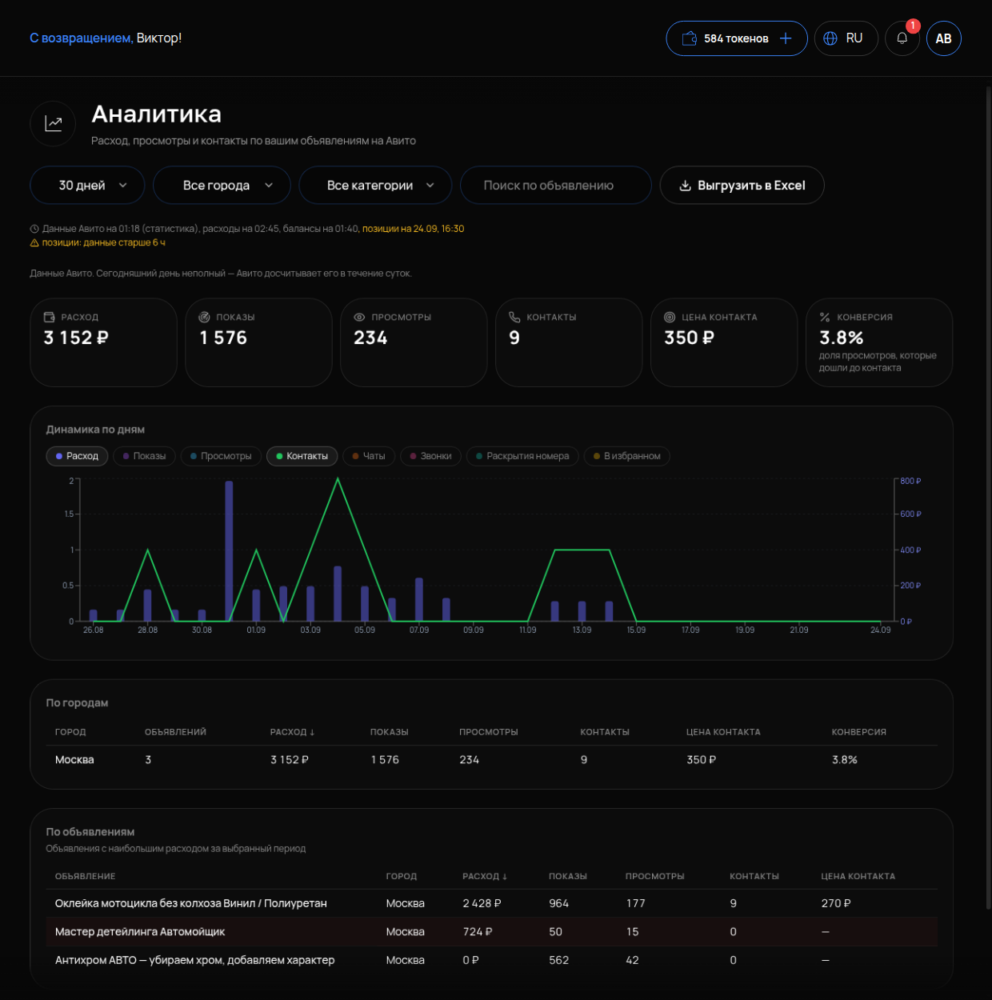

# Аналитика Авито

## Что это и зачем

**Аналитика** — цифры по вашим объявлениям за период. Сколько потратили, сколько раз показали, сколько раз открыли. Сколько человек написали или позвонили, во сколько обошёлся каждый такой человек. По этому разделу принимают решения о ставках, текстах и перевыпуске — а не по ощущениям.

## Где включается

Меню **«АВИТО»** → **«Аналитика»**. Подпись: «Расход, просмотры и контакты по вашим объявлениям на Авито». Ничего включать не нужно. Данные приходят с подключённого аккаунта.

## Что на странице

Фильтры: период **«30 дней»**, **«Все города»**, **«Все категории»**. Кнопка **«Выгрузить в Excel»** скачивает всю таблицу файлом.

Шесть карточек:

- **РАСХОД** — сколько списано за период.
- **ПОКАЗЫ** — сколько раз объявление появилось в выдаче или ленте.
- **ПРОСМОТРЫ** — сколько раз объявление открыли.
- **КОНТАКТЫ** — сколько человек написали в чат, позвонили или нажали «показать телефон».
- **ЦЕНА КОНТАКТА** — расход, делённый на контакты.
- **КОНВЕРСИЯ** — «доля просмотров, которые дошли до контакта».

Ниже — таблица по объявлениям с теми же показателями.

## Как читать цепочку

**Показ → просмотр → контакт.** На каждом шаге часть людей уходит. По месту ухода видно, что именно чинить:

| Что видите | Где проблема | Что делать |
|---|---|---|
| Мало показов | Объявление низко в выдаче | Ставка, возраст объявления, [перевыпуск](08-perepublikaciya.md) |
| Показов много, просмотров мало | Не кликают: первое фото и заголовок | Заголовок и первое фото в [карточке](05-redaktirovanie.md) |
| Просмотров много, контактов мало | Открыли и ушли: текст, цена, остальные фото | Описание, цена, фото |
| Контакты есть, заказов нет | Дальше объявления: ответы в чате | Инструкция и база знаний [агента](../agent/02-instrukciya-agenta.md) |

**Цена контакта — главная цифра.** Она показывает, сколько стоит один написавший или позвонивший клиент. Её легко сравнить с вашим заработком с заказа. Посчитайте сами: сколько вы зарабатываете с одного заказа и сколько обращений доходит до заказа. Если контакт обходится дешевле этой величины — реклама окупается. Если дороже — чинить надо цепочку выше: объявление, фото, цену, а не наливать бюджет.

## Что настроить

Настраивать нечего. Полезно завести привычку: раз в неделю открывать «Аналитику» за 30 дней, сортировать таблицу по цене контакта и разбирать три самых дорогих объявления по таблице выше.

Данные за сегодня неполные. Авито досчитывает день в течение суток (см. [Обзор](01-obzor.md)). Сравнивайте закрытые дни.

## Как проверить, что работает

1. Карточки заполнены за «30 дней». РАСХОД примерно совпадает с операциями в кабинете Авито без сегодняшнего дня.
2. В таблице есть все активные объявления из «Моих объявлений».
3. Кнопка «Выгрузить в Excel» отдаёт файл с теми же цифрами.

## Частые ошибки

- **Смотрят на просмотры как на результат.** Результат — контакты и их цена. Почему просмотры не показатель, читайте в [Управлении ставками](10-stavki.md).
- **Сравнивают сегодня с Авито.** Сегодня не досчитан.
- **Одна цифра за один день.** Это случайность. Смотрите данные за 14–30 дней.
- **Меняют все сразу.** Подняли ставку, переписали текст, сменили фото — и непонятно, что помогло. Одно изменение — неделя — сравнение.
- **Хорошая аналитика объявлений, плохие продажи.** Проблема после контакта. Посмотрите, как агент отвечает в «Чатах».
