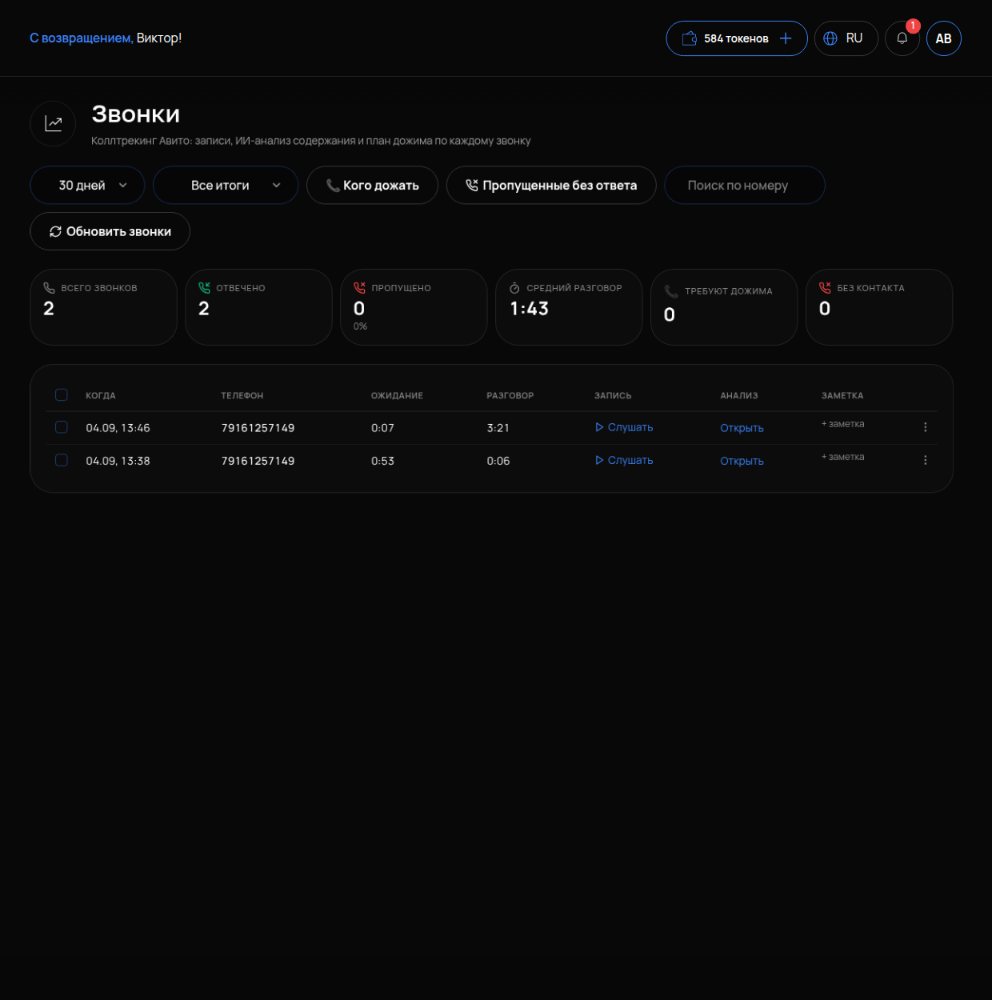

# Звонки

## Что это и зачем

**Звонки** — все входящие вызовы по вашим объявлениям Авито в одном месте. Здесь собраны записи разговоров, разборы от нейросети и подсказки, кому перезвонить. Раздел нужен тем, у кого клиенты звонят, а не только пишут. Без него о пропущенном звонке никто не узнает.

Звонки попадают сюда, если в объявлении используется номер Авито. Площадка сама подставляет его и записывает разговор. Настраивается это на стороне Авито, не в кабинете.

## Где включается

Меню **«АВИТО»** → **«Звонки»**. Подпись: «Коллтрекинг Авито: записи, ИИ-анализ содержания и план дожима по каждому звонку». Кнопка **«Обновить звонки»** подтягивает свежие.

## Что на странице

Фильтры: период **«30 дней»**, **«Все итоги»**, **«📞 Кого дожать»**, **«Пропущенные без ответа»**.

Счётчики: **ВСЕГО ЗВОНКОВ · ОТВЕЧЕНО · ПРОПУЩЕНО · СРЕДНИЙ РАЗГОВОР · ТРЕБУЮТ ДОЖИМА · БЕЗ КОНТАКТА**.

Таблица: **КОГДА · ТЕЛЕФОН · ОЖИДАНИЕ · РАЗГОВОР · ЗАПИСЬ** («Слушать») **· АНАЛИЗ** («Открыть») **· ЗАМЕТКА** («+ заметка»).

## Как читать

- **ОЖИДАНИЕ** — сколько секунд человек слушал гудки до ответа. **РАЗГОВОР** — сколько длился разговор. Долгое ожидание и короткий разговор почти всегда значат одно: клиент бросил трубку, не дождавшись. Если таких много — проблема не в объявлениях, а в том, кто отвечает на телефон.
- **ПРОПУЩЕНО** — звонки без ответа. Каждый такой звонок — клиент, который не дождался ответа.
- **АНАЛИЗ («Открыть»)** — нейросеть прослушала запись и написала: что хотел клиент, договорились ли, что обещали, что делать дальше. Читать текст быстрее, чем слушать аудио.
- **ТРЕБУЮТ ДОЖИМА** — звонки, где клиент проявил интерес, но до заказа не дошло: «подумаю», «перезвоню», «уточню у жены». Это самые тёплые люди в списке.
- **БЕЗ КОНТАКТА** — по звонку не удалось понять, кто это и что нужно (сброс, тишина).

## С чего начинать день

Фильтр **«📞 Кого дожать»** — это список для начала дня. Здесь собраны люди, которые уже интересовались и ждут повода вернуться. Откройте «Анализ» по каждому, перезвоните и зафиксируйте результат кнопкой **«+ заметка»**. Тогда завтра вы не будете звонить им снова.

Второй фильтр на утро — **«Пропущенные без ответа»**: нужно перезвонить всем, кто не дозвонился вчера вечером.

## Как проверить, что работает

1. Нажмите «Обновить звонки» — появились звонки за последние дни с записями «Слушать».
2. У звонка с разговором длиннее минуты «Открыть» показывает разбор: тема, договорённость, следующий шаг.
3. Счётчик ПРОПУЩЕНО совпадает с числом пропущенных в кабинете Авито за период.

## Частые ошибки

- **Раздел пустой.** В объявлениях указан ваш прямой телефон, а не номер Авито — звонки идут мимо записи. Посмотрите настройки номера в кабинете Авито.
- **Много пропущенных в одно и то же время.** Обед, вечер, выходные — некому брать трубку. Поможет график или переадресация.
- **Не читают «Анализ», слушают всё подряд.** Тратят час в день на записи. Разбор нейросети даёт суть разговора за минуту — запись нужна, только когда разбор чего-то не объясняет.
- **«Кого дожать» никто не открывает.** Тёплые клиенты остывают за день-два.
- **Нет заметок.** Через неделю непонятно, кому уже перезвонили. Оставляйте «+ заметка» после каждого звонка.
