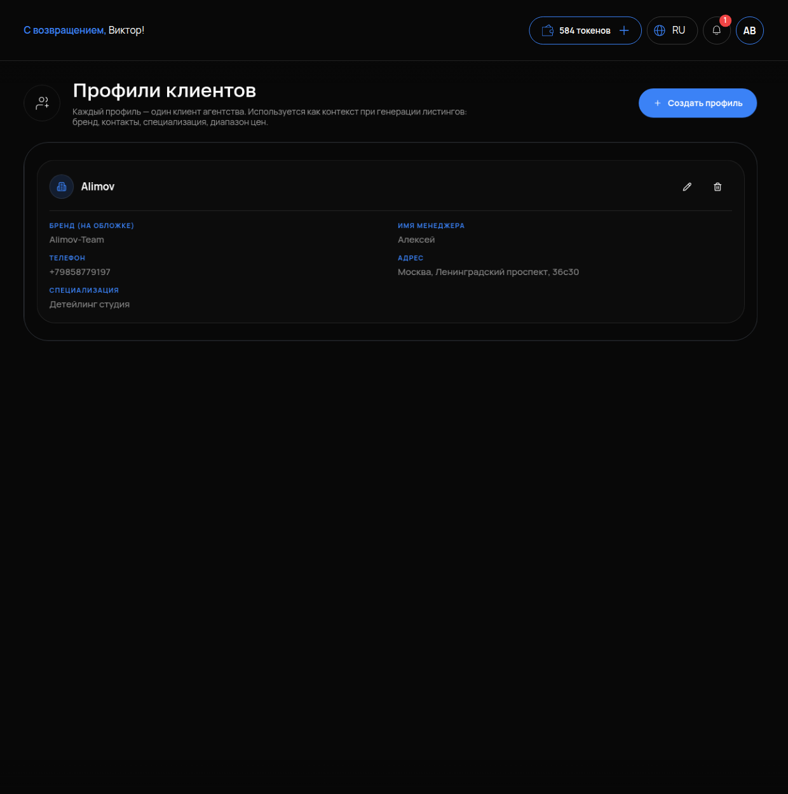

# Профили клиентов

## Что это и зачем

**Профиль клиента** — это карточка бизнеса, для которого вы ведёте Авито. В ней записаны название, менеджер, телефон, адрес и специализация. Нейросеть берёт эти данные при генерации объявлений («Сгенерировать текст», «Сгенерировать в аккаунт», фид «с нуля») и подставляет в текст.

Инструмент нужен тем, кто ведёт **несколько аккаунтов** — агентствам и авитологам. Если у вас один аккаунт, профиль тоже полезен. Тогда в текстах будут ваши контакты, а не заглушка «уточните у менеджера».

## Где включается

Меню **«АВИТО»** → **«Профили клиентов»**. Подпись: «Каждый профиль — один клиент агентства. Используется как контекст при генерации листингов: бренд, контакты, специализация, диапазон цен». Кнопка **«Создать профиль»**.

## Что настроить — поля профиля

- **«БРЕНД (НА ОБЛОЖКЕ)»** — название для текстов и обложек. Пишите имя бренда для покупателей, а не юрлицо.
- **«ИМЯ МЕНЕДЖЕРА»** — имя для общения в объявлении (например, «Звоните, Алексей»).
- **«ТЕЛЕФОН»** — номер для объявлений.
- **«АДРЕС»** — адрес компании. Попадёт в описание и в поле Address при генерации фида.
- **«СПЕЦИАЛИЗАЦИЯ»** — суть бизнеса двумя-тремя фразами: услуги, преимущества, аудитория. Это главное поле. Из него нейросеть понимает, о чём писать.

Если оставить поле пустым, нейросеть пропустит этот блок или придумает общую фразу. Без специализации получатся шаблонные тексты в духе «качественно и недорого».

## Как пользоваться

1. Создайте профиль для каждого клиента или аккаунта.
2. При генерации объявления или фида выберите нужный профиль. Нейросеть сама добавит бренд, контакты и специализацию.
3. Если у клиента изменился телефон или адрес, обновите их в профиле. Новые генерации сразу получат свежие данные.

Старые тексты профиль не меняет. Чтобы обновить их, отредактируйте карточку объявления.

## Как проверить, что работает

1. Профиль создан, все пять полей заполнены.
2. Откройте объявление клиента → нажмите «Сгенерировать текст» с выбранным профилем. В тексте должны появиться бренд, телефон и адрес, а специализация — раскрыться в содержании.

## Частые ошибки

- **Один профиль на всех.** В объявлениях одного клиента появится телефон другого. Создавайте профиль под каждый аккаунт.
- **Пустая специализация.** Тексты выходят безликими. Опишите бизнес так, будто объясняете задачу новому сотруднику.
- **Юрлицо в поле «БРЕНД».** Например, «ООО Вектор-Плюс» вместо «Студия оклейки Вектор». Покупатели ищут понятный бренд.
- **Поменяли телефон в профиле и ждут обновления старых объявлений.** Сами не обновятся — правьте карточки или перегенерируйте.
