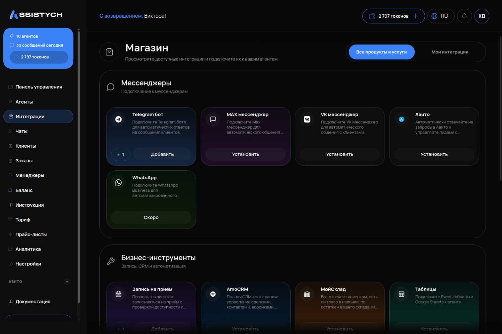
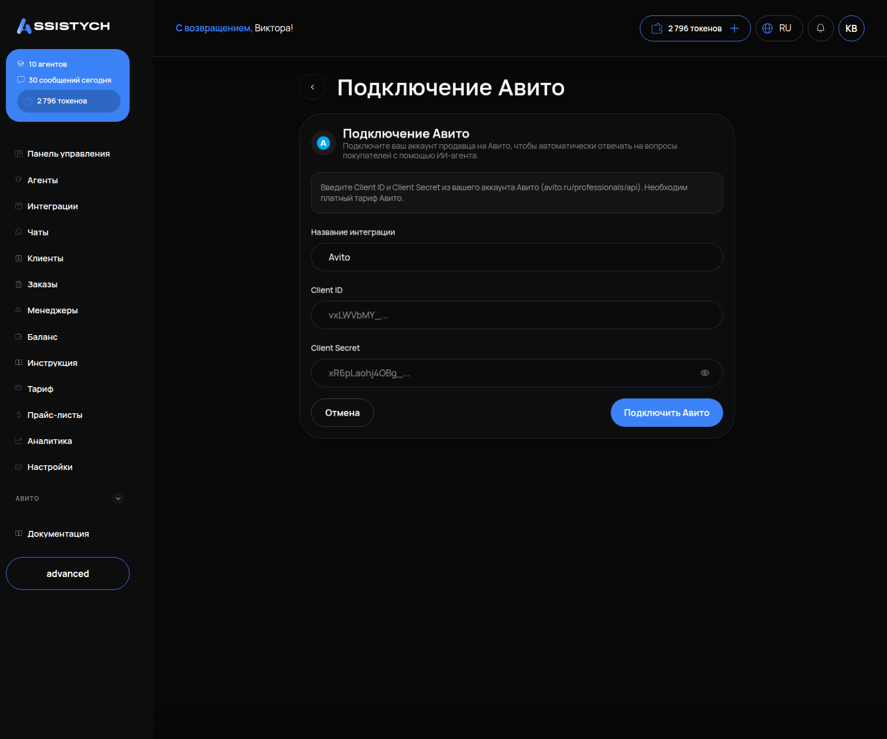
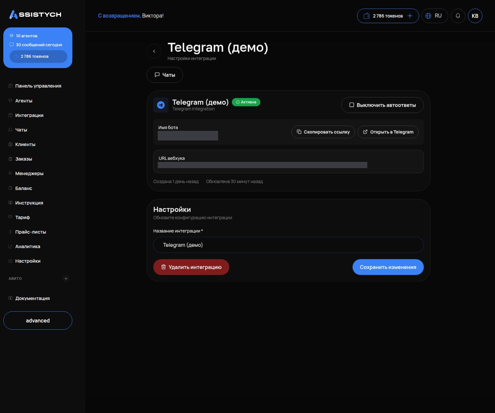
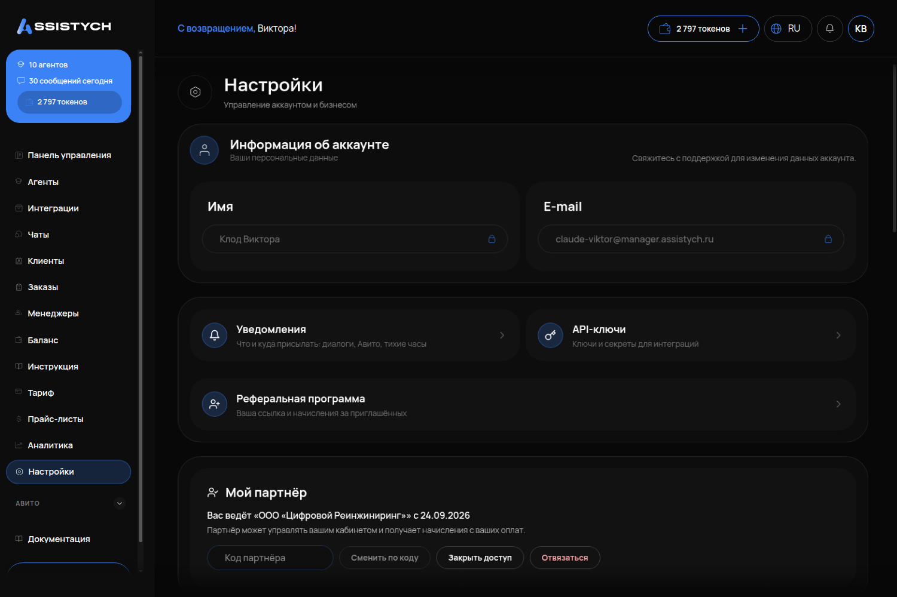

# Подключение каналов: Авито и Telegram

Как подключить агента к чатам Авито и к боту в Telegram, что подтвердить и как проверить, что клиенту отвечают.

Перед подключением у вас должен быть создан и проверен агент (инструкция «Первый запуск»). Канал без агента подключить нельзя: страница подключения покажет «Агенты не найдены. Сначала создайте агента».

---

## Что такое канал

**Канал** — это место, где клиент вам пишет: чат на Авито, ваш бот в Telegram, окно чата на сайте. Агент отвечает только в тех каналах, к которым он подключён. Один агент может обслуживать несколько каналов, и каждый канал привязан к одному агенту.

Все переписки из всех каналов собираются в разделе «Чаты», а люди, которые писали, — в разделе «Клиенты».

Все каналы подключаются из раздела «Интеграции» (пункт меню открывает «Магазин» с карточками каналов) или прямо с карточки агента — второй путь удобнее, канал сразу привязывается к агенту.

---

## Авито

### Что понадобится

Пара ключей от вашего аккаунта Авито: **Client ID** и **Client Secret**. Их выдаёт Авито в кабинете для разработчиков: avito.ru/professionals/api. Для работы с ключами у аккаунта Авито должен быть платный тариф.

Чтобы агент отвечал сразу, а не с задержкой, в кабинете Авито нужна подписка «API мессенджера». Без неё сообщения подтягиваются с задержкой до часа — для чата это слишком долго.

### Подключение

1. В левом меню кабинета откройте «Агенты» → нужный агент → вкладка «Интеграции» → «Добавить интеграцию» → «Авито». Подключать лучше отсюда: так канал сразу привязывается к этому агенту.
2. В форме «Подключение Авито» заполните:
   - «Название интеграции» — как аккаунт будет называться в кабинете, например «Студия, Авито».
   - «Client ID» — первый ключ из Авито.
   - «Client Secret» — второй ключ. Поле скрывает ввод, как пароль.
3. Нажмите «Подключить Авито».

Assistych проверит ключи у Авито. Если всё верно — откроется страница интеграции. Если ошибка — проверьте, что оба ключа скопированы из одного приложения в кабинете Авито, целиком и без пробелов по краям.

### Включите автоответы

После подключения аккаунт появится в левом меню: «Авито» → «Мои аккаунты». На карточке аккаунта есть статус «Автоответы вкл» или «Автоответы выкл».

1. На карточке нажмите «Настройки».
2. Нажмите «Включить автоответы».

[скрин: карточка аккаунта Авито в «Мои аккаунты», выделить статус автоответов и кнопку «Настройки» — снимается из аккаунта продавца]

Пока автоответы выключены, кабинет работает как наблюдатель: вы видите переписку, объявления и статистику, но агент клиентам не отвечает. Это удобно, чтобы сначала посмотреть на входящие, а потом включить агента.

Если при подключении вы не выбрали агента, кабинет создаст выключенного агента «Авито-ассистент». Он не отвечает, пока вы его не настроите и не включите.

### История переписки

Если в аккаунте уже есть переписка с покупателями, на карточке нажмите «Подтянуть историю». Старые диалоги появятся в «Чатах» в течение нескольких минут. Дубли не создаются.

---

## Telegram

### Что понадобится

Свой бот в Telegram. Его создают один раз через официального бота @BotFather — это занимает две минуты.

### Создайте бота

1. Откройте в Telegram @BotFather (на странице подключения есть кнопка «Открыть @BotFather в Telegram»).
2. Отправьте команду `/newbot`.
3. Придумайте имя, которое увидят клиенты, например «Студия Динамо».
4. Придумайте username — латиницей, обязательно с «bot» на конце, например `dinamo_studio_bot`.
5. BotFather пришлёт **токен** — длинную строку вида `123456789:ABCdef...`. Скопируйте её. Токен управляет вашим ботом: никому его не показывайте.

[скрин: диалог с @BotFather, выделить строку с токеном — снимается из аккаунта владельца]

### Подключите бота к агенту

1. В кабинете: «Агенты» → нужный агент → «Интеграции» → «Добавить интеграцию» → «Telegram».
2. В форме «Подключение бота» заполните «Название интеграции», вставьте «Токен бота», в поле «Подключить к агенту» выберите агента.
3. Нажмите «Подключить бота». Появится «Telegram-бот подключён!».
4. Проверьте карточку интеграции: статус должен быть **«Активна»**, а автоответы включены. Если видите кнопку «Запустить» или «Включить автоответы» — нажмите её. Без этого бот не принимает сообщения.

Один бот подключается только к одному агенту. Если попробовать подключить тот же токен второй раз, кабинет скажет, что бот уже подключён.

---

## Уведомления вам лично

Отдельно от клиентских каналов кабинет умеет присылать уведомления вам: о новых чатах, о том, что клиент ждёт ответа, об окончании баланса. Они приходят через сервисный бот @AssistychBot в Telegram — это не тот бот, с которым общаются клиенты.

1. «Настройки» → блок «Telegram» → «Получить код». Появится 6-значный код, он действует несколько минут.
2. Откройте @AssistychBot в Telegram и отправьте ему код.
3. В кабинете блок покажет «Подключён как @ваш_username».
4. Там же отметьте, что присылать, и задайте «Тихие часы», чтобы ночью телефон молчал.

---

## Как убедиться, что получилось

**Авито**
1. В «Авито» → «Мои аккаунты» есть карточка вашего аккаунта со статусом «Автоответы вкл».
2. Напишите в свой аккаунт с другого аккаунта Авито (или попросите знакомого) — сообщение появилось в разделе «Чаты», и агент ответил. Если ответ пришёл не сразу, а через десятки минут, — на Авито не подключена подписка «API мессенджера».

**Telegram**
1. У интеграции статус «Активна».
2. Найдите своего бота в Telegram по username, нажмите «Старт» и напишите «Здравствуйте, сколько стоит ...». Ответ агента пришёл в Telegram, а сам диалог виден в «Чатах».

**Если агент молчит в любом канале**, проверьте по порядку:
- переключатель «Активен» на странице агента включён;
- у канала статус «Активна» (Telegram) или «Автоответы вкл» (Авито);
- в «Балансе» есть токены — без них агент не отвечает;
- если в настройках агента стоит режим ответов «Предлагает ответ», ответы ждут вашего «Отправить» в «Чатах», а не уходят сами.

Дальше: «Запись клиентов», если агент должен записывать на услуги, и «Агент отвечает не то — что делать», если ответы не нравятся.
