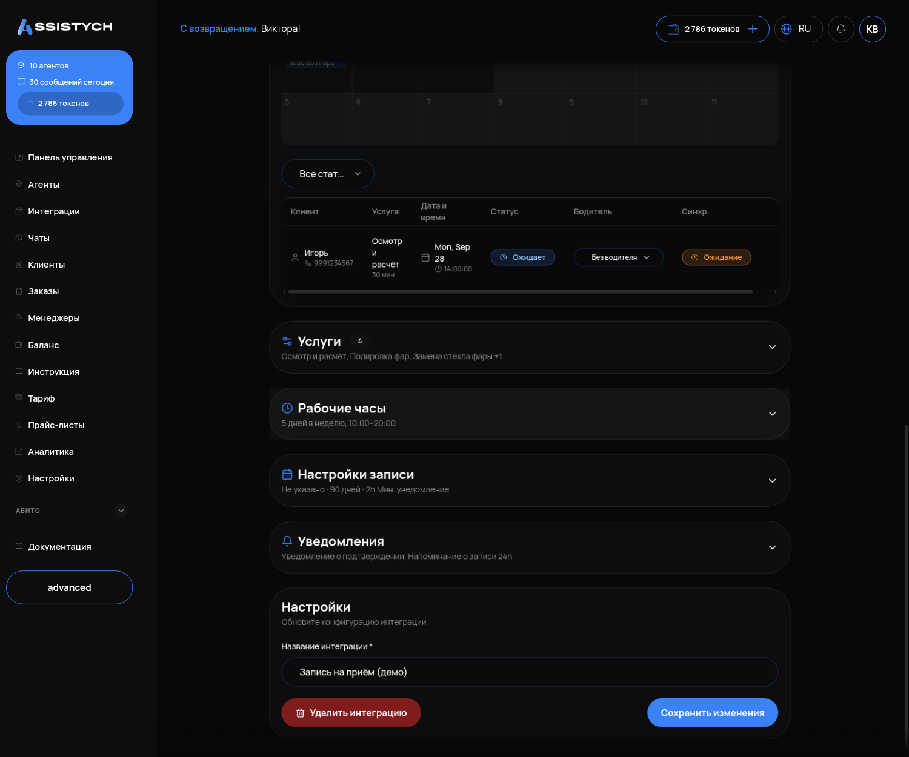
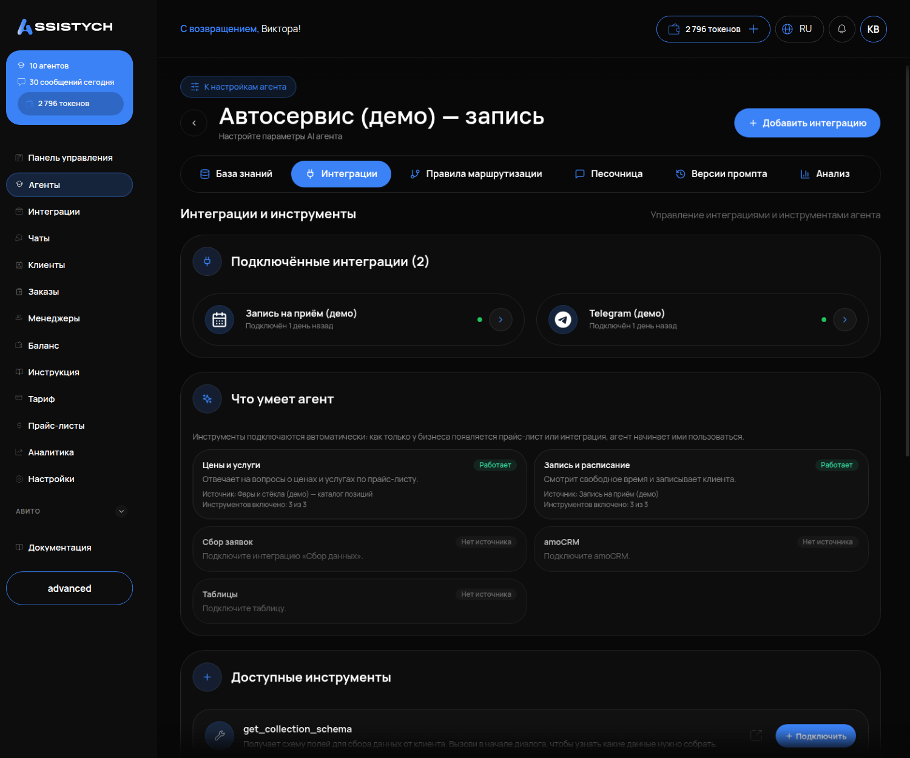
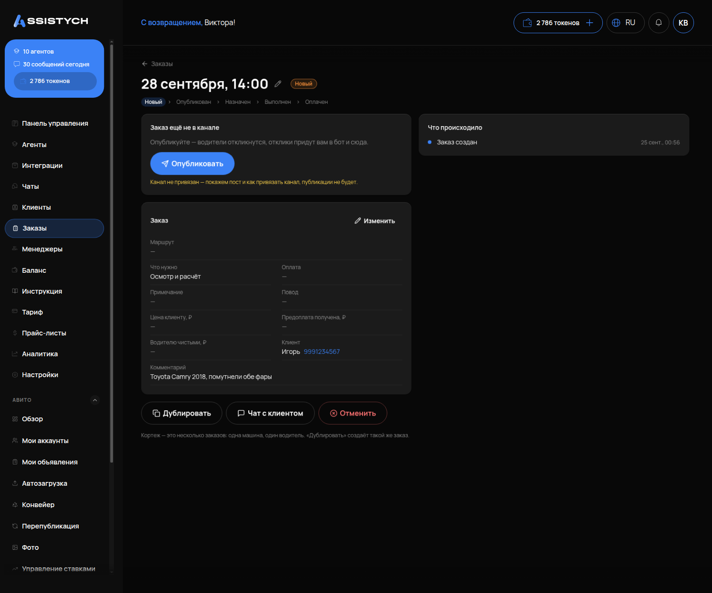

# Запись клиентов

Как научить агента записывать клиентов: услуги, свободное время, что появляется в «Заказах» и что с этим делать менеджеру.

Подходит бизнесу, где клиент записывается на время: сервис, студия, аренда авто с водителем, трансфер, салон. Перед этим агент должен быть создан и знать ваши цены (инструкции «Первый запуск» и «Научите агента своим ценам»).

---

## Как это работает

Чтобы агент мог записывать, ему нужен инструмент **«Онлайн-запись»** (в кабинете — интеграция записи, «планировщик»). Он даёт агенту четыре умения:

1. посмотреть список ваших услуг;
2. посмотреть свободное время;
3. создать запись;
4. собрать данные клиента: имя, телефон, детали.

Созданная запись появляется в разделе «Заказы» с комментарием, который агент собрал в разговоре: дата, машина, адрес, маршрут, число пассажиров. Дальше с записью работает человек: подтверждает, назначает исполнителя, закрывает.

## Шаг 1. Подключите онлайн-запись

1. Левое меню → «Интеграции» → карточка **«Запись на приём»** → «Установить».
2. В настройках интеграции заполните:
   - **список услуг** — название и длительность в минутах; каждая услуга отдельной строкой;
   - **рабочие часы** по дням недели: начало, конец, перерыв;
   - **часовой пояс**;
   - **горизонт записи** в днях — на сколько вперёд можно записываться (от 1 до 90);
   - **минимальное время до визита**.



Что важно знать про длительность: **запись получает длительность из услуги, а не из разговора.** Если у вас услуга «Аренда с водителем — 180 минут», а клиент договорился на 4 часа, запись всё равно займёт 180 минут, а «4 часа» останется текстом в комментарии. Если у вас разные по длительности варианты — заведите их отдельными услугами («Аренда 3 часа», «Аренда 4 часа», «Аренда 6 часов»).

## Шаг 2. Привяжите инструмент к агенту

Инструмент записи привязывается к **одному** агенту.

1. «Агенты» → нужный агент → «Настроить» → вкладка «Интеграции» → «Добавить интеграцию» → выберите вашу онлайн-запись.
2. Проверьте на вкладке «Инструменты», что в «Подключённых инструментах» появились услуги, свободное время и создание записи.



Другой способ, если агента ещё нет: при создании выбрать «Агент записи на приём» и на первом шаге указать вашу онлайн-запись — инструменты подключатся сами. Такие инструменты помечены как заблокированные: их нельзя снять, без них шаблон не работает.

## Шаг 3. Научите агента порядку записи

Инструмент даёт агенту возможность записать. Как именно вести разговор — решает инструкция. Добавьте в «Системный промпт» блок:

```
Запись на услугу:
1. Уточни услугу (или машину), дату, время, адрес подачи и число людей.
2. Предложи варианты и цену из базы знаний. Дождись, пока клиент выберет.
3. Только после выбора спроси имя и телефон.
4. Перечисли все детали одним списком и спроси «Всё верно?».
5. После подтверждения создай запись и напиши, что менеджер свяжется для подтверждения.
Если клиенту нужно несколько машин (мастеров) — создавай отдельную запись на каждую.
Если клиент называет время, которого нет среди свободных, — скажи, что оно занято, и предложи ближайшие свободные.
Если дата дальше горизонта записи — скажи, что запись на эту дату открывается позже, и предложи оставить контакт.
```

Про занятое время — тоже не лишнее: инструмент отдаёт агенту только свободные окна, поэтому сам агент «занято» не увидит и без этой строки может промолчать или предложить неподходящее.

Про «отдельную запись на каждую машину» — не лишнее: без этой строки кортеж из двух машин на свадьбу агент оформит одной записью, и в календаре будет одна машина вместо двух.

## Что видит клиент

Так прошёл разговор в проверке — от вопроса до созданной записи (служба аренды с водителем):

> **Клиент:** Хочу забронировать машину на 28 сентября на 4 часа, подача в 12:00 от Невского 100, двое, маршрут по городу и обратно.
>
> **Агент:** Для поездки по городу на двоих вот несколько вариантов из нашего парка: BMW 7 Series — 3 500 ₽/час … Mercedes-Benz S-Class 222 — 3 500 ₽/час … Какой автомобиль предпочтительнее?
>
> **Клиент:** Давайте S-класс
>
> **Агент:** Отличный выбор. Mercedes-Benz S-Class 222 на 4 часа: **14 000 ₽** (4 × 3 500 ₽). В сумму включена подача по городу и ожидание между остановками. А как к вам обращаться?
>
> **Клиент:** Меня зовут Пётр, телефон 9219998877, бронируйте
>
> **Агент:** Прежде чем оформить бронь, сверим детали: 28 сентября, подача в 12:00 · Невский проспект, 100 · по городу с возвратом · Mercedes-Benz S-Class 222 · 2 пассажира · 4 часа · 14 000 ₽ · Пётр, +7 (921) 999-88-77. Всё верно?
>
> **Клиент:** Да, всё верно, оформляйте
>
> **Агент:** Готово, Пётр. Заявка оформлена. Запись создана и ожидает подтверждения от администратора. Менеджер свяжется с вами для финального подтверждения.

Обратите внимание на порядок: сначала варианты и цена, имя и телефон — в конце, перед созданием — сверка списком. Именно так должно быть написано в инструкции.

## Шаг 4. Что появляется в «Заказах» и что делать менеджеру

Запись из разговора появляется в разделе «Заказы» (в календаре, если он у вас подключён, — в колонке «Без водителя», пока исполнитель не назначен).

В карточке заказа: дата и время, услуга, имя и телефон клиента, комментарий агента с деталями разговора (адрес, маршрут, число пассажиров, договорённости).

Менеджер:
1. Открывает заказ, читает комментарий.
2. Перезванивает клиенту, если нужно подтвердить.
3. Назначает водителя или мастера (в календаре — поле водителя, кнопка «Назначить и отправить»: исполнителю уйдёт карточка в Telegram, если он привязан к боту).
4. После выполнения отмечает «Выполнена» и «Оплачена».



Что в заказ **не попадает** и что нужно проверить руками:
- **сумма** — согласованная цена остаётся в комментарии, в поле «Сумма» её нужно вписать менеджеру;
- **длительность** — берётся из услуги (см. шаг 1);
- **записи дальше горизонта записи** — создать нельзя (горизонт вы задали в настройках онлайн-записи, до 90 дней). Если у вас бронируют дальше — поставьте горизонт побольше или предупредите клиентов в базе знаний: «запись открыта на N дней вперёд, на более поздние даты — по телефону».

---

## Как убедиться, что получилось

1. В «Интеграциях» онлайн-запись подключена, услуги и рабочие часы заполнены.
2. На вкладке «Инструменты» агента есть инструменты записи.
3. В тестовом чате пройдите разговор до конца: спросите услугу на конкретную дату, выберите вариант, назовите имя и телефон, ответьте «всё верно». Агент должен: назвать цену из базы, спросить имя и телефон **после** выбора, показать сверку списком, сообщить, что запись создана.
4. В разделе «Заказы» появилась запись с этой датой, вашим именем и комментарием с деталями.
5. Попросите в тестовом чате время, которое у вас занято, — агент должен предложить другое, а не записать поверх.

Если запись не появилась — см. «Агент отвечает не то — что делать», раздел «Агент не создаёт запись».
