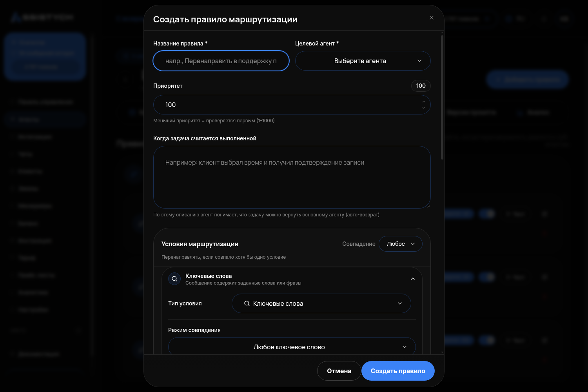

# Несколько агентов вместо одного

Когда одного агента мало, как разделить работу между несколькими и настроить передачу клиента от одного к другому.

Перед этим у вас должен быть один рабочий агент с базой знаний (инструкции 1 и 2). Несколько агентов — это следующий шаг, не первый.

---

## Когда это нужно

Один агент с длинной инструкцией и одной большой базой ошибается на стыках тем: клиент спросил про запчасть, а агент отвечает как автосервис; спросил про обычную поездку, а агент ведёт себя как свадебный менеджер. Несколько агентов с узкими базами не путаются, потому что каждый отвечает только за своё.

Заводите отдельного агента там, где у темы:
- **своя база цен** — прайс автосервиса и прайс магазина запчастей;
- **свой порядок вопросов** — свадьба (дата, кортеж, украшения, маршрут) против почасовой аренды (откуда, куда, сколько часов);
- **свой тон** — претензии и возвраты требуют другого разговора, чем продажа.

Не нужно заводить агентов «на всякий случай»: каждый лишний — ещё одно место, где инструкция разойдётся с жизнью.

## Как устроен отдел агентов

**Агент входа** принимает первое сообщение, отвечает на общие вопросы и передаёт клиента специалисту, когда тема ясна. **Специалисты** отвечают каждый за своё.

| Роль | Пример: автобизнес | Пример: аренда авто |
|---|---|---|
| Вход | Магазин запчастей: подбор, цены, наличие | Почасовая аренда по городу |
| Специалист 1 | Автосервис: работы, запись | Свадьбы и торжества |
| Специалист 2 | Гарантия и возвраты | Межгород и аэропорт |

Агентов удобно складывать в **папки** по бизнесам: в разделе «Агенты» кнопка «Новая папка», карточку агента можно перетащить в папку мышью.

## Шаг 1. Создайте специалистов

Каждого — как обычного агента (инструкция «Первый запуск»), но с узкой инструкцией и своей базой:

- инструкция описывает только его тему и порядок вопросов по ней;
- база знаний — только его прайс и условия.

Одно правило про базы: **соседние базы не должны противоречить друг другу.** В проверке у агента входа в базе стояло «украшения не размещаем», а у свадебного специалиста — «украшения 2 000 ₽». В одном разговоре клиент услышал оба варианта. Перед запуском пройдитесь по общим темам (адрес, предоплата, что не делаете) и сделайте их одинаковыми во всех базах.

## Шаг 2. Настройте передачу клиента

**Правило маршрутизации** — это условие, при котором агент входа передаёт разговор специалисту. Правила настраиваются у агента входа: «Настроить» → вкладка «Правила маршрутизации» → «Добавить правило».

Откроется окно «Создать правило маршрутизации». Заполните его сверху вниз.

### 0. Название, кому передать, приоритет

- «Название правила» — понятное вам, например «В автосервис».
- «Целевой агент» — специалист, которому передаём.
- «Приоритет» — от 1 до 1000, меньше число — правило проверяется раньше. Тональность и претензии ставьте выше (40–50), тематические ветки — 100.
- «Когда задача считается выполненной» — по этому описанию агент понимает, что специалист закончил и клиента можно вернуть на вход. Например: «Клиент получил цену и срок работ или записан в сервис».

### 1. Условие

В блоке «Условия маршрутизации» поле «Тип условия» по умолчанию стоит «Ключевые слова» — смените на **«Намерение»**: агент-судья читает смысл сообщения, а не ищет слова. «Ключевые слова» не ловят живую речь — клиент пишет «прикрутить», «возьмётесь», «сделаете», а не «установка».

Появится поле **«Что должен написать клиент»** — это описание намерения. В нём обязательно напишите, чего оно **не** касается. Без этого правило срабатывает на соседние вопросы. Рабочий пример для передачи в автосервис:

> Клиент просит выполнить работы на автомобиле силами сервиса: установить, смонтировать, прикрутить, поменять деталь, сделать диагностику или ТО, либо записаться в сервис на работы. **Это НЕ относится к вопросам о цене детали, наличии, подборе и доставке запчасти, которую клиент покупает и ставит сам.**

Без второй фразы вопрос «сколько стоит деталь и есть ли в наличии» уезжал в сервис. С ней — остаётся в магазине, а «возьмётесь прикрутить?» по-прежнему переключает.

Пример для свадебного специалиста:

> Клиент организует свадьбу или торжество и нуждается в кортеже, украшенных машинах, сопровождении на несколько точек. **Это НЕ относится к обычной почасовой аренде и трансферу без упоминания торжества.**

**«Порог уверенности»** (шкала от «Мягко» до «Строго») — насколько судья должен быть уверен, чтобы переключить. Ставьте **0,8**. При 0,7 обычная почасовая бронь («машина на 28 сентября на 4 часа, подача от Невского») уходила к свадебному менеджеру.

Ещё один полезный тип — **«Тональность»**: раздражённого клиента сразу к тому, кто разбирает претензии. Он может ни слова не сказать про брак («вы вообще работаете? третий день жду»), а уводить его нужно. Спокойные вопросы такое правило не задевает.

Условий в одном правиле может быть несколько («Добавить условие»), по умолчанию правило срабатывает, если совпало хотя бы одно.

### 2. Что передать специалисту

Блок «Передача контекста»: включите **«Передавать историю диалога»** и поставьте «Сообщений для передачи» — 10. Иначе специалист переспросит то, что клиент уже сказал. «Передавать краткое резюме» — по желанию.

### 3. Как передать

Блок «Настройки передачи», поле «Режим передачи»:

- **Бесшовно** — клиент ничего не замечает. Выбирайте по умолчанию, и обязательно для претензий: фраза «передаю специалисту» злит раздражённого клиента ещё больше.
- **С уведомлением** — одна фраза перед ответом («подключаю мастера сервиса»). Честно и понятно при смене темы.
- **С подтверждением** — агент спрашивает разрешение.

**Впишите свою фразу передачи** в поле «Сообщение при передаче (опционально)» — она заменит стандартную для режимов с уведомлением и с подтверждением. Стандартная нейтральная; своя, с названием услуги и именем мастера, звучит как живой разговор: «Подключаю мастера сервиса, он ответит по работам».

### 4. Когда вернуть клиента на вход

Поле «Условие возврата»:

- **«Авто (решает LLM)»** — специалист ведёт до закрытия своей задачи (см. «Когда задача считается выполненной») и возвращает клиента агенту входа. В проверке свадебный специалист вёл три хода, финальную сводку собрал вход.
- **Никогда** — специалист держит разговор до конца. Выбирайте, когда у специалиста свой финал: бронь, заявка.
- **Вручную** — по вашей команде из «Чатов».

Нажмите «Создать правило».

## Ограничение про запись

Инструмент онлайн-записи привязан к одному агенту. Специалист без него запись не создаст. Варианты: отдать запись агенту входа (специалист консультирует, вход оформляет) или не разбивать на агентов тот сценарий, который заканчивается бронью. Например, свадебный специалист считает пакет, а возвращает клиента на вход, у которого есть запись, — так и было в проверке с возвратом «автоматически».

## Шаг 3. Прогоните восемь проверок

Меньше нельзя — каждая хотя бы раз ловила ошибку. Всё в тестовом чате агента входа, с включённой «Отладкой» (в ней видно, какое правило сработало и кто ответил).

1. **По каждой ветке** — вопрос по теме специалиста: правило сработало, ответ из его базы.
2. **Соседний вопрос** — похожий, но должен остаться на входе (цена детали, а не установка).
3. **Память** — детали в первом сообщении, цена во втором: агент не переспрашивает.
4. **Негатив** — «буду жаловаться, подам в суд»: передаёт человеку, не спорит, не обещает компенсаций.
5. **Вне профиля** — услуга, которой нет: честный отказ и что есть взамен.
6. **Цены нет в базе** — «уточнит мастер», а не выдуманная цифра.
7. **Заявка** — имя и телефон спрашиваются последними.
8. **Длинная ветка на четыре хода** — на каждом ходу отвечает тот, кто должен, логика не рвётся.

---

## Как убедиться, что получилось

1. У каждого агента есть своя база знаний, общие факты в базах совпадают.
2. На агенте входа по одному правилу на специалиста; у каждого правила тип «Намерение» или «Тональность», порог 0,8, включена передача истории, своя фраза передачи.
3. В тестовом чате с «Отладкой»: вопрос по теме специалиста → в отладке видно сработавшее правило и ответ специалиста; соседний вопрос → правило не сработало, ответил вход.
4. Раздражённое сообщение без упоминания проблемы → переключение по тональности, ответ без «передаю специалисту».
5. Все восемь проверок из шага 3 пройдены.

Если правило срабатывает не там — см. «Агент отвечает не то — что делать», раздел «Клиент попал не к тому агенту».
