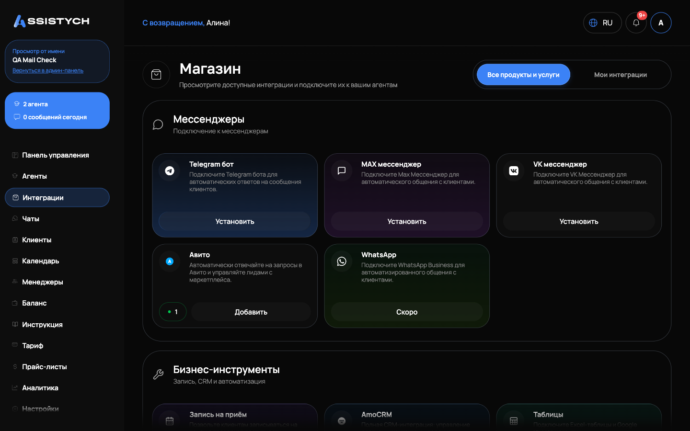
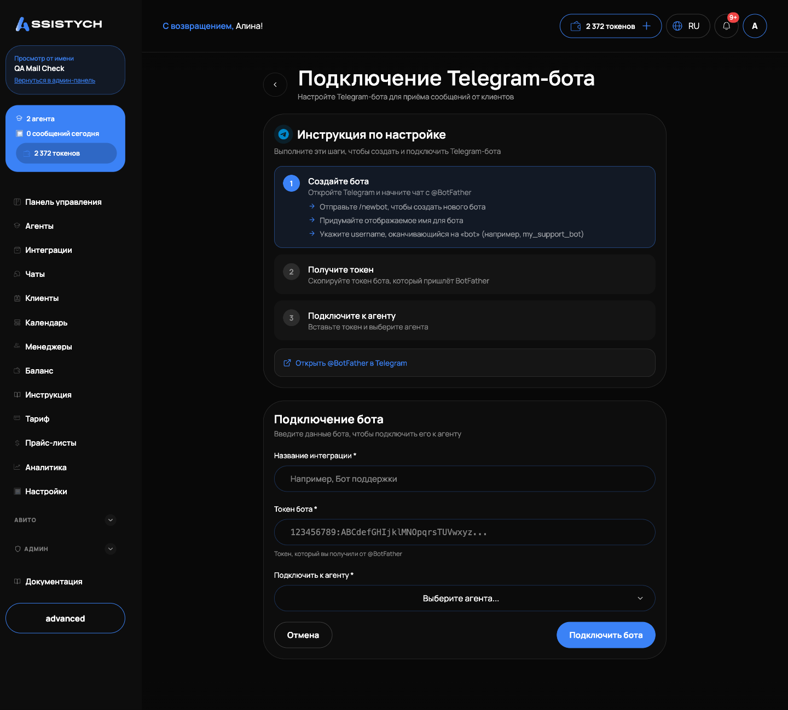
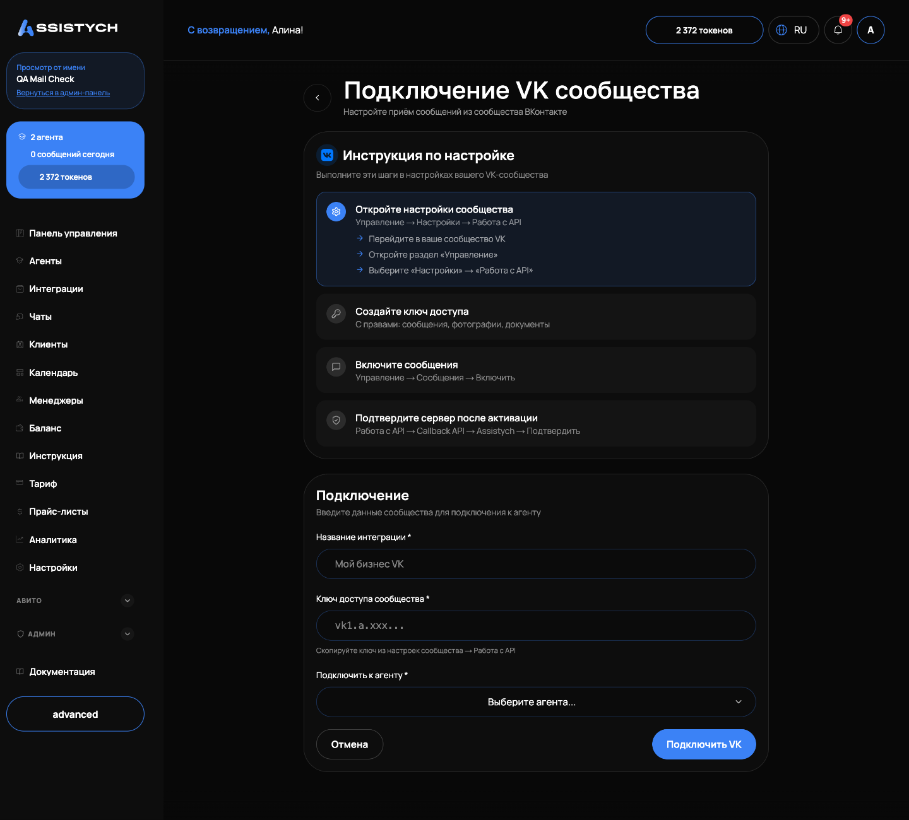
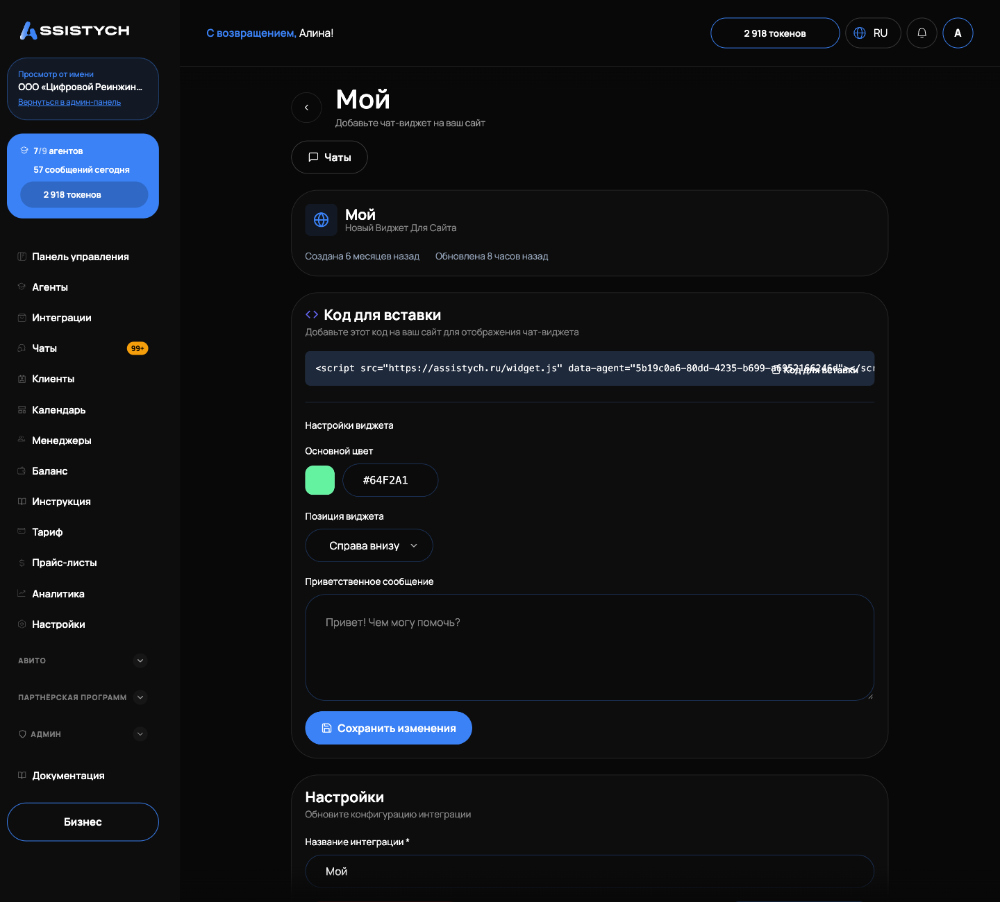

# Интеграции: Telegram, MAX, ВКонтакте и виджет

Раздел «Интеграции» в левом меню это магазин каналов и инструментов. Здесь вы подключаете мессенджеры, через которые клиенты пишут вам, и чат-виджет для сайта. После подключения диалоги из канала попадают в [Чаты](../chats/assistant.md), а контакты в [Клиенты](../chats/clients.md). Открывайте раздел, когда хотите подключить новый канал, остановить старый или проверить, что всё работает.

## Магазин интеграций

Страница открывается на вкладке «Все продукты и услуги»: карточки сгруппированы по разделам «Мессенджеры», «Бизнес-инструменты», «Данные и аналитика», «Сайт». Вкладка «Мои интеграции» показывает только то, что уже подключено, с числом установленных в скобках. Карточки с пометкой «Скоро» пока недоступны (например, WhatsApp).

На карточке канала нажмите «Установить» (или «Добавить», если один такой канал уже подключён и нужен ещё один). Откроется страница подключения с пошаговой инструкцией.

Перед подключением любого канала у вас должен быть создан агент: именно он будет отвечать клиентам. Если агентов нет, страница подключения покажет «Агенты не найдены. Сначала создайте агента» (см. [Агенты](../agents/overview.md)).

## Telegram-бот для клиентов

Клиенты пишут вашему боту в Telegram, отвечает агент. Подключение:

1. Создайте бота в Telegram: откройте @BotFather, отправьте /newbot, придумайте отображаемое имя и username на «bot» (например, my_support_bot). На странице подключения есть кнопка «Открыть @BotFather в Telegram».2. Скопируйте токен, который пришлёт BotFather (вида 123456789:ABCdef...). Токен управляет вашим ботом, храните его в секрете.
3. В кабинете заполните форму «Подключение бота»: «Название интеграции *», «Токен бота *», «Подключить к агенту *». Нажмите «Подключить бота».
4. Появится сообщение «Telegram-бот подключён!». Теперь нажмите «Запустить» на карточке интеграции: бот начнёт принимать сообщения.

Один и тот же бот не может быть подключён дважды: при повторе вы получите ошибку, что бот уже подключён. Если токен неверный, система скажет об этом сразу при подключении.

## MAX

Карточка «MAX мессенджер» в магазине сейчас помечена «Скоро».Клиентский канал MAX работает по токену бота, который выдаёт @MasterBot в MAX, по аналогии с BotFather.
Отдельно от клиентского канала: уведомления владельцу можно получать в MAX. Привязка делается коротким кодом, как у Telegram (см. ниже «Уведомления владельцу»): получите код в кабинете и отправьте его сервисному боту Assistych в MAX.
## ВКонтакте

Клиенты пишут в сообщения вашего сообщества ВКонтакте, отвечает агент. На странице «Подключение VK сообщества» инструкция из четырёх шагов:

1. В вашем сообществе VK откройте «Управление» → «Настройки» → «Работа с API».2. Нажмите «Создать ключ», отметьте права: сообщения, фотографии, документы. Скопируйте ключ.
3. В «Управление» → «Сообщения» включите сообщения сообщества.
4. В кабинете заполните форму «Подключение»: «Название интеграции *», «Ключ доступа сообщества *», «Подключить к агенту *». Нажмите «Подключить VK».
5. После активации интеграции в Assistych вернитесь в настройки VK: «Работа с API» → вкладка «Callback API», выберите сервер «Assistych» и нажмите «Подтвердить», затем во вкладке «Типы событий» включите «Входящие сообщения». Без этого шага сообщения доходить не будут.

## Виджет на сайте

Виджет добавляет окно чата на ваш сайт, посетитель пишет, отвечает агент.

1. На карточке «Виджет для сайта» нажмите «Установить».
2. Заполните «Настройки виджета»: «Название интеграции *» (например, «Чат на сайте»), «Выберите агента *», «Основной цвет», «Позиция виджета» («Справа внизу» или «Слева внизу»), «Приветственное сообщение» (например, «Привет! Чем могу помочь?»).
3. Нажмите «Создать виджет». Виджет активен сразу, запускать его отдельно не нужно.
4. Откройте интеграцию, в блоке «Код для вставки» скопируйте скрипт вида `` и добавьте его на ваш сайт. Цвет, позицию и приветствие можно потом поменять здесь же кнопкой «Сохранить изменения».

## Статусы и управление

У каждой подключённой интеграции есть статус: «Активна», «Неактивна» или «Ошибка». Кнопки «Запустить» и «Остановить» включают и выключают приём сообщений. При запуске вы увидите «@{имя бота} теперь принимает сообщения», при остановке «Бот перестал принимать сообщения». История чатов сохраняется в обоих случаях.

Удаление интеграции необратимо: появится подтверждение «Вы уверены, что хотите удалить интеграцию? Вебхук будет отключён, действие нельзя отменить. История чатов сохранится, но бот перестанет отвечать».

Что происходит после подключения: новые диалоги из канала появляются в разделе [Чаты](../chats/assistant.md), бот отвечает автоматически, а вы можете в любой момент нажать «Взять управление».

## Уведомления владельцу

Уведомления о новых чатах, собранных данных и событиях биллинга приходят вам лично в Telegram или MAX через сервисный бот @AssistychBot. Это не клиентский бот, а ваш личный канал уведомлений.

Привязка в [Настройках](../settings/overview.md), блок «Telegram»:

1. Нажмите «Получить код». Появится 6-значный код и таймер «Истекает через ...». Код можно скопировать кнопкой рядом.
2. Откройте @AssistychBot в Telegram, нажмите кнопку «Открыть чаты» (это [мини-приложение](../integrations/mini-app.md)) и введите код. Либо просто отправьте код боту сообщением.3. Блок покажет «Подключён как @username». Кнопка «Отключить» снимает привязку.

Там же настраивается, что присылать: «Новые чаты клиентов», «Новые данные», напоминание «Клиент ждёт ответа» («Сразу», «Если нет ответа час» или «Не напоминать»), «Аванс Авито заканчивается», «Подписка и оплата», и «Тихие часы», время, когда уведомления не приходят.

## Если что-то пошло не так

- «Не удалось подключить бота» в Telegram. Проверьте токен: он должен быть от @BotFather, без лишних пробелов. Если бот уже подключён к Assistych (в любом кабинете), используйте другого бота.- VK подключён, но сообщения не приходят. Чаще всего не сделан шаг подтверждения сервера: в VK «Callback API» выберите сервер «Assistych», нажмите «Подтвердить» и включите «Входящие сообщения» в «Типах событий».- Статус «Ошибка» у интеграции. Канал потерял доступ (например, отозван токен): остановите интеграцию и подключите заново с новым токеном.
- Виджет не появляется на сайте. Проверьте, что скрипт из «Код для вставки» добавлен на страницу без изменений и что у виджета выбран агент.
- Код привязки уведомлений не принимается. Код живёт несколько минут: нажмите «Новый код» и отправьте свежий.
- Клиент пишет, а в «Чатах» пусто. Проверьте, что у интеграции статус «Активна» (кнопка «Запустить»), и что у бизнеса есть токены: без баланса бот не отвечает (см. [Токены и пополнение](../billing/tokens.md)).
