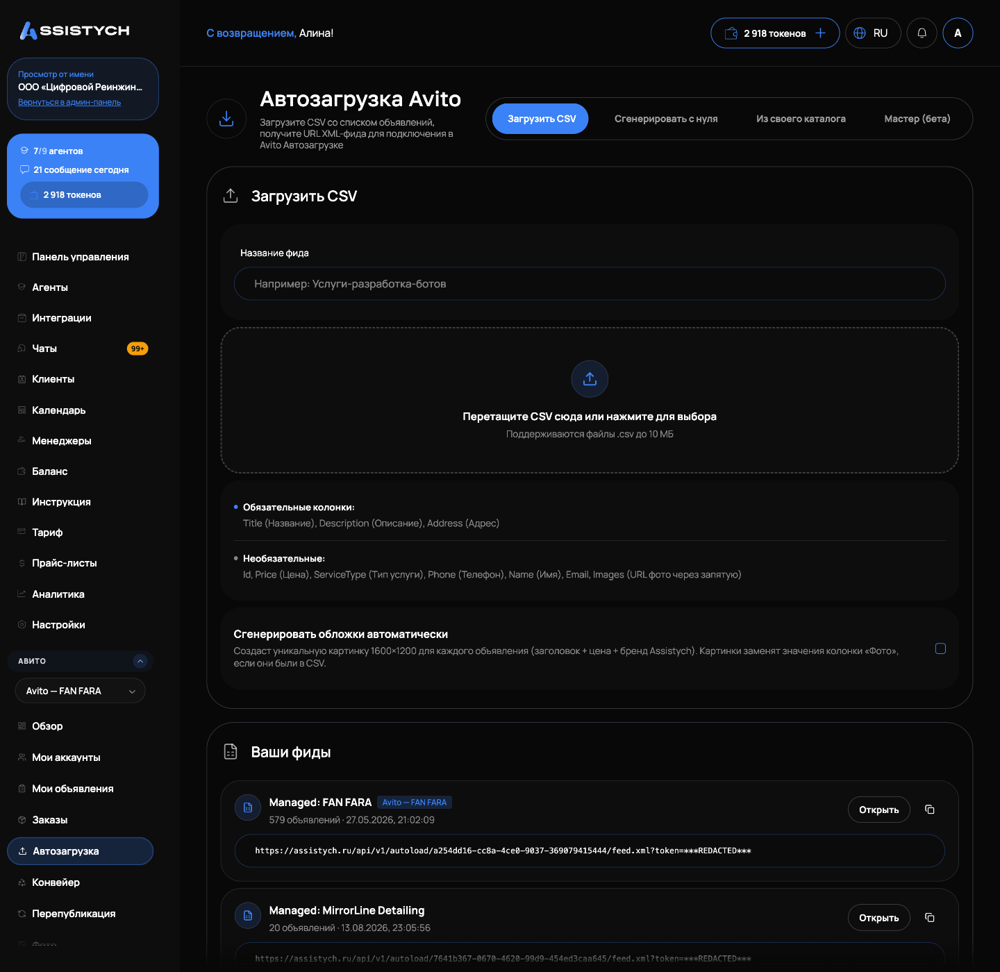

# Автозагрузка и публикация

Раздел Авито → «Автозагрузка» управляет фидами (XML), которые сервис отдаёт на ваш аккаунт Авито. Авито опрашивает фид по своему расписанию (обычно раз в 2-3 часа) и сама публикует, обновляет и снимает объявления по его содержимому.Всё, что лежит в фиде, это и есть ваши объявления на Авито.

## Создание фида

На странице раздела вкладки:

- «Загрузить CSV»: перетащите файл .csv до 10 МБ или выберите его. Обязательные колонки: Title (Название), Description (Описание), Address (Адрес). Необязательные: Id, Price, ServiceType, Phone, Name, Email, Images. Итог: «Импортировано: N. Ошибок: M», ошибки показываются построчно. Галочка «Сгенерировать обложки автоматически» создаст картинку для каждого объявления.
- «Сгенерировать с нуля» и «Из своего каталога»: ИИ-генерация объявлений, см. [Создание объявления с нуля (ИИ)](../listings/create-from-scratch.md).
- «Мастер (бета)»: собирает каталог из описания своими словами, перед генерацией вы всё проверяете, объявления создаются черновиками.

Ниже список «Ваши фиды» с числом объявлений и кнопкой «Открыть».

Быстрый способ наполнить фид: в [Моих объявлениях](../listings/overview.md) выделите строки и нажмите «Взять в управление», они появятся в управляемом фиде.

## Страница фида

Внутри фида рабочая таблица карточек: что в ней лежит, то Авито и подтянет на сайт. Сверху «Публичный XML:» с адресом фида и подсказка: изменения подхватываются Авито автоматически каждые 2-3 часа.

Сводная панель показывает: «Авто-выгрузка включена» или «выключена», «Последняя публикация», «Активны на Авито», «Черновики», «В очереди по датам» и строку «Есть неопубликованные изменения. Они уйдут на Авито только после нажатия "Опубликовать"».

Карточки бывают:

- черновиками: не выгружаются, пока вы не нажмёте «Отправить в фид» (уйдёт на Авито при следующей выгрузке);
- в очереди по датам: уйдут в свою дату публикации;
- активными на Авито;
- «ждут подтверждения Авито»: «снято (отправлено)», пока Авито не подтвердил.

Фильтры таблицы: «Все», «Оригиналы», «Дубли», «Импорт», «Генерация», «Только черновики», поле «Город», «Поиск по названию», отдельный переключатель «Только дубли» (гео-клоны и дубли с городами).

Массовые действия над выделенными карточками (нижняя панель): «Сделать дубли» с галочкой «Уникализировать» (перепишем текст и слегка изменим фото, в том же городе Авито банит копии), «Снять с Авито», «Подтянуть фото», «Удалить выбранные», «Снять выделение». Категория и параметры правятся в карточке через [редактор](../listings/editor.md).

Кнопка «Расписание публикации» распределяет даты по карточкам: период «Начало периода», «Конец периода», часы «Не раньше», «Не позже», распределение «Равномерно» или «Вразброс (перемешать)». После «Применить» нажмите «Опубликовать на Avito», чтобы даты ушли в Авито.

## Публикация

1. Нажмите «Опубликовать на Avito».
2. Ещё до подтверждения видно, сколько уйдёт: «При публикации в Avito уйдёт N объявл.». В Avito уходят только активные: снятые и завершённые останутся только в «Моих объявлениях» и не публикуются.
3. Подтвердите галочкой «Я понимаю, объявления будут опубликованы на Avito» и кнопкой «Опубликовать».

Ваш профиль автозагрузки не затирается: наш фид добавляется в автозагрузку аккаунта рядом с вашими, существующие фиды и расписание сохраняются. Существующие объявления аккаунта не удаляются: совпадающие обновятся по AvitoId, остальные останутся как есть. Если фид ещё не подключён к профилю Авито, мы предупредим об этом отдельно перед публикацией. Если Авито не дал доступ к автозагрузке, появится «Авито не дал доступ к автозагрузке — настройте в кабинете»: перейдите на Avito, «Профиль → Автозагрузка», вставьте ссылку на фид и сохраните.
Авито разрешает запуск выгрузки раз в час. При повторном запуске раньше часа появится: «Avito разрешает запуск выгрузки раз в час. Изменения уже в фиде — они уйдут при следующем запуске (вручную через час или автоматически по расписанию)».Если автозагрузка у аккаунта выключена, прогон не состоится, будет прямое предупреждение: включите её в кабинете Авито и опубликуйте снова.

После запуска: «Выгрузка запущена — объявления обычно появляются в течение ~получаса. Точный результат смотрите в отчёте ниже».

## Расписание и авто-обновление

- «Регулярное расписание автозагрузки»: «Дни недели», «Часы» (время московское) и «Объявлений за запуск». Авито будет публиковать фид по этому графику. Сохраняется кнопкой «Сохранить расписание» с галочкой «Я понимаю, что фид будет публиковаться вживую по графику».
- «Запланировать»: разовая публикация один раз в выбранные «Дата и время».
- Тумблер «Обновлять Авито автоматически»: раз в час сами публикуем ваши правки на Авито, чтобы не нажимать «Опубликовать» вручную. Работает после первой ручной публикации. Если тумблер выключен, правки копятся, о чём напоминает строка «Есть неопубликованные изменения».

## Отчёт и причины отказов

После прогона карточка «Статус публикации» показывает итог «Опубликовано: X, ошибок: Y» и таблицу по каждому объявлению («Внешний ID», «ID Avito», «Статус», «Ошибки») с текстами ошибок от самого Авито. Частые причины:

- «Нужно пополнить аванс»: на аккаунте кончился аванс на продвижение. Пополните аванс в кабинете Авито и опубликуйте снова.- «Неправильно заполнен обязательный параметр»: у объявления пустое обязательное поле категории. Откройте карточку в редакторе и заполните поля «обязательное», редактор подсказывает их ещё при сохранении черновика.
- «Не получилось опубликовать в регионе …»: на аккаунте нет тарифа платного размещения. Подключите тариф в кабинете Авито. Уже опубликованные объявления доживут до конца оплаченного срока, но не продлятся.
## Снятие и удаление карточек

Убрать карточку из фида значит снять объявление с публикации на Авито при следующем прогоне автозагрузки, это штатное поведение Авито.
- «Снять с Авито» убирает карточки из фида и сразу публикует: Авито отправит объявления в архив. Подтверждение: «Снять N объявл. с Авито? Они будут убраны из фида и сняты с публикации на Авито».
- Опубликованные карточки уходят в архив с сохранением текста и фото: их можно вернуть кнопкой «Вернуть в публикацию», они опубликуются с прежним содержимым.
- Карточки, которые ни разу не публиковались, удаляются без возможности восстановить.
- Нельзя снять так последние объявления: «В фиде должно остаться хотя бы одно». Авито игнорирует пустой фид, и объявления не снимутся. Чтобы снять всё, используйте «Закрыть все» в [Моих объявлениях](../listings/overview.md).

## Сверка с Авито

Блок «Сверить с Авито» сравнивает значения в фиде с живой страницей объявления: кнопка «Проверить» показывает таблицу «Поле», «У нас», «На Авито», «Совпадает». Полезно, когда правки внесены, а прогон ещё не был. Карточки без AvitoId пропускаются, страница, которая не открылась, помечается «Страница не открылась».

## Если что-то пошло не так

- «Аккаунт Avito не подключён» в диалоге публикации. Подключите аккаунт, см. [Подключение Авито](../getting-started/connect-avito.md).
- «В фиде нет объявлений». Добавьте карточки: «Взять в управление» в «Моих объявлениях», загрузите CSV или сгенерируйте.
- Выгрузка не стартует из-за лимита раз в час. Изменения уже сохранены в фиде: подождите следующий запуск по расписанию или повторите через час.
- В отчёте ошибки «Нужно пополнить аванс» или «обязательный параметр». Пополните аванс в кабинете Авито или заполните обязательные поля в редакторе, затем опубликуйте снова.
- Карточка висит в ожидании подтверждения больше суток. Похоже на сбой синхронизации: напишите в поддержку.
- Удалили карточку, а объявление осталось на Авито. Если фид после удаления опустел, Авито его проигнорировал: верните одну карточку или снимите объявление в кабинете Авито.
