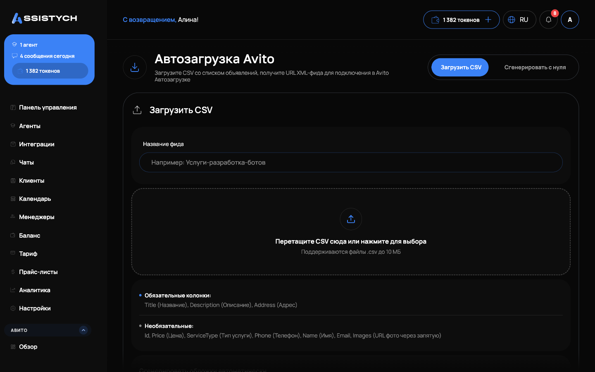

# Автозагрузка и публикация

Раздел **Авито → Автозагрузка** — это фид, который сервис загружает на ваш аккаунт Авито.

1. Добавьте объявления в фид кнопкой «Добавить в фид» (из «Моих объявлений» или вручную).
2. Опубликуйте — статус публикации виден в карточке фида.
3. При желании настройте расписание публикации и автопубликацию.


Если убрать объявление из фида, на ближайшей синхронизации Авито снимет его с публикации.

