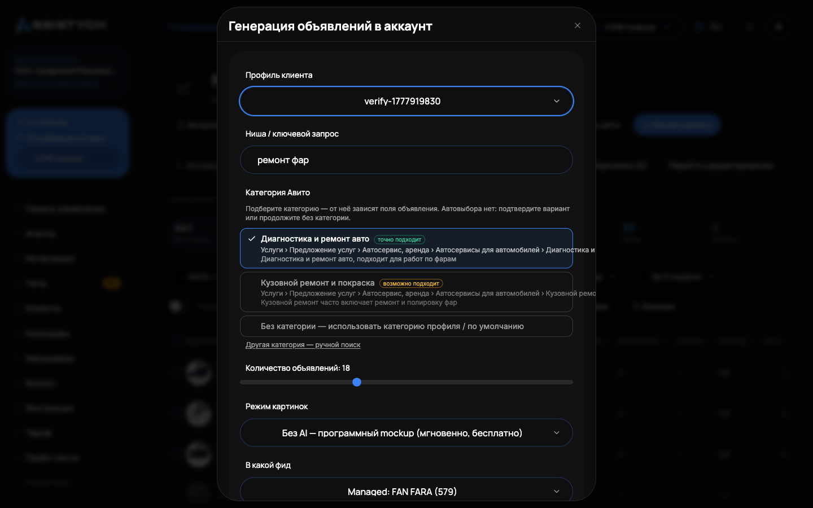

# Создание объявления с нуля (ИИ)

«Сгенерировать в аккаунт» создаёт пачку готовых объявлений без ручной работы: система анализирует выдачу Авито по вашему городу, пишет заголовки и описания, подбирает цену по рынку, делает фото и собирает фид для публикации. Функция нужна, когда вы выходите в новую нишу или хотите быстро наполнить аккаунт.

Не путайте с разделом «Конвейер»: тот перевыпускает уже существующие объявления, здесь создаются новые.

## Что нужно до начала

- Профиль клиента: карточка с данными бизнеса, в том числе городом. По городу система смотрит выдачу, цены и конкурентов. Если профиля нет, интерфейс подскажет: «Создайте профиль на странице "Профили клиентов"».
- Баланс токенов: генерация текста и AI-фото списывается с баланса, см. [Токены и пополнение](../billing/tokens.md).

## Пошагово

### Шаг 1. Открываем генерацию

Слева в меню: Авито → «Мои объявления». На верхней панели нажмите «Сгенерировать в аккаунт» (рядом с «Добавить объявление» и «Импортировать»). Откроется окно «Генерация объявлений в аккаунт».

Тот же генератор есть на странице Авито → «Автозагрузка», вкладка «Сгенерировать с нуля». Рядом вкладки «Из своего каталога» (свой прайс или список товаров), «Загрузить CSV» и «Мастер (бета)».

### Шаг 2. Заполняем форму

- «Профиль клиента»: выбираете из списка. От профиля берётся город, по нему идёт анализ ниши. Это ключевой момент: цены и конкуренты в разных городах разные, объявление получится под ваш рынок, а не усреднённое.
- «Ниша / ключевой запрос»: коротко, что продаём, например «разработка чат-ботов» или «аренда автомобилей». По этому запросу система найдёт конкурентов в выдаче.
- «Количество объявлений»: ползунок от 5 до 50, по умолчанию 18.
- «Режим картинок»: как делать фото, см. таблицу ниже. По умолчанию бесплатный макет.

### Шаг 3. Подтверждаем категорию

После ввода ниши появляется блок «Категория Авито» с подходящими вариантами (статус «Ищем подходящие категории…»). Выберите и подтвердите правильную категорию или вариант «Без категории — использовать категорию профиля / по умолчанию». Если по запросу ничего не нашлось, уточните нишу.

Автовыбора нет специально: без подтверждённой категории объявление собралось бы по чужой рубрике. Если категорию не выбрать и в профиле её нет, запуск не пройдёт: «Выберите категорию объявлений». После подтверждения нажмите «Запустить генерацию».

Галочка «Дозагрузить в текущий фид (черновиками)» добавит новые объявления в существующий фид черновиками: в выдачу они сами не уйдут, существующие объявления не изменятся, публикация отдельным шагом.

### Шаг 4. Ждём и проверяем черновики

Откроется страница «Генерация feed'а» с этапами: «Запуск...», «Анализ ниши», «Придумываем тексты», «Генерируем обложки», «Собираем feed». Прогресс виден на странице: «Готово X из N». Тексты пишутся небольшими порциями, большая пачка собирается заметное время.

Готовые объявления появляются черновиками в «Моих объявлениях»: заголовок, цена с пометкой «рекомендовано ИИ», фото, статус. Тексты и цены можно поправить до публикации, «рекомендовано ИИ» это подсказка по рынку, а не жёсткое значение.

На странице генерации есть блок «Семантическое ядро»: «Горячие запросы» (из них собраны заголовки), «Холодные запросы» (вплетены в описания) и «Медиана цены рынка» с коридором цен. Цену вы задаёте сами в черновике.

Обязательные параметры категории мы не выдумываем. Если у черновика не хватает обязательных полей Авито, редактор при сохранении честно скажет: «Черновик сохранён, но для публикации не хватает полей» и перечислит их. Заполните эти поля до публикации, иначе Авито отклонит объявление.

### Шаг 5. Публикация

Когда генерация завершена, виден статус «Готово · N объявлений», ссылка на XML-фид (кнопка «Копировать») и кнопка «Опубликовать на Авито». Нажмите её и подтвердите кнопкой «Подтвердить публикацию».

Фид подключается к автозагрузке вашего аккаунта рядом с тем, что уже настроено: существующие фиды и расписание сохраняются, добавляется наш URL. Мгновенной публикации нет: Авито опрашивает фид по своему расписанию, обычно раз в 2-3 часа, и заберёт объявления в ближайший слот.Если фид уже подключён, появится уведомление «Этот фид уже подключён к автозагрузке аккаунта».

## Режимы фото

| Режим | Что это | Стоимость |
| --- | --- | --- |
| «Без AI — программный mockup» | Программная картинка с заголовком, ценой и брендом | Бесплатно, мгновенно |
| «GPT Image 2» | Генерация изображения нейросетью | Списывается за каждое фото |
| «Nano Banana Pro» | Более качественная нейросеть | Дороже за фото |

Рядом с AI-режимами в интерфейсе видна ориентировочная цена за картинку и время генерации. Если сервис генерации фото временно недоступен, система сама подставит шаблонные фоны без списания за нейросеть, генерация не сорвётся (предупреждение «Нейросеть недоступна — использованы шаблонные фоны»).

## Сколько стоит

- Текст объявления: фиксированная цена за объявление, списывается в токенах.
- Фото: отдельно за каждую картинку, только в AI-режимах. Макет бесплатный.

Списание идёт с баланса кабинета в токенах. Если токенов не хватает, генерация не запустится и покажет, сколько нужно: «Недостаточно токенов: нужно ~N, доступно M. Пополните пакет токенов». Пополнение: [Баланс](../getting-started/balance.md).

## Полезно знать

- Город решает. Чем точнее в профиле указан город, тем релевантнее анализ ниши и цены.
- Категорию подтверждаете вы. Автоподбор только предлагает варианты, финальное слово за человеком.
- Правьте до публикации. Тексты и цены редактируются в черновиках, см. [Редактирование объявления](../listings/editor.md).
- «Аналитика спроса» строится по живой выдаче конкурентов по вашему запросу и городу.

## Если что-то пошло не так

- «Выберите категорию объявлений». Подтвердите категорию в блоке «Категория Авито» или выберите «Без категории», если она задана в профиле.
- «Ничего не нашли по запросу» в подсказках категории. Переформулируйте нишу короче и конкретнее или продолжите без категории.
- «Не удалось сгенерировать». Попробуйте ещё раз с другим профилем или ключевым запросом.
- Генерация остановилась на «Недостаточно токенов». Пополните баланс и запустите заново.
- Объявления не появились на Авито после «Опубликовать на Авито». Это нормально в первые часы: Авито забирает фид в свой цикл (обычно 2-3 часа). Статус смотрите в [Автозагрузке](../listings/autoload.md).
