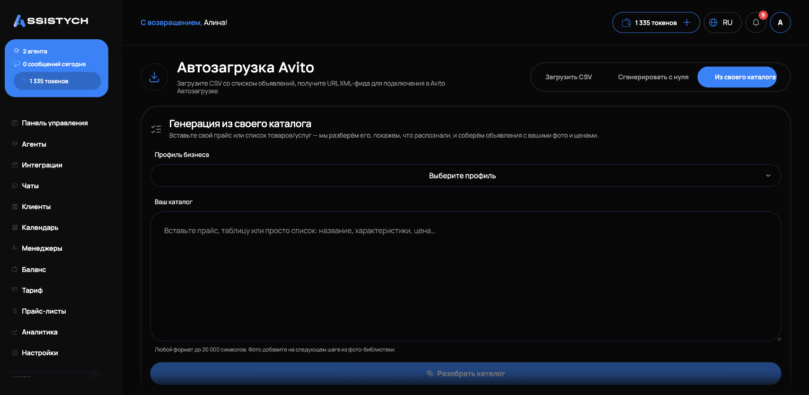
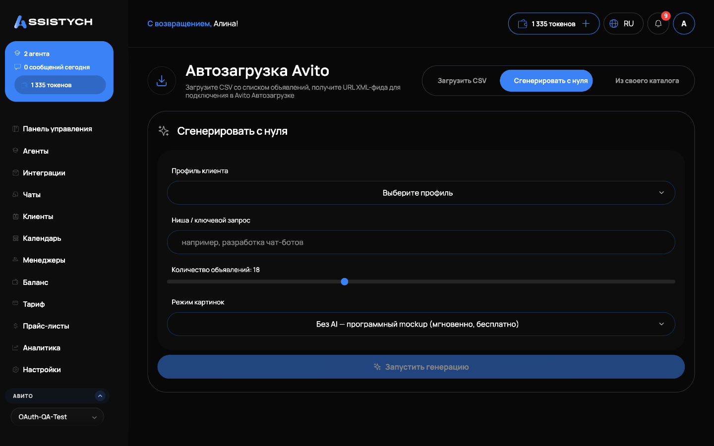

# Создание объявления с нуля (ИИ)

Эта функция создаёт **готовое объявление с нуля** — вам не нужно вручную писать заголовок, описание, подбирать цену и категорию. Вы указываете нишу и клиента, а система сама:

1. изучает выдачу Авито по вашему городу (конкуренты, цены, продвижение),
2. пишет продающие заголовки и описания,
3. подбирает цену по рынку,
4. генерирует фотографии,
5. собирает готовый фид и по кнопке отправляет его на публикацию.


Не путайте с разделом **«Конвейер»** — тот отвечает за автоматическую **переподачу уже существующих** объявлений, чтобы они не теряли позиции. Здесь мы **создаём новое** объявление.


## Что нужно до начала

- **Профиль клиента** — карточка с данными бизнеса, в том числе **городом**. Именно по городу система смотрит выдачу и цены. Если профиля ещё нет, создайте его заранее.
- **Баланс** — генерация текста и фото списывается с баланса (см. раздел «Сколько стоит» ниже).

## Пошагово

### Шаг 1. Открываем генерацию

Слева в меню откройте **Авито → Мои объявления**. На верхней панели нажмите кнопку **«Сгенерировать в аккаунт»** (рядом с «Добавить объявление» и «Импортировать»).

### Шаг 2. Заполняем форму генерации

Откроется окно **«Генерация объявлений в аккаунт»**. Заполняем по порядку:

- **Профиль клиента** — выбираете из списка. От профиля берётся **город**, по которому пойдёт анализ ниши. Это ключевой момент: цены и конкуренты в разных городах разные, поэтому объявление получается «под ваш рынок», а не усреднённое по России.
- **Ниша / ключевой запрос** — коротко, что продаём (например, «стекло фары BMW» или «аренда автомобилей»). По этому запросу система найдёт конкурентов в выдаче.
- **Количество объявлений** — ползунок (по умолчанию 18). Сколько вариантов сгенерировать.
- **Режим картинок** — как делать фото (по умолчанию бесплатный макет, см. таблицу ниже).

### Шаг 3. Подтверждаем категорию

Как только вы ввели нишу, появляется блок **«Категория Авито»** с подходящими вариантами. Нужно **выбрать и подтвердить** правильную (или выбрать «Без категории — использовать категорию профиля / по умолчанию»).


Пока категория не подтверждена, генерация не запускается. Это сделано специально: без категории объявление собралось бы по чужой рубрике, а автоматический подбор иногда ошибается. Финальное слово — за вами.


После подтверждения категории нажимаете **«Запустить генерацию»**.

### Шаг 4. Смотрим сгенерированные объявления

Система создаёт объявления: анализирует нишу по вашему городу (заголовки конкурентов, медианную цену, маркеры продвижения), пишет тексты, подставляет цену и генерирует фото. Тексты пишутся **небольшими порциями по 2 объявления**, поэтому большая пачка собирается заметное время — прогресс виден на странице («Готово X из N»).

Готовые черновики отображаются списком — заголовок, цена (с пометкой **«рекомендовано ИИ»**), фото, статус.

**Тексты и цены можно поправить** прямо здесь до публикации — цена редактируется, «рекомендовано ИИ» это лишь подсказка.


**Обязательные параметры категории мы не выдумываем.** Если у черновика не хватает обязательных полей Авито (например, «Место осмотра» у товарной категории), редактор при сохранении честно скажет: «Черновик сохранён, но для публикации не хватает полей» — и перечислит их. Заполните эти поля до публикации, иначе Авито отклонит объявление.


### Шаг 5. Готовый фид

На странице **«Генерация feed'а»** видно статус **«Готово · N объявлений»**, ссылку на XML‑фид (её можно скопировать) и кнопку **«Опубликовать на Авито»**.

### Шаг 6. Публикация

Нажимаете **«Опубликовать на Авито»** — появляется панель подтверждения. Подтверждаете кнопкой **«Подтвердить публикацию»**. Фид подключается к автозагрузке вашего аккаунта, и дальше Авито само публикует объявления в свой цикл.


**Ваши фиды и расписание автозагрузки не затираются.** Публикация добавляет наш фид в профиль автозагрузки рядом с тем, что уже настроено у вас в кабинете Авито, — существующие фиды и расписание сохраняются.



Мгновенной публикации «в одну секунду» у Авито нет — Авито принимает объявления только через автозагрузку (фид), которую опрашивает по расписанию (обычно раз в 2–3 часа). Наша кнопка подключает фид к автозагрузке, а публикует уже сам Авито в ближайший цикл.


## Режимы фото

| Режим | Что это | Стоимость |
| --- | --- | --- |
| **Без AI — макет** | Программная картинка с заголовком, ценой и брендом | Бесплатно, мгновенно |
| **AI‑фото** | Реальная генерация изображения нейросетью | Списывается за каждое фото |
| **AI‑фото (премиум)** | Более качественная нейросеть | Дороже за фото |

Если сервис генерации фото временно недоступен, система сама подставит бесплатный макет **без списания** — генерация не сорвётся.

## Сколько стоит

- **Текст объявления** — фиксированно, один токен за объявление.
- **Фото** — отдельно, за каждую картинку (только для AI‑режимов; макет бесплатный).

Списание идёт с вашего баланса в валюте тарифа (токены или рубли). Если на балансе только токены (без рублей) — генерация всё равно запустится, считается в токенах.

## Полезно знать

- **Город решает.** Чем точнее в профиле указан город клиента, тем релевантнее анализ ниши и цены — объявление под ваш локальный рынок.
- **Категорию подтверждаете вы.** Автоподбор только предлагает варианты, финальный выбор за человеком.
- **Правьте до публикации.** Тексты и цены можно отредактировать в списке черновиков перед отправкой.
- **«Аналитика спроса».** Мы не берём её из закрытого API Авито (его нет) — система анализирует живую выдачу конкурентов по вашему запросу и городу.

## Частые вопросы

**Объявления появятся сразу после кнопки «Опубликовать»?**
Не мгновенно. Кнопка подключает фид к автозагрузке, а публикует Авито в свой цикл (обычно 2–3 часа).

**Можно ли изменить цену, которую предложил ИИ?**
Да, цена редактируется в списке черновиков до публикации. «Рекомендовано ИИ» — это подсказка по рынку, а не жёсткое значение.

**Что, если категория в подсказках неправильная?**
Выберите верную из предложенных вручную или «Без категории». Запуск заблокирован, пока категория не подтверждена, — именно чтобы не ошибиться.

**Публикация сотрёт мой текущий фид или расписание в кабинете Авито?**
Нет. Наш фид добавляется в профиль автозагрузки рядом с вашими — существующие фиды и расписание сохраняются.
