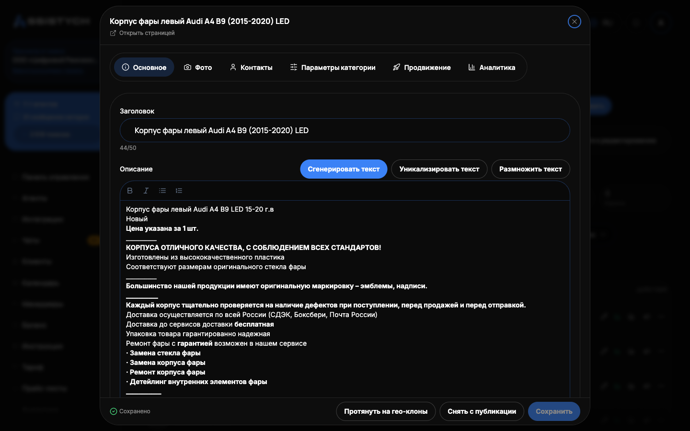

# Редактирование объявления

Редактор меняет текст, фото, категорию, параметры и цену объявления. Нужен, чтобы подготовить черновик к публикации или обновить уже живое объявление: изменения уйдут на Авито при следующей выгрузке фида.

Открывается кнопкой «Редактировать» в строке объявления в «Моих объявлениях» или на странице фида. Карточка собрана из секций: «Основное», «Контакты», «Фото», «Параметры категории», «Прайс-лист», «Продвижение». После правок нажмите «Сохранить». Изменения подхватятся Авито при следующем опросе фида, обычно раз в 2-3 часа.

## Заголовок и описание

- Под заголовком счётчик длины «N/M». Лимит задаёт категория Авито, у большинства категорий это 50 символов. За пределом счётчик краснеет, но сохранить длинный заголовок можно.
- У описания свой счётчик, лимит 7000 символов, за пределом тоже краснеет.
- Описание поддерживает форматирование: списки, выделение жирным, переносы строк.

Работа с текстом нейросетью:

- «Сгенерировать текст»: окно «Генерация текста объявления» с двумя режимами. «Переписать текущий»: поле «Пожелание (необязательно)», например «сделай короче, добавь про гарантию и сроки». «Новый по запросу»: поле «Что за товар или услуга». Готовый вариант вставляется кнопкой «Вставить в редактор».
- «Уникализировать текст»: переписывает заголовок и описание, сохраняя смысл, чтобы текст не считался дублем. Показывает сравнение «Сейчас» и «Новый вариант», применяется кнопкой «Применить новый».
- «Размножить текст»: размножение для тиражирования. Варианты пишутся в фигурных скобках через вертикальную черту, например {быстрый|оперативный} ремонт, город подставляется переменной [city]. Видно число комбинаций «Вариантов: N».

## Категория и параметры

Категорию можно сменить через поиск «Выбрать категорию…»: под новым шаблоном подтянутся её параметры, уже заполненные поля сохранятся.

Поля категории помечены значками «обязательное» и «необязательное». Если при сохранении не хватает обязательных полей, редактор предупредит: «Черновик сохранён, но для публикации не хватает полей» и перечислит, какие заполнить. Без них Авито отклонит объявление при выгрузке.

Если у карточки пометка «без категории», параметры Авито не показываются. Выберите категорию, параметры появятся. У категории без дополнительных полей будет надпись «У этой категории нет дополнительных параметров».

Адрес заполняется одной строкой или по полям: «Область / регион», «Город», «Улица», «Дом», «Метро», «Район», снизу виден «Итоговый адрес». В секции «Контакты»: «Имя контакта», «Телефон», «Email». Поле «AvitoId объявления» нужно, чтобы при публикации обновить конкретное живое объявление; для нового оставьте пустым.

## Фото

- Загрузите свои фото кнопкой «+ Загрузить фото»: до 10 штук, каждое до 10 МБ. Лишние не примутся: «Достигнут лимит 10 фото», «Размер файла больше 10 МБ».
- Первое фото это обложка объявления («Первое фото = обложка»).
- «Из библиотеки»: вставить фото из [фотобиблиотеки](../listings/photos.md).
- «✨ Сгенерировать через AI»: генерация фото нейросетью. Идёт в фоне: окно можно закрыть, прогресс в правом нижнем углу, фото добавятся сами.
- «Инфографика»: наложение заголовка, подзаголовка и цены на фото.
- «Уникализировать»: слегка изменяет фото, чтобы оно не считалось копией. Бесплатно, 1-3 секунды.
- «Восстановить фото с Авито»: подтягивает фото со страницы живого объявления. Кнопка «Перенести в фид» скачает их к нам и поставит в объявление вместо текущих.

Подробно про все фото-инструменты: [Фото и обложки](../listings/photos.md).

## Цена и прайс-лист

Цена правится в поле «Цена, ₽», вариант «Договорная» тоже есть. Секция «Прайс-лист» хранит до 50 услуг: подсказка «Не более 50 услуг. Выберите услугу и тип цены из списков, для своего варианта — галочка "Своя услуга"». Если добавить больше, редактор предупредит, что Авито принимает не более 50 услуг в одном прайс-листе. После изменений нажмите «Сохранить».

Кнопка «Откатить загрузку» возвращает текст, фото и параметры к состоянию до последней загрузки фида.

## Продвижение

Секция «Продвижение» показывает состояние управления ставками по объявлению и пакеты продвижения Авито: «Пакеты продвижения Авито», варианты вида «До N× просмотров, M дн.», «XL-объявление», «Выделение цветом». Цены Авито считает по категории и региону объявления, списание идёт с кошелька Авито.Подробнее: [Продвижение с прогнозом](../promotion/forecast.md) и [Управление ставками](../promotion/bids.md).

## Протянуть на гео-клоны

Если у объявления есть клоны по городам, кнопка «Протянуть на гео-клоны» переносит выбранные поля этой карточки на все её гео-клоны: «Заголовок», «Описание», «Цена», «Фото». Отдельная галочка «Уникализировать текст под каждый город». Город у каждого клона останется свой. Подробнее: [Гео-клоны по городам](../listings/geo-clones.md).

Публикация сохранённых правок на Авито: [Автозагрузка и публикация](../listings/autoload.md).

## Если что-то пошло не так

- «Черновик сохранён, но для публикации не хватает полей». Заполните перечисленные поля с пометкой «обязательное» и сохраните снова.
- «Не удалось сохранить» или «Авито-аккаунт недоступен». Проверьте подключение аккаунта Авито и повторите.
- Фото не загружается. Проверьте формат (нужно изображение) и размер (до 10 МБ), всего фото не больше 10.
- Счётчик заголовка красный. Заголовок длиннее лимита категории: сократите его, иначе Авито может обрезать или отклонить.
- Правки сохранены, но на Авито старое. Изменения уходят при следующей выгрузке фида: нажмите «Опубликовать на Avito» в [Автозагрузке](../listings/autoload.md) или дождитесь расписания.
- «Не удалось сгенерировать, попробуйте ещё раз» при генерации текста. Повторите; если ошибка постоянная, проверьте баланс токенов.
