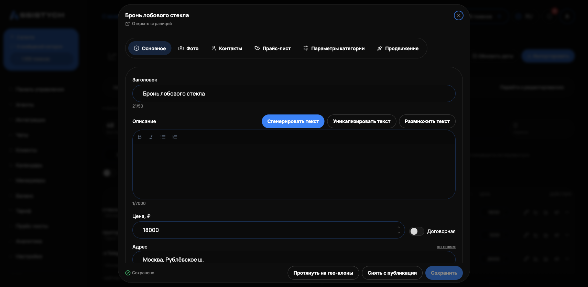

# Редактирование объявления

Нажмите «Редактировать» в строке объявления — откроется карточка.

## Заголовок и описание

* Можно править вручную или сгенерировать нейросетью (кнопка **«Сгенерировать текст»**: переписать текущий по пожеланию или написать новый по запросу).
* Есть переключатель «сгенерировать / вставить свой текст».
* Описание поддерживает форматирование: списки, выделение жирным, переносы. Для тиражирования есть размножение текста: варианты в фигурных скобках и переменная `[city]`.
* Под заголовком — счётчик длины. Лимит заголовка задаёт категория Авито (у большинства категорий это 50 символов): счётчик краснеет за пределом, но сохранить длиннее можно.

## Категория и характеристики

Категорию можно сменить через поиск — под новым шаблоном подтянутся её параметры, уже заполненные поля сохранятся.

Поля категории помечены значками **«обязательное»** и **«необязательное»**. Если при сохранении черновика не хватает обязательных полей, редактор предупредит: «Черновик сохранён, но для публикации не хватает полей» — и перечислит, какие заполнить. Без них Авито отклонит объявление при выгрузке.


Если у карточки стоит пометка «без категории», редактор не покажет параметры Авито. Выберите категорию — параметры появятся.


## Фото

* Загрузите свои фото (до 10 штук, каждое до 10 МБ) или сгенерируйте нейросетью.
* Первое фото — обложка объявления.
* Доступна библиотека фото, уникализация и наложение текста (инфографика: заголовок, подзаголовок, цена).
* Генерация идёт в фоне — окно можно закрыть, результат подтянётся сам.
* Кнопка **«Восстановить фото с Авито»** подтягивает фото со страницы живого объявления.

## Цена и услуги

Цена и список услуг редактируются прямо в карточке (прайс-лист — до 50 услуг). После изменений нажмите «Сохранить».

## Протянуть на гео-клоны

Если у объявления есть клоны по городам, кнопка **«Протянуть на гео-клоны»** переносит выбранные поля этой карточки (заголовок, описание, цену, фото) на все её гео-клоны. Город у каждого клона останется свой.
