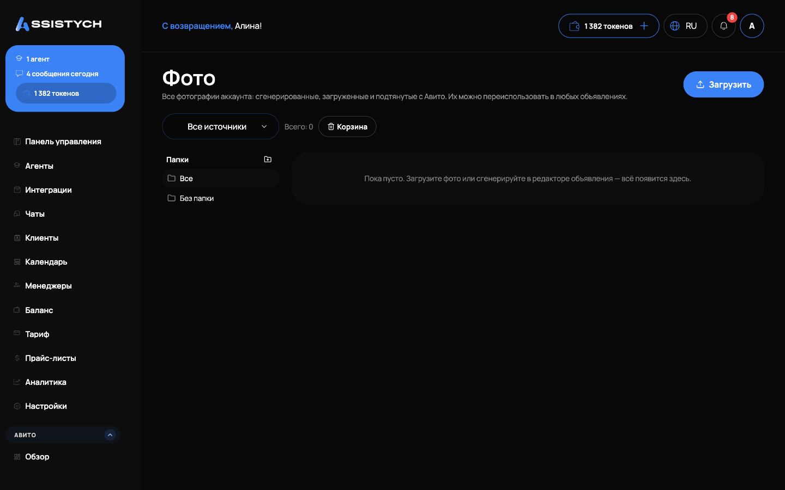

# Редактирование объявления

Нажмите «Редактировать» в строке объявления — откроется карточка.

## Заголовок и описание

* Можно править вручную или сгенерировать нейросетью.
* Есть переключатель «сгенерировать / вставить свой текст».
* Описание поддерживает форматирование: списки, выделение жирным, переносы.
* Под заголовком — счётчик длины (Авито ограничивает заголовок).

## Категория и характеристики

Категорию можно сменить через поиск. Поля категории заполняются по подсказкам.

## Фото

* Загрузите свои фото или сгенерируйте нейросетью.
* Доступна библиотека фото и генерация по образцу.
* Генерация идёт в фоне — окно можно закрыть, результат подтянется сам.

## Цена и услуги

Цена и список услуг редактируются прямо в карточке. После изменений нажмите «Сохранить».
