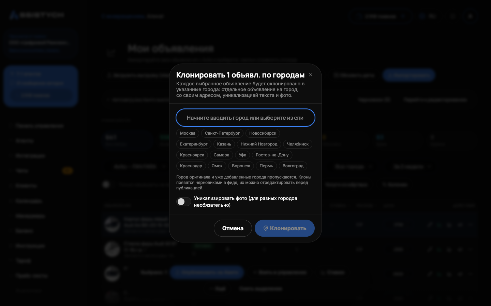

# Гео-клоны по городам

Гео-клоны тиражируют одно объявление сразу по нескольким городам: на каждый город создаётся отдельное объявление со своим адресом, подстановкой города в заголовок и текст, уникализацией текста и фото. Нужно, когда одна услуга или товар продаётся в нескольких городах.

## Как запустить

1. В разделе Авито → «Мои объявления» выделите объявление (или несколько) галочками. Тот же запуск есть на странице фида в [Автозагрузке](../listings/autoload.md), кнопка «По городам».
2. В нижней панели действий выберите «По городам».
3. В окне «Клонировать N объявл. по городам» укажите города: начните вводить название, подсказка появится автоматически («Начните вводить город или выберите из списка»).
4. Подтвердите кнопкой «Клонировать».

Запуск уходит в фоновую обработку: «Запущено клонирование: N объявл. × M городов». Город оригинала и города, где клон уже есть, пропускаются. Клоны появляются черновиками в фиде: в выдачу сами не уйдут, их можно спокойно отредактировать, а затем опубликовать отдельным шагом.

В диалоге заранее видно, сколько получится: «Будет создано N клонов (X объявл. × Y городов)». Если больше лимита, счётчик предупредит до запуска.

## Ограничения

- До 30 городов за один запуск: «Слишком много городов (макс. 30 за запуск)».
- До 1000 клонов за один запуск (объявления × города): «Слишком много клонов за один запуск (макс. 1000). Уберите часть городов или объявлений».
- Клонируйте объявления одного аккаунта за раз: «Выбраны объявления из разных аккаунтов. Клонируйте по одному аккаунту за раз».

## Что происходит с текстом

- Город в заголовке и тексте заменяется автоматически. Переменная [city] в тексте тоже подставит нужный город.
- Заголовок обрезается до лимита категории Авито (у большинства категорий 50 символов), аккуратно, по границе слова, без обрубков посреди фразы. Если у оригинала длинный заголовок, сократите его заранее, иначе у клонов хвост обрежется.
- «Переписать текст ИИ»: текст каждого клона переформулируется, чтобы объявления не считались точными копиями.
- Варианты в фигурных скобках (размножение текста, например {быстрый|оперативный}) раскрываются по-разному у разных городов, см. [Редактирование объявления](../listings/editor.md).

## Фото клонов

Галочка «Уникализировать фото (для разных городов необязательно)» слегка изменяет снимки у клонов. Для разных городов это обычно не нужно: Авито банит за точные копии в одном городе, а не за одинаковые фото в разных.Про саму уникализацию: [Фото и обложки](../listings/photos.md).

## Чем гео-клон отличается от дубля

«По городам» создаёт копию в другом городе: другой адрес, подстановка города. Кнопка «Сделать дубли» на странице фида создаёт копию в том же городе, и там уникализация обязательна: подсказка так и говорит, «В том же городе Авито банит копии: при создании дубля перепишем текст и слегка изменим фото. Снимите галочку для точной копии».
## Управление клонами

В «Моих объявлениях» и на странице фида клоны сгруппированы под оригиналом: строка «N дублей» разворачивается («Показать дубли этого объявления») и показывает каждый клон с его городом, статусом (черновик или опубликован), позицией в поиске, просмотрами, CTR, контактами и расходом. У клона свои действия: «Редактировать», «Статистика», «Ставка», «В конвейер перепубликации». «Удалить дубль» убирает его из фида; на Авито уже опубликованное объявление так не снимается.

Новые клоны лежат черновиками: на вкладке «Черновики» в «Моих объявлениях» или с фильтром «Только черновики» на странице фида. В публикацию они уходят кнопкой «Отправить в фид» по одному или массовой «Опубликовать выбранные (N)».

Массово обновить всю группу можно из редактора оригинала: кнопка «Протянуть на гео-клоны» переносит выбранные поля («Заголовок», «Описание», «Цена», «Фото») на все клоны, город у каждого останется свой. Галочка «Уникализировать текст под каждый город» перепишет тексты заново.

Публикация клонов на Авито идёт через фид: [Автозагрузка и публикация](../listings/autoload.md).

## Если что-то пошло не так

- «Укажите хотя бы один город». Поле городов пустое: добавьте города из подсказок.
- «Слишком много клонов за один запуск (макс. 1000)». Уберите часть городов или разбейте запуск на несколько раз.
- «Слишком много городов (макс. 30 за запуск)». Сократите список до 30, остальные прогоните следующим запуском, уже добавленные города пропустятся сами.
- «Выбраны объявления из разных аккаунтов». Снимите выделение с чужого аккаунта и клонируйте по одному аккаунту за раз.
- Клоны не появились сразу. Клонирование идёт в фоне: обновите страницу фида через пару минут.
- У клона обрезался заголовок. Сократите заголовок оригинала до лимита категории и протяните его на клоны из редактора.
