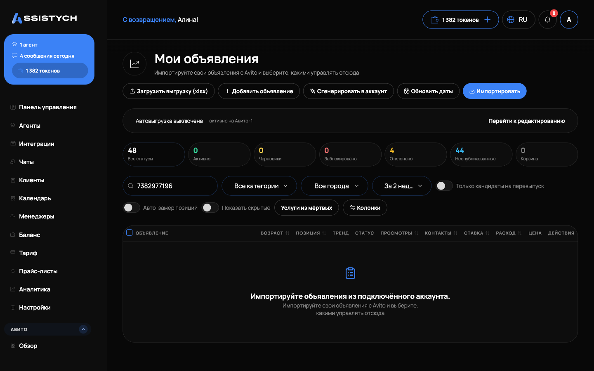

# Мои объявления

Раздел **Авито → Мои объявления** — это все объявления выбранного аккаунта в одном списке: заголовок, категория, цена, позиция в выдаче, статус, просмотры, контакты и расход по каждому.

1. Откройте раздел и выберите аккаунт.
2. Нажмите **«Импортировать»** — подтянутся ваши живые объявления с Авито (в строке результата видно, сколько добавлено новых и сколько обновлено).
3. Новое объявление создаётся кнопкой **«Добавить объявление»**, пачка объявлений с помощью ИИ — кнопкой **«Сгенерировать в аккаунт»** (подробнее — «Создание объявления с нуля»).

## Статусы и счётчики

Над таблицей — плитки со счётчиками, они же фильтры:

- **Активно** — опубликованные на Авито;
- **Черновики** — видны только вам и уйдут на Авито после публикации;
- **Заблокировано** и **Отклонено** — подсвечены, рядом есть ссылка на объявление в Авито;
- **Архив** — снятые с публикации или завершённые на самом Авито;
- **Корзина** — то, что сняли или убрали вы у нас («Снять с Авито», «Убрать из списка»). Отсюда объявление можно вернуть.


Счётчики считаются **по нашему реестру** и могут отличаться от цифр в кабинете Авито — это особенность API Авито, веб-кабинет считает по-своему. Наши цифры соответствуют данным API.


## Фильтры, период и сортировка

Над таблицей — фильтры по категории, городу и статусу, а также **выбор периода статистики** (день, неделя, 2 недели, месяц, всё время или свой диапазон). Клик по заголовку колонки сортирует таблицу (по позиции, просмотрам, расходу и т.д.), повторный клик переворачивает порядок.

## Колонка «Избранное»

Показывает, сколько раз объявление добавили в избранное за выбранный период (по статистике Авито). Это косвенный спрос: покупатели сохраняют объявление, но пока не пишут.

## Массовые действия

Выделите объявления галочками — снизу появится панель действий:

- **«Взять в управление»** — объявления попадут в управляемый фид, их можно будет редактировать и публиковать через автозагрузку;
- **«По городам»** — гео-клоны (подробнее — «Гео-клоны по городам»);
- **«Ставки»** — массово задать расписание ставок или удержание позиции (подробнее — «Управление ставками»);
- **«Снять с публикации»** — снять объявления с Авито;
- **«Убрать из списка»** — скрыть строки только у нас, чтобы не мешали. На самом Авито это никак не влияет; вернуть можно через «Показать скрытые» → «Вернуть».

## Кнопки в строке объявления

У каждого объявления в строке есть кнопки: статистика по дням, **«Продвижение с прогнозом»** (мегафон — варианты продвижения и прогноз просмотров от Авито, подробнее — «Продвижение с прогнозом») и меню остальных действий.
