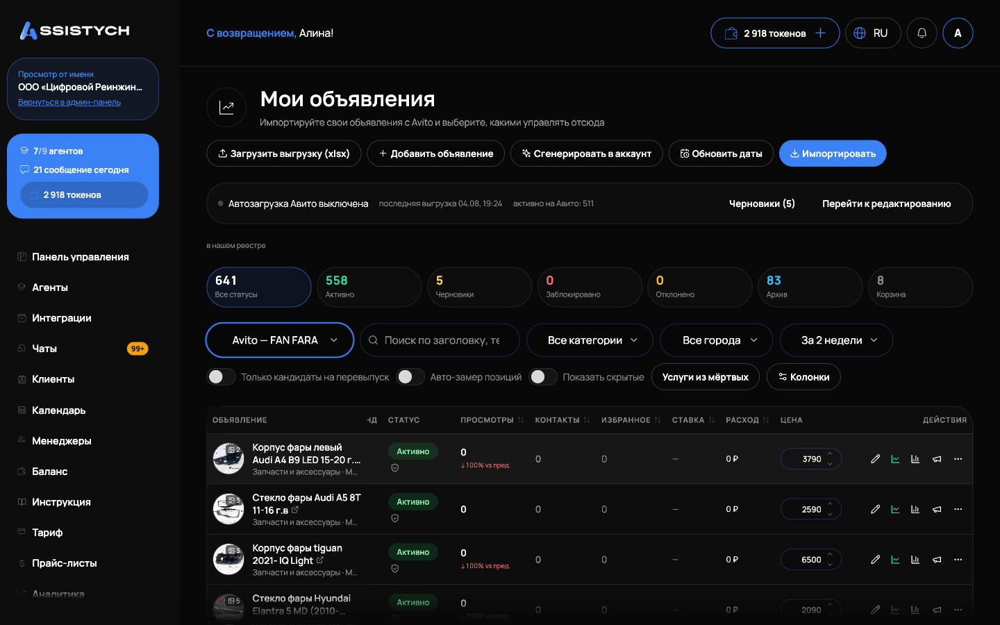

# Мои объявления

Раздел Авито → «Мои объявления» показывает все объявления выбранного аккаунта Авито одним списком: заголовок, категория, цена, позиция в выдаче, статус, показы, просмотры, контакты и расход по каждому. Отсюда начинается любая работа с объявлениями: импорт, редактирование, публикация, продвижение.

Аккаунт выбирается переключателем в шапке (см. [Подключение Авито](../getting-started/connect-avito.md)). Если аккаунт не подключён, кнопки будут неактивны: появится подсказка «Авито-аккаунт не подключён или подключение устарело».

## Первый шаг: импорт

1. Откройте Авито → «Мои объявления» и выберите аккаунт.
2. Нажмите «Импортировать». Подтянутся ваши живые объявления с Авито.
3. В строке результата видно итог: «Импортировано: X новых, Y обновлено, всего Z». Если что-то пошло не так, появится «Не удалось импортировать».

Рядом есть кнопка «Загрузить выгрузку (xlsx)»: она принимает файл выгрузки из кабинета Авито. Итог загрузки: «Загружено: X новых, Y обновлено, Z без AvitoId пропущено». Кнопка «Обновить даты» ставит в очередь обновление дат публикации.

Новое объявление создаётся кнопкой «Добавить объявление»: откроется окно «Новое объявление», где выбирают категорию («Создать в этой категории») или создают без неё («Создать без категории»), категорию можно назначить позже. Пачка объявлений с помощью ИИ создаётся кнопкой «Сгенерировать в аккаунт», подробнее в [Создание объявления с нуля (ИИ)](../listings/create-from-scratch.md).

## Статусы и счётчики

Над таблицей плитки со счётчиками, они же фильтры по клику:

- «Активно»: опубликованные на Авито;
- «Черновики»: видны только вам, уйдут на Авито после публикации;
- «Заблокировано» и «Отклонено»: подсвечены, рядом есть ссылка «причина в Авито». Причину блокировки Авито через API не отдаёт, её смотрят в кабинете Авито;
- «Неопубликованные»: завершённые или снятые с публикации на самом Авито;
- «Корзина»: то, что сняли или убрали у нас («Снять с Авито», «Убрать из списка»). Отсюда объявление можно вернуть.

Счётчики считаются по нашему реестру и могут отличаться от цифр в кабинете Авито. Просмотры и контакты мы показываем уникальные (так отдаёт API Авито), а веб-кабинет Авито считает все, включая повторные, поэтому там цифра больше.
## Фильтры, период и сортировка

Над таблицей:

- фильтры «Статус», «Категория», «Город»;
- поиск по заголовку, тексту и ID (по тексту описания ищет только среди объявлений, взятых в управление);
- переключатели «Только управляемые», «Только отслеживаемые», «Только кандидаты на перевыпуск» (активное объявление старше N дней с малым числом контактов);
- выбор периода статистики: «За сутки», «За неделю», «За 2 недели», «За месяц», «Всё время», «Свой период»;
- кнопка «Колонки»: какие колонки показывать.

Клик по заголовку колонки сортирует таблицу, повторный клик переворачивает порядок.

Полезные колонки: «Позиция» (последняя известная позиция в выдаче), «Возраст» (сколько дней объявление на Авито), «Показы» и «Просмотры» за период, «CTR» (контакты к просмотрам), «Расход» (затраты на продвижение за период и цена одного контакта), «Тренд» (динамика просмотров против прошлого равного периода), «Ставка» (реальная ставка на Авито и состояние нашего управления ставками), «Конвейер» (состояние в конвейере перепубликации). Цену можно править прямо в строке: сохранится пометка «Цена сохранена, уйдёт на Авито при следующей выгрузке». «Договорная» цена тоже поддерживается.

## Кнопки в строке объявления

У каждой строки справа:

- трекер позиции: включает регулярный замер позиции в поиске;
- «Статистика по дням»: графики «Просмотры», «Контакты», «Избранное», «Расход, ₽» за 7, 30 или 90 дней. «Избранное» показывает, сколько раз объявление сохранили за период: это косвенный спрос, люди сохраняют, но пока не пишут;
- меню «Ещё»: «По городам» (гео-клоны), «В конвейер» или «Перевыпустить», «А/Б-тест: запустить копию рядом», «Снять с Авито» или «Вернуть в публикацию», «Убрать из списка» или «Вернуть».

## Массовые действия

Выделите объявления галочками (есть «Выбрать все на странице»), снизу появится панель:

- «Опубликовать на Авито»: публикует выбранные сразу, как есть. Добавляются к уже опубликованным, остальные остаются черновиками;
- «Взять в управление»: объявления попадут в управляемый фид, их можно будет редактировать и публиковать через [Автозагрузку](../listings/autoload.md). Итог: «Взято в управление: X, уже было: Y»;
- «Ставки»: массово задать расписание ставок или удержание позиции, подробнее в [Управление ставками](../promotion/bids.md);
- «Ещё»: «По городам» (см. [Гео-клоны по городам](../listings/geo-clones.md)), «Объединить» (слить выделенные в одно: услуги и описание в базовое, остальные снимутся с Авито), «Назначить агента» (входящие по этим объявлениям пойдут выбранному агенту), «Подтянуть фото» и «Переподтянуть заново», «В конвейер», «Вернуть в публикацию», «Снять с Авито», «Убрать из списка».

«Убрать из списка» прячет строки только у нас, на самом Авито это никак не влияет. Вернуть их можно тумблером «Показать скрытые» над таблицей, затем «Вернуть».

Для правки текстов, фото и параметров нажмите «Редактировать» в строке, см. [Редактирование объявления](../listings/editor.md). Пакеты продвижения с прогнозом просмотров подключаются из редактора, см. [Продвижение с прогнозом](../promotion/forecast.md).

## Если что-то пошло не так

- «Не удалось импортировать». Проверьте, что аккаунт Авито подключён и подключение активно, затем повторите. Если не помогло, переподключите интеграцию.
- Счётчики не совпадают с кабинетом Авито. Это ожидаемо: мы показываем уникальные просмотры и контакты по API, кабинет Авито считает все.
- Кнопки неактивны и видна подсказка про аккаунт. Аккаунт не выбран или подключение устарело: выберите аккаунт переключателем или переподключите его.
- Не могу снять объявление, появляется «нет в фиде». Такие объявления снимаются только в кабинете Авито: сначала возьмите их в управление, потом повторите.
- «Не удалось обновить» при массовом действии. Повторите действие; при повторной ошибке обновите страницу и проверьте подключение аккаунта.
