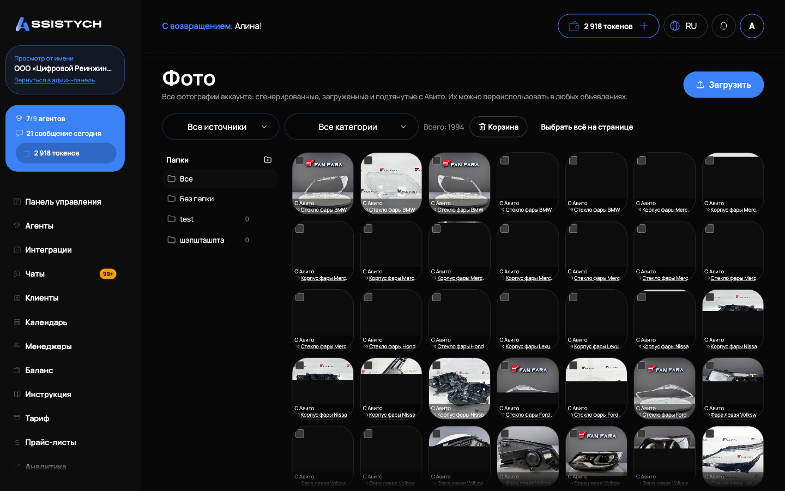

# Фото и обложки

Раздел Авито → «Фото» это фотобиблиотека аккаунта: все фотографии в одном месте, сгенерированные, загруженные и подтянутые с Авито. Их можно переиспользовать в любых объявлениях. Сюда же автоматически попадает всё, что вы загрузили или сгенерировали в редакторе объявления.

Фото показываются по выбранному аккаунту Авито (переключатель в шапке).

## Фотобиблиотека

Кнопка «Загрузить» принимает один или несколько файлов изображений. Лимит: до 10 МБ на файл. Слишком большой файл не примется: «Файл слишком большой. Максимум 10 МБ», нераспознанный формат: «Не удалось распознать изображение».

Над сеткой фильтры:

- по источнику: «Все источники», «Сгенерировано», «Загружено», «С Авито», «Импорт»;
- по категории объявления, к которому привязано фото;
- счётчик «Всего: N».

На каждой миниатюре виден источник и, если фото привязано к объявлению, ссылка на это объявление: она открывает наш редактор в новой вкладке. Клик по фото открывает полный размер, листать можно стрелками на экране или клавишами ← и →, закрыть клавишей Esc.

### Папки

Слева блок «Папки»: «Все», «Без папки» и ваши папки. Папка создаётся кнопкой «Папка» с названием, переименовывается и удаляется по наведению. При удалении папки фото остаются, просто выходят из неё. Чтобы разложить фото: выделите их галочками (Shift выделяет диапазон, есть «Выбрать всё на странице») и в нижней панели выберите «Переместить выбранные (N) в папку».

### Корзина

Выделенные фото убираются кнопкой «В корзину (N)». Фото, уже добавленные в объявления, останутся в них: из библиотеки удаляется только запись реестра. Кнопка «Корзина» открывает удалённые: отсюда их можно «Восстановить (N)» или «Удалить навсегда (N)». Удаление навсегда нельзя отменить.

## Генерация фото нейросетью

Генерация запускается из [редактора объявления](../listings/editor.md), кнопка «✨ Сгенерировать через AI». В окне «Сгенерировать AI-фото»:

- «Режим»: «Mock (бесплатно)» (шаблонная обложка без нейросети), «gpt-image-2», «nano-banana-pro» (качественнее). Рядом видны ориентировочная цена за картинку и время.
- «Количество» фото.
- «Пожелание к фото (необязательно)»: словами, что должно быть на снимках. Пусто: ИИ сам соберёт промпт из текста объявления.
- «Референс (по вашему фото)»: нейросеть сгенерирует фон на основе загруженного снимка, файл сохранится в библиотеку.
- Режим генерации: «Обычная» или «Серия по сценарию»: по одному фото на выбранный пункт в едином стиле («Обложка», «Ответы на вопросы», «Гарантии», «Прайс и выгода», «Сроки», «Примеры работ»).

Перед запуском видно, сколько спишется с баланса: AI-фото оплачиваются за каждую картинку в токенах, шаблонный режим бесплатный. При нехватке средств появится «Недостаточно средств на балансе. Пополните баланс кабинета», см. [Токены и пополнение](../billing/tokens.md).

Генерация идёт в фоне: окно можно закрыть и редактировать другие объявления, прогресс виден в трее «Генерация фото (N)» в правом нижнем углу, готовые фото добавятся в объявление и в библиотеку автоматически. Если нейросеть недоступна, фото соберутся по шаблону с предупреждением «Нейросеть недоступна — использованы шаблонные фоны».

## Обложки и инфографика

Первое фото объявления это его обложка. Кнопка «Инфографика» в редакторе накладывает текст на фото:

- «Пресеты стиля»: «Распродажа», «Премиум», «Контакт», «Минимал»;
- поля: «Заголовок», «Подзаголовок», «Цена (текст)», «Призыв (CTA)», «Цвет акцента». Пустой заголовок: наложится только водяной знак;
- «Положение текста»: «Внизу», «По центру», «Вверху»;
- «Формат»: «4:3 (стандарт)», «1:1 (квадрат)», «9:16 (вертикальный)»;
- «Водяной знак (анти-кража)»: например бренд или телефон;
- «Логотип на фото»: загрузка логотипа и его угол;
- «Фон»: «Загруженное/реальное фото» или «Сгенерировать ИИ (чистый фон)» (ИИ рисует фон без текста, надпись ляжет один раз).

Применить можно «к этому фото» или «ко всем (N)». Если на фото уже есть текст, редактор предупредит: повторное наложение даст двойной текст, берите исходное фото без надписи.

## Уникализация фото

Кнопка «Уникализировать» на фото слегка изменяет снимок, чтобы он не считался точной копией. «Уровень изменений»: «Лёгкий (только crop + лёгкий шум)», «Средний (+ цвет, поворот)», «Сильный (+ зеркало, заметнее)». Бесплатно, занимает 1-3 секунды. Пригодится для дублей в одном городе, см. [Гео-клоны по городам](../listings/geo-clones.md).

## Восстановить фото с Авито

Кнопка «Восстановить фото с Авито» в редакторе подтягивает фото со страницы живого объявления (блок «Фото с Авито»). Затем «Перенести в фид» скачает их к нам и поставит в объявление вместо текущих. Если страницу открыть не удалось, появится «Не удалось открыть страницу объявления». Массово фото подтягиваются из «Моих объявлений» кнопкой «Подтянуть фото».

## Где это используется

- [Редактирование объявления](../listings/editor.md): загрузка, генерация, инфографика, обложка.
- [Создание объявления с нуля (ИИ)](../listings/create-from-scratch.md): режимы фото при генерации пачки.
- [Гео-клоны по городам](../listings/geo-clones.md): уникализация фото при клонировании.

## Если что-то пошло не так

- «Не удалось загрузить» при добавлении фото. Проверьте, что файл изображение до 10 МБ, и повторите.
- Генерация фото не стартует: «Недостаточно средств на балансе». Пополните баланс токенов и запустите заново.
- «Не удалось сгенерировать фото» в трее. Повторите генерацию; при повторе смените режим на «Mock (бесплатно)», чтобы не терять время.
- На фото двойной текст после инфографики. Вы наложили текст на фото, где надпись уже была: возьмите исходное фото без текста.
- «Не удалось открыть страницу объявления» при восстановлении фото с Авито. Объявление закрыто на Авито, страницы уже нет: загрузите фото вручную.
- Удалили фото из библиотеки, а в объявлении оно осталось. Так задумано: из объявлений фото удаляются только в редакторе объявления.
